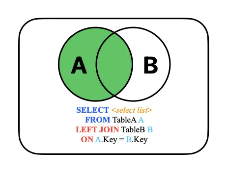
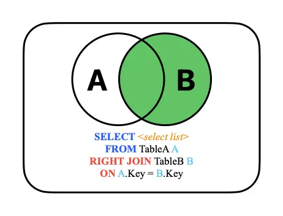
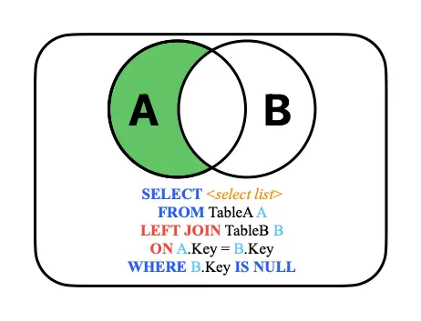
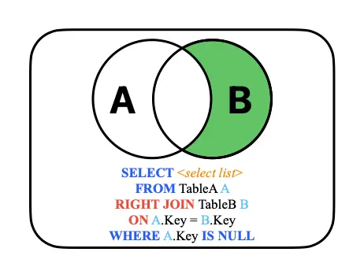
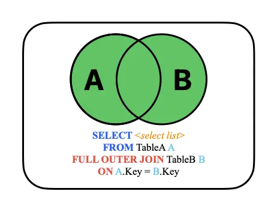
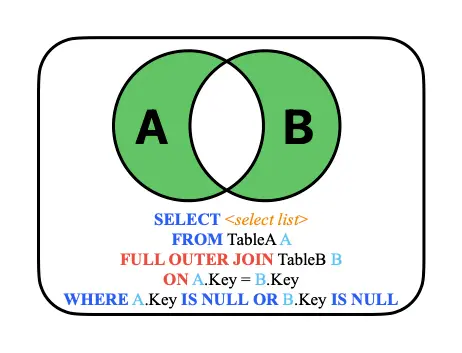
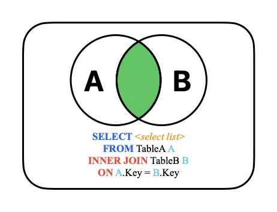

# SQL Join

Frequently it is useful to join the data from multiple tables together.

```sql
-- Syntex;
SELECT column(x) FROM firsttable f
JOIN secondtable s ON f.column = s.column;

-- Select all columns from both tables; join on purchase_order number;
SELECT * FROM purchase_orders o
JOIN purchase_order_lines l
ON o.purchase_order_id = l.purchase_order_id;
```

## Type of sql join

- INNER JOIN (DEFAULT)
- LEFT JOIN
- RIGHT JOIN
- FULL OUTER JOIN
- CROSS JOIN
- SELF JOIN
- NATURAL JOIN

```sql
-- INNER JOIN
-- Rows that have matching values in both tables.
SELECT * FROM orders INNER JOIN customers ON orders.id = customers.id;
```

```sql
-- LEFT JOIN
-- All rows from the left and the matching rows from right table. Nullable.
SELECT * FROM customers LEFT JOIN orders ON customers.id = orders.id;
```

```sql
-- RIGHT JOIN
-- All rows from the right and the matching rows from left table. Nullable.
SELECT * FROM orders RIGHT JOIN customers ON orders.id = customers.id;
```

```sql
-- FULL OUTER JOIN
-- All rows from both tables, **NULL** for no matches.
SELECT * FROM customers FULL OUTER JOIN orders ON customers.id = orders.id;
```

```sql
-- CROSS JOIN
-- Cartesian product of both tables.
SELECT * FROM customers CROSS JOIN orders;
```

```sql
-- SELF JOIN
-- Joins a table with itself, comparing rows within the same table.
SELECT * FROM employees INNER JOIN employees AS managers ON employees.id = managers.id;
```

```sql
-- NATURAL JOIN
-- INNER JOIN where condition is based on all columns with the same names.
SELECT * FROM orders NATURAL JOIN customers;
```

### Example table : purchase_lines

| product_id | purchased |
| :--------- | :-------- |
| 100        | 15        |
| 102        | 25        |
| 103        | 10        |
| 106        | 10        |

### Example table : sales_lines

| product_id | sold |
| :--------- | :--- |
| 100        | 5    |
| 101        | 6    |
| 103        | 8    |
| 104        | 5    |
| 106        | 7    |

## Inner Join

```sql
-- Keyword `INNER` is optional.
-- ANSI 92 syntax. Most commonly used join type.
-- If the column is not unique, it must be qualified.
SELECT s.product_id, sold, purchased FROM sales_lines s
INNER JOIN purchase_lines p ON s.product_id = p.product_id;
```

Rows returned only if they exist in both tables.

| product_id | sold | purchased |
| :--------- | :--- | :-------- |
| 100        | 5    | 15        |
| 103        | 8    | 10        |
| 106        | 7    | 10        |

## Left Outer Join

```sql
-- Keyword `OUTER` is optional.
SELECT s.product_id, sold, purchased FROM sales_lines s
LEFT OUTER JOIN purchase_lines p ON s.product_id = p.product_id;
```

All rows from left (first) table, matching rows from right (second) table, and missing values as `NULL`.

| product_id | sold | purchased |
| :--------- | :--- | :-------- |
| 100        | 5    | 15        |
| 101        | 6    | NULL      |
| 103        | 8    | 10        |
| 104        | 5    | NULL      |
| 106        | 7    | 10        |

## Right Outer Join

```sql
-- Keyword `OUTER` is optional.
SELECT s.product_id, sold, purchased FROM sales_lines s
RIGHT OUTER JOIN purchase_lines p ON s.product_id = p.product_id;
```

All rows from the right (second) table, matching rows from left (first) table, and missing values as `NULL`.

| product_id | sold | purchased |
| :--------- | :--- | :-------- |
| 100        | 5    | 15        |
| NULL       | NULL | 25        |
| 103        | 8    | 10        |
| 106        | 7    | 10        |

## Right Outer Join

```sql
-- Keyword `OUTER` is optional.
SELECT p.product_id, sold, purchased FROM sales_lines s
RIGHT OUTER JOIN purchase_lines p ON s.product_id = p.product_id;
```

| product_id | sold | purchased |
| :--------- | :--- | :-------- |
| 100        | 5    | 15        |
| 102        | NULL | 25        |
| 103        | 8    | 10        |
| 106        | 7    | 10        |

## Full Outer Join

```sql
-- Keyword `OUTER` is optional.
SELECT s.product_id, p.product_id, sold, purchased FROM sales_lines s
FULL OUTER JOIN purchase_lines p ON s.product_id = p.product_id;
```

All rows from both tables, missing values as `NULL`.

| product_id | product_id | sold | purchased |
| :--------- | :--------- | :--- | :-------- |
| 100        | 100        | 5    | 15        |
| 101        | NULL       | 6    | NULL      |
| 103        | 103        | 8    | 10        |
| 104        | NULL       | 5    | NULL      |
| 106        | 106        | 7    | 10        |
| NULL       | 102        | NULL | 25        |

## Cross Join

```sql
SELECT p.product_id, sold, purchased FROM sales_lines s
CROSS JOIN purchase_lines p;
```

Each row from the left table is joined with each row from the right table, results are usually an error.

| product_id    | sold | purchased |
| :------------ | :--- | :-------- |
| 100           | 5    | 15        |
| 100           | 6    | 15        |
| 100           | 8    | 15        |
| 100           | 5    | 15        |
| 100           | 7    | 15        |
| 102           | 5    | 25        |
| 14 more rows… |      |           |

## Older Syntax – Inner Join

Pre ANSI 92 syntax, joins were inner, cross join if where clause omitted.

```sql
SELECT s.product_id, sold, purchased
FROM sales_lines s, purchase_lines p
WHERE s.product_id = p.product_id;
```

## Joining 3 Tables

```sql
SELECT first_name, last_name, med_desc, dosage FROM patients p
JOIN unit_dose_orders u ON p.patient_id = u.patient_id
JOIN medications m ON u.medication_id = m.medication_id
ORDER BY last_name, first_name, med_desc;
```

### Example table : employees

| employee_id | first_name | last_name | department | title | supervisor | salary        |
| :---------- | :--------- | :-------- | :--------- | :---- | :--------- | :------------ |
| 101         | Malcolm    |           | Reynolds   |       | Management | President     |
| 102         | Zoe        |           | Washburne  |       | Sales      | VP of Sales   |
| 103         | Jayne      |           | Cobb       |       | Sales      | Sales Rep     |
| 104         | Hoban      |           | Washburne  |       | Finance    | VP of Finance |
| 105         | Kaylee     |           | Frye       |       | Finance    | AP Clerk      |
| 106         | Inara      |           | Serra      |       | Finance    | AR Clerk      |
| 107         | Simon      |           | Tam        |       | Sales      | Sales Rep     |
| 108         | Derrial    |           | Book       |       | Sales      | Sales Rep     |
| 109         | River      |           | Tam        |       | Finance    | GL Clerk      |

## Joining a table with itself

```sql
-- Might miss some of the records.
SELECT
  e1.employee_id, e1.first_name, e1.last_name, e1.department,
  e1.title, e1.supervisor,
  e2.employee_id, e2.first_name, e2.last_name
FROM employees e1
JOIN employees e2
ON e1.supervisor = e2.employee_id
ORDER BY e1.department, e1.employee_id;
```

```sql
-- Includes all the records.
SELECT
  e1.employee_id, e1.first_name, e1.last_name,
  e1.department, e1.title, e1.supervisor,
  e2.employee_id, e2.first_name, e2.last_name
FROM employees e1
LEFT JOIN employees e2
ON e1.supervisor = e2.employee_id
ORDER BY e1.department, e1.employee_id;
```

## SQL Join Visualization

      
