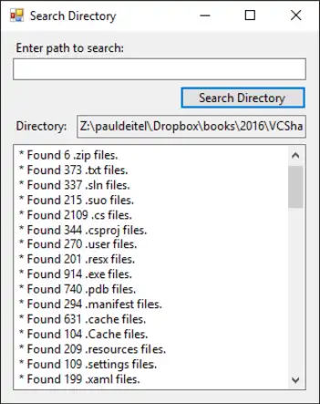
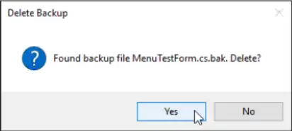

| No. | Topic                                                                                                                         |
| --- | ----------------------------------------------------------------------------------------------------------------------------- |
| 1   | [Files and Streams](#files-and-streams)                                                                                       |
| 2   | [Creating a Sequential-Access Text File](#creating-a-sequential-access-text-file)                                             |
| 3   | [Case Study: Credit Inquiry Program](#case-study-credit-inquiry-program)                                                      |
| 4   | [Serialization](#serialization)                                                                                               |
| 5   | [Creating a Sequential-Access File Using Object Serialization](#creating-a-sequential-access-file-using-object-serialization) |
| 6   | [Defining the RecordSerializable Class](#defining-the-recordserializable-class)                                               |
| 7   | [Reading and Deserializing Data from a Binary File](#reading-and-deserializing-data-from-a-binary-file)                       |
| 8   | [Classes File and Directory](#classes-file-and-directory)                                                                     |
| 9   | [Searching Directories with LINQ](#searching-directories-with-linq)                                                           |

# Files and Streams

- C# views each file as a sequential stream of bytes
- Each file ends either with an `end-of-file` marker or at a specific `byte`
  number that's recorded in a system-maintained administrative data structure.
- When a file is opened, an object is created and a stream is associated with
  the object.
- When a console app executes, the runtime environment creates three stream
  objects that are accessible via properties `Console.Out`, `Console.In` and
  `Console.Error`, respectively.
- These objects use streams to facilitate communication between a program and a
  particular file or device.
- `Console.In` refers to the standard input stream object, which enables a
  program to input data from the keyboard.
- `Console.Out` refers to the standard output stream object, which enables a
  program to output data to the screen.
- `Console.Error` refers to the standard error stream object, which enables a
  program to output error messages to the screen.
- Abstract class `Stream` provides functionality for representing streams as
  bytes. Classes `FileStream`, `MemoryStream` and `BufferedStream` (all from
  namespace `System.IO`) inherit from class `Stream`.
- Class `FileStream` can be used to write data to and read data from files.
- Class `MemoryStream` enables the transfer of data directly to and from memory,
  this is much faster than reading from and writing to external devices.
- Class `BufferedStream` uses buffering to transfer data to or from a stream.
- The `System.IO` namespace includes stream classes such as `StreamReader` (for
  text input from a file), `StreamWriter` (for text output to a file) and
  `FileStream` (for both input from and output to a file).
- These stream classes inherit from abstract classes `TextReader`, `TextWriter`
  and `Stream`, respectively.
- Properties `Console.In` and `Console.Out` are of type `TextReader` and
  `TextWriter`, respectively.
- The system creates objects of `TextReader` and `TextWriter` derived classes to
  initialize `Console` properties `Console.In` and `Console.Out`.

## Creating a Sequential-Access Text File

- C# imposes no structure on files.
- Thus, the concept of a "record" does not exist in C# files.
- This means that you must structure files to meet the requirements of your
  apps.
- Releasing resources explicitly when they're no longer needed makes them
  immediately available for reuse by other programs, thus improving resource
  utilization.

## Case Study: Credit Inquiry Program

- To retrieve data sequentially from a file, programs normally start from the
  beginning of the file, reading consecutively until the desired data is found.
- It sometimes is necessary to process a file sequentially several times (from
  the beginning of the file) during the execution of a program.
- A `FileStream` object can reposition its file-position pointer (which contains
  the byte number of the next byte to be read from or written to the file) to
  any position in the file.
- When a `FileStream` object is opened, its file-position pointer is set to byte
  position 0 (i.e., the beginning of the file)

## Serialization

- In the prior examples, Record was used to aggregate the information for one
  record.
- When the instance variables for a Record were output to a disk file, certain
  information was lost, such as the type of each value.
- For instance, if the value "3" is read from a file, there's no way to tell if
  the value came from an int, a `string` or a `decimal`.
- We have only data, not type information, on disk.
- If the program that's going to read this data "knows" what object type the
  data corresponds to, then the data can be read directly into objects of that
  type.
- For example, we know that we are inputting an int (the account number), the
  first and last name strings and a decimal (the balance).
- We also know that these values are separated by commas, with only one record
  on each line.
- So, we are able to parse the strings and convert the account number to an int
  and the balance to a decimal.
- Sometimes it would be easier to read or write entire objects.
- C# provides such a mechanism, called object serialization.
- A serialized object is an object represented as a sequence of bytes that
  includes the object's data, as well as information about the object's type and
  the types of data stored in the object.
- After a serialized object has been written to a file, it can be read from the
  file and deserialized, that is, the type information and bytes that represent
  the object and its data can be used to recreate the object in memory.
- Class `BinaryFormatter` (namespace
  `System.Runtime.Serialization.Formatters.Binary`) enables entire objects to be
  written to or read from a stream.
- `BinaryFormatter` method `Serialize` writes an object's representation to a
  file.
- `BinaryFormatter` method `Deserialize` reads this representation from a file
  and reconstructs the original object.
- Both methods throw a `SerializationException` if an error occurs during
  serialization or deserialization.
- Both methods require a Stream object (e.g., the `FileStream`) as a parameter
  so that the `BinaryFormatter` can access the correct stream.
- Next, we create and manipulate sequential-access files using object
  serialization.
- Object serialization is performed with byte-based streams, so the sequential
  files created and manipulated will be binary files.
- Binary files are not human readable.
- For this reason, we write a separate app that reads and displays serialized
  objects.

## Creating a Sequential-Access File Using Object Serialization

- We begin by creating and writing serialized objects to a sequentialaccess
  file.
- In this section, we reuse much of the code from earlier sections, so we focus
  only on the new features.

## Defining the RecordSerializable Class

- Class `RecordSerializable` (part of the `BankLibrary` project) is marked with
  the `[Serializable]` attribute, which indicates to the CLR that
  `RecordSerializable` objects can be serialized.
- Classes that represent serializable types must include this attribute in their
  declarations or must implement interface `ISerializable`.

```cs
// Serializable class that represents a data record.
using System;
namespace BankLibrary {
    [Serializable]
    public class RecordSerializable {
        public int Account { get; set; }
        public string FirstName { get; set; }
        public string LastName { get; set; }
        public decimal Balance { get; set; }

        // default constructor sets members to default values
        public RecordSerializable() : this(0, string.Empty, string.Empty, 0M) {}

        // overloaded constructor sets members to parameter values
        public RecordSerializable(int account, string firstName, string lastName, decimal balance) {
            Account = account;
            FirstName = firstName;
            LastName = lastName;
            Balance = balance;
        }
    }
}
```

- In a class that's marked with the `[Serializable]` attribute or that
  implements interface `ISerializable`, you must ensure that every instance
  variable of the class is also serializable.
- All simple-type variables and strings are serializable.
- For variables of reference types, you must check the class declaration (and
  possibly its base classes) to ensure that the type is serializable.
- By default, array objects are serializable.
- However, if the array contains references to other objects, those objects may
  or may not be serializable.
- Using a `Serialization` Stream to Create an Output File
- Next, we'll create a sequential-access file with serialization
- To test this program, we used the sample data
- A `BinaryFormatter` for writing serialized objects.
- The `FileStream` to which this program writes the serialized objects.
- The string argument that's passed to the `FileStream`'s constructor represents
  the name and path of the file to be opened.
- This specifies the file to which the serialized objects will be written.
- The program does not show how the data records actually appear in the file.
- Remember that we are now using binary files, which are not human readable.
- To verify that the file was created successfully, the next section presents a
  program to read the file's contents.

```cs
// Creating a sequential-access file using serialization
using System;
using System.IO;
using BankLibrary;
using System.Windows.Forms;
using System.Runtime.Serialization;
using system.Runtime.Seralization.Formatters.Binary;

namespace CreateFile {
    public partial class CreateFileForm: BankUIForm {
        // Obiect for serializing RecordSerializables in binary format
        private BinaryFormatter formatter = new BinaryFormatter();
        private FileStream output; // stream for writing to a file

        // parameterless constructor
        public CreateFileForm() {
            InitializeComponent();
        }

        // handler for saveButton_Click
        private void saveButton_Click(object sender, EventArgs e) {
            // create and show dialog box enabling user to save file
            DialogResult result;
            string fileName; // name of file to save data
            using (SaveFileDialog fileChooser = new SaveFileDialog()) {
                fileChooser.CheckFileExists = false; // let user create file

                // retrieve the result of the dialog box
                result = fileChooser.ShowDialog();
                fileName = fileChooser.FileName; // get specified file name
            }

            // ensure that user clicked "OK"
            if (result == DialogResult.OK) {
                //  show error if user specified invalid file
                if (string.IsNul10rEmpty(fileName)) {
                    MessageBox.Show("Invalid File Name", "Error",
                        MessageBoxButtons.OK, MessageBoxIcon.Error);
                } else {
                    try {
                        // save file via FileStream if user specified valid file
                        output = new FileStream(fileName,
                            FileMode.OpenOrCreate, FileAccess.Write);

                        // disable Save button and enable Enter button
                        saveButton.Enabled = false:
                        entersuccon.Enabled = true:
                    } catch (IOexception) {
                        // notify user if file could not be opened
                        MessageBox.Show("Error opening file", "Error",
                            MessageBoxButtons.OK, MessageBoxIcon.Error);
                    }
                }
            }
        }

        // handler Tor enterburton criCK
        private void enterButton_Click(object sender, EventArgs e) {
            // store TextBox values string array
            string values = GetTextBoxValues();

            // determine whether textbox account field is empty
            if (!string.IsNul10rEmpty(values[(int) TextBoxIndices.Account])) {
                // store TextBox values in RecordSerializable and serialize
                try {
                    // get account-number value from TextBox
                    int accountNumber = int.Parse(values[(int) TextBoxIndices.Account]);
                    // determine whether accountNumber is valid
                    if (accountNumber > 0) {
                        // RecordSerializable to serialize
                        var record = new RecordSerializable(
                            accountNumber,
                            values[(int) TextBoxIndices.First],
                            values[(int) TextBoxIndices.Last],
                            decimal.Parse(values[(int) TextBoxIndices.Balance])
                        );

                        // write Record to FileStream (serialize object)
                        formatter.Serialize(output, record);
                    } else {
                        // notify user if invalid account number
                        MessageBox.Show(" Invalid Account Number", "Error",
                            MessageBoxButtons.OK, MessageBoxIcon.Error);
                    }
                } catch (SerializationException) {
                    MessageBox.Show("Error Writing to File", "Error",
                        MessageBoxButtons.OK, MessageBoxIcon.Error);
                } catch (FormatException) {
                    MessageBox.Show("Invalid Format", "Error",
                        MessageBoxButtons.OK, MessageBoxIcon.Error);
                }
            }
            ClearTextBoxes(); // clear TextBox values
        }

        // handler for exitButton Click
        private void exitButton_Click(object sender, EventArgs e) {
            // close file
            try {
                output?.Close(); // close FileStream
            } catch (IOException) {
                MessageBox.Show("Cannot close file", "Error",
                    MessageBoxButtons.OK, MessageBoxIcon.Error);
            }
            Application.Exit();
        }
    }
}
```

## Reading and Deserializing Data from a Binary File

- The preceding section showed how to create a sequential-access file using
  object serialization.
- In this section, we discuss how to read serialized objects sequentially from a
  file.
- The program reads objects from a file in event handler `nextButton_Click`.
- We use method Deserialize to read the data.
- Note that we cast the result of Deserialize to type `RecordSerializable`, this
  cast is necessary, because `Deserialize` returns a reference of type object
  and we need to access properties that belong to class `RecordSerializable`.
- If an error occurs during deserialization or the end of the file is reached, a
  `SerializationException` is thrown, and the `FileStream` object is closed.

```cs
using System;
using System.IO;
using BankLibrary;
using System.Windows.Forms;
using System.Runtime.Serialization;
using system.Runtime.seralization.Formatters.Binary;

namespace ReadSequentialAccessFile {
    public partial class ReadSequentialAccessFileForm: BankUIForm {
        // object for deserializing Recordseralizable in binary format
        private Binarvrormatter reader = new binaryrormatter());
        private Filestream input: // stream

        public ReadSequentialAccessFileForm() {
            InitializeComponent();
        }

        // invoked when user clicks the Open button
        private void openButton_Click(object sender, EventArgs e) {
            // create and show dialog box enabling user to open file
            DialogResult result; // result of OpenFileDialog
            string fileName; // name of file containing data

            using (OpenFileDialog fileChooser = new OpenFileDialog()) {
                result = fileChooser.ShowDialog();
                fileName = fileChooser.FileName; // get specified name
            }

            // ensure that user clicked ok
            if (result == DialogResult.OK) {
                ClearTextBoxes();

                // show error if user specified invalid file
                if (string.IsNullOrEmpty(fileName)) {
                    MessageBox. Show("Invalid File Name", "Error",
                        MessageBoxButtons.OK, MessageBoxIcon. Error);
                } else {
                    // create FileStream to obtain read access to file
                    input = new FileStream(fileName, FileMode.Open, FileAccess.Read);

                    openButton.Enabled = false; // disable Open File button
                    nextbutcon.Enabled = true;
                }
            }
        }

        // invoked when user clicks Next button
        private void nextButton_Click(object sender, EventArgs e) {
            // deserialize RecordSerializable and store data in TextBoxes
            try {
                // get next RecordSerializable available in file
                RecordSerializable record = (RecordSerializable) reader.Deserialize(input);

                // store RecordSerializable values in temporary string array
                var values = new string[] {
                    record.Account.ToString(),
                    record.FirstName.ToString(),
                    record.Lastrame.Tostring(),
                    record.Balance.ToString()
                }

                // copy string-array values to TextBox values
                SetTextBoxValues(values);
            } catch (SerializationException) {
                input?.Close(); // close FileStream
                openButton.Enabled = true; // enable Open File button
                nextButton.Enabled = false; // disable Next Record button

                ClearTextBoxes();

                // notify user if no RecordSerializables in file
                MessageBox.Show("No more records in file", string.Empty,
                    MessageBoxButtons.OK, MessageBoxIcon.Information);
            }
        }
    }
}
```

## Classes File and Directory

- Information is stored in files, which are organized in directories (also
  called folders).
- Classes File and Directory enable programs to manipulate files and directories
  on disk.
- Class File can determine information about files and can be used to open files
  for reading or writing.

## Searching Directories with LINQ

- We now consider another example that uses file and directorymanipulation
  capabilities.
- The program also serves as a "clean-up" utility—when it finds a file that has
  the .bak file-name extension (i.e., a backup file), the program displays a
  MessageBox asking the user whether that file should be removed, then responds
  appropriately to the user's input.
- This example also uses LINQ to Objects to help delete the backup files.

```cs
using System;
using System.IO;
using System.Ling;
using System.Windows.Forms;
using System.Collections.Generic;

namespace LINQToFileDirectory {
    public partial class LINQToFileDirectoryForm: Form {
        // store extensions found, and number of each extension found
        Dictionary<string, int> found = new Dictionary<string, int>();

        // parameterless constructor
        public LINQToFileDirectoryForm() {
            InitializeComponent();
        }

        // handles the Search Directory Button's Click
        private void searchButton_Click(object sender, EventArgs e) {
            // check whether user specified path exists
            if(!string.IsNullOrEmpty(pathTextBox.Text) && !Directory.Exists(pathTextBox.Text)) {
                // Ichow error if user does not specify valid directory
                MessageBox.Show("Invalid Directory", "Error",
                    MessageBoxButtons.OK, MessageBoxicon.Error);
            } else {
                // directory to search; if not specified use current directory
                string currentbirectory = (!string.IsNullOrEmpty(pathTextBox.Text))
                    ? pathTextBox.Text
                    : Directory.GetCurrentDirectory();

                directoryTextBox.Text = currentDirectory; // show directory

                // clear textboxes
                pathTextBox.Clear();
                resultsTextBox.Clear();

                SearchDirectory(currentDirectory); // search the directory

                // allow user to delete .bak files
                CleanDirectory(currentDirectory);

                // summarize and display the results
                foreach (var current in found.Keys) {
                    // display the number of files with current extension
                    resultsTextBox.AppendText(
                        $"* Found { found[current] } {current} files." +
                        Environment.NewLine
                    );
                }
                found.Clear(); // clear results for new search
            }
        }

        // search directory usina LINO
        private void SearchDirectory(string folder) {
            // files contained in the directory
            string[] files = Directory.GetFiles(folder);

            // subdirectories in the directory
            string[] directories = Directory.GetDirectories(folder);

            // find all file extensions in this directory
            var eytencions = from file in files
                group file by Path.GetExtension(file);

            foreach (var extension in extensions) {
                if (found.ContainsKey(extension.Key)) {
                    found[extension.Key] += extension.Count(); // update count
                } else {
                    found[extension.Key] = extension.Count(); // add count
                }
            }

            // recursive call to search subdirectories
            foreach (var subdirectory in directories) {
                SearchDirectory (subdirectory);
            }
        }

        // allow user to delete backup files (.bak)
        private void CleanDirectory(string folder) {
            // files contained in the directory
            string[] files = Directory.GetFiles(folder);

            // subdirectories in the directory
            string[] directories = Directory.GetDirectories(folder);

            // select all the backup files in this directory
            var backupFiles = from file in files
                where Path.GetExtension(file) == "‚bak"
                select file;

            // iterate over all backup files (.bak)
            foreach (var backup in backupriles) {
                DialogResult result = MessageBox.Show(
                    $"Found backup file {Path.GetFileName(backup)}. Delete?",
                    "Delete Backup",
                    MessageBoxButtons.YesNo,
                    MessageBoxIcon.Question
                );

                // delete file if user clicked 'yes'
                if (result == DialogResult.Yes) {
                    File.Delete(backup); // delete backup file
                    --found[".bak"]; // decrement count in Dictionary

                    // bak files, delete key from Dictionary
                    if (found[".bak"] == 0) {
                        found.Remove("bak");
                    }
                }
            }

            // recursive call to clean subdirectories
            foreach (var subdirectory in directories) {
                CleanDirectory(subdirectory);
            }
        }
    }
}
```




