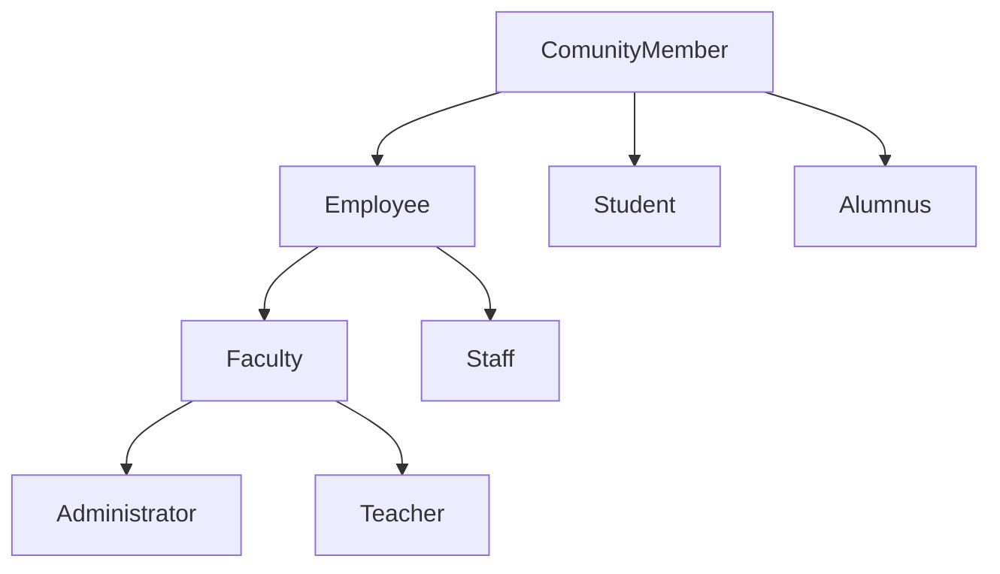
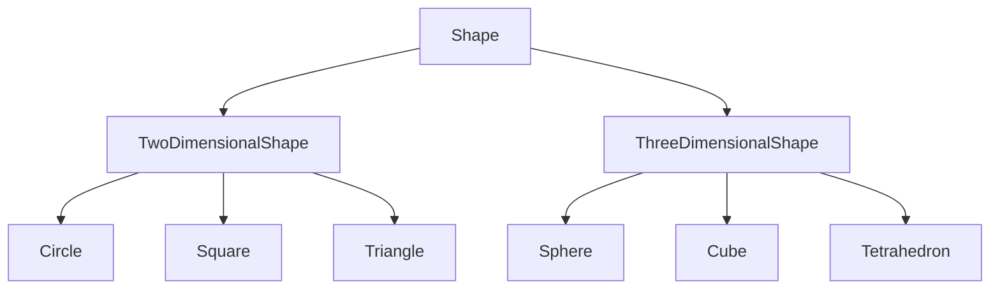
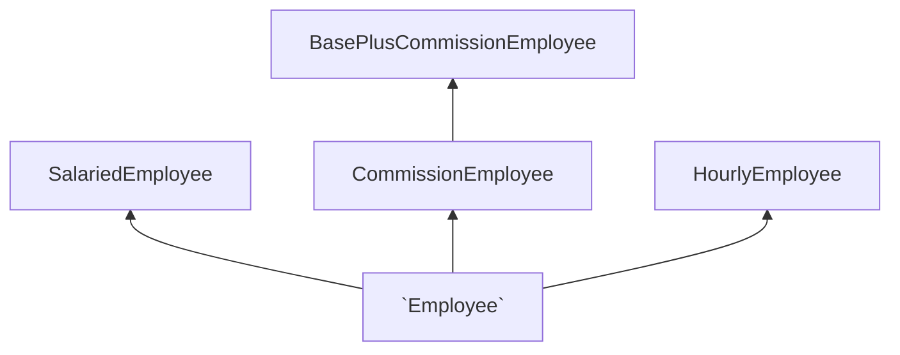

| No. | Topic                                                                                                                                                                   |
| --- | ----------------------------------------------------------------------------------------------------------------------------------------------------------------------- |
| 1   | [Classes and Objects](#classes-and-objects)                                                                                                                             |
| 2   | [Association](#association)                                                                                                                                             |
| 3   | [Composition](#composition)                                                                                                                                             |
| 4   | [Encapsulation](#encapsulation)                                                                                                                                         |
| 5   | [Specialization](#specialization)                                                                                                                                       |
| 6   | [Polymorphism](#polymorphism)                                                                                                                                           |
| 7   | [Defining a Class](#defining-a-class)                                                                                                                                   |
| 8   | [Instantiating Objects](#instantiating-objects)                                                                                                                         |
| 9   | [Classes Versus Objects](#classes-versus-objects)                                                                                                                       |
| 10  | [Access Modifiers](#access-modifiers)                                                                                                                                   |
| 11  | [Access modifer Restrictions](#access-modifer-restrictions)                                                                                                             |
| 12  | [Constructors](#composition)                                                                                                                                            |
| 13  | [The this Keyword](#the-this-keyword)                                                                                                                                   |
| 14  | [Static and Instance Modifiers](#static-and-instance-modifiers)                                                                                                         |
| 15  | [Invoking Static Methods](#invoking-static-methods)                                                                                                                     |
| 16  | [Using Static Fields](#using-static-fields)                                                                                                                             |
| 17  | [Memory Allocation](#memory-allocation)                                                                                                                                 |
| 18  | [Encapsulating Data with Properties](#encapsulating-data-with-properties)                                                                                               |
| 19  | [The get Accessor](#the-get-accessor)                                                                                                                                   |
| 20  | [The set Accessor](#the-set-accessor)                                                                                                                                   |
| 21  | [Class with a Property Rather Than Set and Get Methods](#class-with-a-property-rather-than-set-and-get-methods)                                                         |
| 22  | [Class with an Instance Variable and a Property](#class-with-an-instance-variable-and-a-property)                                                                       |
| 23  | [UML Class Diagram with a Property](#uml-class-diagram-with-a-property)                                                                                                 |
| 24  | [Auto-Implemented Properties](#auto-implemented-properties)                                                                                                             |
| 25  | [Automatic Properties](#automatic-properties)                                                                                                                           |
| 26  | [Garbage Collection and Destructors](#garbage-collection-and-destructors)                                                                                               |
| 27  | [readonly Variables](#readonly-variables)                                                                                                                               |
| 28  | [const Variables](#const-variables)                                                                                                                                     |
| 29  | [Getter-Only Auto-Implemented Properties and readonly](#getter-only-auto-implemented-properties-and-readonly)                                                           |
| 30  | [Object Initializers](#object-initializers)                                                                                                                             |
| 31  | [Operator Overloading](#operator-overloading)                                                                                                                           |
| 32  | [Creating Value Types with struct](#creating-value-types-with-struct)                                                                                                   |
| 33  | [Extension Methods](#extension-methods)                                                                                                                                 |
| 34  | [Base Classes and Derived Classes](#base-classes-and-derived-classes)                                                                                                   |
| 35  | [Protected Members](#protected-members)                                                                                                                                 |
| 36  | [Inheritance Hierarchy Using Private Instance Variables](#inheritance-hierarchy-using-private-instance-variables)                                                       |
| 37  | [Constructors in Derived Classes](#constructors-in-derived-classes)                                                                                                     |
| 38  | [Software Engineering with Inheritance](#software-engineering-with-inheritance)                                                                                         |
| 39  | [Polymorphism Example](#polymorphism-example)                                                                                                                           |
| 40  | [Demonstrating Polymorphic Behavior](#demonstrating-polymorphic-behavior)                                                                                               |
| 41  | [Abstract Classes and Methods](#abstract-classes-and-methods)                                                                                                           |
| 42  | [Case Study: Payroll System Using Polymorphism](#case-study-payroll-system-using-polymorphism)                                                                          |
| 43  | [Creating Abstract Base Class](#creating-abstract-base-class)                                                                                                           |
| 44  | [Summary of the Allowed Assignments Between Base-Class and Derived-Class Variables](#summary-of-the-allowed-assignments-between-base-class-and-derived-class-variables) |
| 45  | [sealed Methods and Classes](#sealed-methods-and-classes)                                                                                                               |
| 46  | [Interfaces](#interfaces)                                                                                                                                               |
| 47  | [Common interfaces of the .NET Framework Class Library](#common-interfaces-of-the-net-framework-class-library)                                                          |

## Classes and Objects

- Object-Oriented Programming Helps to manage complexity of a program
- Well-designed programs are filled with objects
- An object's state is the set of its current values
- An object's capabilities are what actions it can perform
- The object's responsibilities are to be able to know how to perform its own
  action and maintain its own state
- The ability of an object to own responsibility for its own internal state and
  actions is known as encapsulation
- All objects in a program are metaphors for real-world objects
- The process of creating objects is called modeling
- A class defines a new type of thing
- Defines common characteristics of every object
- Defines common behaviours every object can perform
- Acts as a blueprint for a house
- An object is an individual instance of a class
- Objects have unique values for their characteristics
- Is the actual house once constructed
- If Dog was a class, then Fido, Spot and Rover could all be specific objects
  (or instances) of that class

## Association

- The simplest interaction is when a method in one class is used to call a
  method in a second class
- A Manager class may have a method to call the UpdateSalary method on an object
  of type Employee
- The Manager class and the Employee class are then said to be associated
- This relationship is referred to as the uses-a relationship

## Composition

- Some complicated types are composed of other types
- An automobile might be composed of wheels, engine, transmission, etc.
- An Automobile object would have four instances of the Wheel class and one
  instance each of the Engine and Transmission class
- The Automobile class aggregates (or is composed of) the Wheel, Engine and
  Transmission classes
- This relationship is referred to as the has-a relationship

## Encapsulation

- Keep each type or class discrete and self-contained
- Allows the private implementation of the class to be changed without affecting
  any other class
- A class providing a method that other classes can use is called a server
- A class that uses that method is called a client
- The `public` interface is a contract that:
  - Promises to do a specific task if provided with certain parameters and
    `return` a value
  - Allows access to specific values only
  - Clients rely on `public` interfaces not to change

## Specialization

- Implemented through inheritance
- Declares that a new class derives from an existing class
- The specialized (derived) class inherits the characteristics of the more
  general (base) class
- This relationship is referred to as the is-a relationship
  - A Dog is a Mammal
  - A Car is a Vehicle
  - A Manager is a special type of Employee
    - Has new capabilities (hiring, firing) and new characteristics
    - Inherits the characteristics and capabilities common to all Employees

## Polymorphism

- Refers to the ability of a single type or class to take many forms
- Allows a collection of disparate derived types to be treated as a group
- Buttons, listboxes, textboxes, etc, can all be treated as controls
- All inherit shared abilities such as the `Draw()` method
- The `Draw()` method may be implemented differently for each control, but each
  control will be drawn correctly using its own variation of the `Draw()` method

## Defining a Class

- Characteristics are described with member fields
- Hold each object's state
- Behaviours are defined with member methods
  ```cs
  class Dog {
      // Member field
      private int weight;
      private string name;

      // Member method
      public void Bark() {
          // Code here to bark
      }
  }
  ```
- Keywords `public` and `private` are access modifiers
- An OOP language's power is that new types can be created to suit particular
  problems
- A class is a new data type
- Describes attributes or characteristics
- Maintained in fields or member variables
- Describes actions or behaviours
- Maintained in methods or member functions
- A particular instance of a class is an object
- Classes encapsulate the characteristics and capabilities of a type, in a
  single, self-contained unit

- Access modifiers are either `public` or `private` and applies to the class,
  its fields and its methods
- The identifier is the name of the provided class

## Instantiating Objects

- To make an actual instance, or object, of a class, it must be declared and
  memory allocated to it
- These steps instantiate the object:
  ```cs
  Dog fido;         // declare fido to be an instance of Dog
  fido = new Dog(); // allocate memory for fido

  // Or can be combined into one statement
  Dog rover = new Dog();
  ```

## Classes Versus Objects

- Understand the difference between class and object:
  - Compare with the difference between the type `int` and a variable of type
    `int`
  - Can't assign a value to a type: `int = 5; // error`
  - Instead, assign a value to an object of that type:
    `int myInteger; myInteger = 5; // ok`
  - Similarly, can't assign values to fields in a class:
    `Dog.weight = 5; // error`
  - Not every dog is 5 pounds, so assign values to fields in an object:
    `fido.weight = 5; // ok`

## Access Modifiers

- An access modifier determines which class methods (including members of other
  classes) can see and use a member variable or method within a class
- Public methods are part of the class's public interface, defining how this
  class behaves
- Private methods are "helper methods" used by the public methods to accomplish
  the work of the class
- Because the internal workings of the class are private, helper methods should
  not be exposed to other classes

## Access modifer Restrictions

- `public`: No restriction, members are visible to any method of any class.
- `private`: The members in the class are accessible only to methods of the same
  class.

## Constructors

- Whenever an object is instantiated a special method known as a constructor is
  called
- Constructors are provided by the compiler unless one has been defined
  explicitly
- The job of the constructor is to create an instance of the object and put it
  into a valid state
- A default constructor is a constructor with no arguments, whether it has been
  coded or provided by the compiler
- If member variables are not explicitly initialized, the constructor will
  initialize them to default values
- The constructor must be the same name as the class
- Constructors have no return types
  ```cs
  // Constructor for class Box
  public Box(int inWidth, int inHeight, int inLength) {
      width = inWidth;
      height = inHeight;
      length = inLength;
  }
  ```
- Instantiating a Box object:
  ```cs
  Box boxObject = new Box(4, 8, 3);
  ```

## The `this` Keyword

- The keyword `this` refers to the current object instance
- Used to quality instance members that have the same name as parameters:
  ```cs
  public void SomeMethod(int length) {
      this.length = length;
  }
  ```
- `length` refers to the parameter
- `this.length` refers to the member variable
- A second use of the `this` reference is to pass the current object as a
  parameter to another method:
  ```cs
  class SomeClass {
      public void FirstMethod(OtherClass otherObject) {
          otherObject.SecondMethod(this);
      }
  }
  ```
- Uses two classes, `SomeClass` and `OtherClass`
- `FirstMethod()` belongs to `SomeClass`, and `SecondMethod()` belongs to
  `OtherClass`
- Inside `FirstMethod()`, the `SecondMethod()` is invoked, passing in the
  current object for further processing

## Static and Instance Modifiers

- Fields and methods of a class can be either instance members or static members
- Instance members – associated with instances of a type
- Static members – associated with the class itself
- All methods are instance methods unless marked as `static`
- Occasionally it is convenient to invoke a method without having to create an
  instance of that class
- Access a static member through the name of the class, not through an instance
  of the class
- Static methods do not have a this reference

## Invoking Static Methods

- Static methods cannot directly access non-static members
- To call a non-static method of any class, it must be instantiated first
  ```cs
  public class Tester {
      public void Run() {
          Console.WriteLine("Hello World");
      }

      public static void Main() {
          Tester t = new Tester();
          t.Run();
      }
  }
  ```

## Using Static Fields

- A common use of static member fields is to keep track of the number of objects
  that currently exist for a class

```cs
public class Cat {
    // static value for number of Cat objects
    private static int count = 0;
    private int weight;
    private String name;

    // constructor increments the count of Cat objects
    public Cat(String name, int weight) {
        count++;
        this.name = name;
        this.weight = weight;
    }

    //static method to retrieve the count of Cats
    public static void HowManyCats() {
        Console.WriteLine("{0} cats adopted", count);
    }

    public void TellWeight() {
        Console.WriteLine("{0} is {1} pounds", name, weight);
    }
}

public class Tester {
    public void Run() {
        Cat.HowManyCats();

        Cat frisky = new Cat("Frisky", 5);
        frisky.TellWeight();
        Cat.HowManyCats();

        Cat whiskers = new Cat("Whiskers", 7);
        whiskers.TellWeight();
        Cat.HowManyCats();
    }

    static void Main() {
        Tester t = new Tester();
        t.Run();
    }
}
```

## Output:

```console
0 cats adopted
Frisky is 5 pounds
1 cats adopted
Whiskers is 7 pounds
2 cats adopted
```

- There's only one static variable for all Cats

## Memory Allocation

- Variables created within methods are local variables
- Allocated (created) in a memory area called the stack
- When a method ends, local variables are destroyed
- De-allocated (removed) from the stack
- Value types (`int`, `float`) are created in the stack
- Reference types (objects) are created in a memory area called the heap
- When an instance of a reference type is declared, a reference is actually
  created
- A variable that refers to another object
- The reference acts like an alias for the object

## Encapsulating Data with Properties

- Most member variables should be set to `private`
- This aspect of encapsulation enforces data hiding
- Other classes may access these data through properties
- Properties allow other methods (clients) to access the class state as though
  they were accessing them directly
- External classes could read a field but not change it
- The field could accept only values in a certain range

```cs
public class Box {
    // private variables
    private int length;
    private int width;
    private int height;

    // property
    public int Length {
        get {
            return length;
        }
        set {
            length = value;
        }
    }

    // public methods
    public void DisplayBox() {
        Console.WriteLine("Length: {0}, Width: {1}, Height: {2}", length, width, height);
    }

    // constructor
    public Box(int length, int width, int height) {
        this.length = length;
        this.width = width;
        this.height = height;
    }
}

public class Tester {
    public void Run() {
        // create a box for testing and display it
        Box testBox = new Box(3, 5, 7);
        testBox.DisplayBox();

        // access the length, store it in a local variable
        int testLength = testBox.Length;
        Console.WriteLine("Length of box is: {0}", testLength);

        // increment the length
        testLength++;

        // assign the new value to the member variable
        testBox.Length = testLength;

        // display the box again to test the new value
        testBox.DisplayBox();
    }

    public static void Main() {
        Tester t = new Tester();
        t.Run();
    }
}
```

## Output:

```console
Length: 3, Width: 5, Height: 7
Length of box is: 3
Length: 4, Width: 5, Height: 7
```

- Create a property by writing the property type and name
- Within braces, declare the `get` and `set` accessors
- Very similar to methods but are part of the property
- Provides the client with simple ways to retrieve and change the value of the
  private member length
- The `set` accessor has an implicit parameter called value used to set the
  value of the member variable

## The `get` Accessor

- Similar to a class method that returns an object of the type of the property
- Sometimes called a getter
- The `get` accessor is invoked when value is retrieved
- To the client, the local variable `testLength` is assigned the value of the
  `Length` property of `testBox`
- To the creator, the `get` accessor is called which returns the value of the
  `length` member variable
  ```cs
  Box testBox = new Box(3, 5, 7);
  int testLength = testBox.Length;
  ```

## The `set` Accessor

- Sets the value of a property
- Sometimes called setter
- The keyword value is used to represent the argument whose value is assigned to
  the property
- When code assigns a value to the property, the `set` accessor is automatically
  invoked, and the implicit parameter value is set to the value assigned
  ```cs
  testLength++;
  testBox.Length = testLength;
  ```

- Appears to the client as if assigning to a `public` variable
- To the creator, the `set` accessor is used to pass value

## Class with a Property Rather Than Set and Get Methods

- Our class contained a `private` instance variable name and `public` methods
  `SetName` and `GetName`.
- C# provides a more elegant solution—called properties to accomplish the same
  tasks.
- A property encapsulates a `set` accessor for storing a value into a variable
  and a `get` accessor for getting the value of a variable.
- To access a property, you specify the object's name, followed by the
  member-access operator (`.`) and the property's name.
- This notation implicitly executes the property's get accessor.

## Class with an Instance Variable and a Property

- The property's `get` and `set` accessors handle the details of getting and
  setting data, respectively.
- Unlike method names, the accessor names `get` and `set` each begin with a
  **lowercase** letter.
  ```cs
  public string Name;
  ```
- The `Name` property declaration, which specifies that the property is `public`
  so it can be used by the class's clients, the property's type is `string` and
  the property's name is `Name`.
- By convention, a property's identifier is the capitalized identifier of the
  instance variable that it manipulates
- C# is case sensitive, so `Name` and `name` are distinct identifiers.
- The property's body is enclosed in braces `{}`.
- A `get` accessor begins with the keyword `get`, and its body is delimited by
  braces
- A `get` accessor's body contains a `return` statement that typically returns
  the value of an instance variable.
- The property notation `person1.Name` allows the client to think of the
  property as the underlying data, but the client still cannot directly
  manipulate the `private` instance variable name.
- Keyword `get` is a contextual keyword, because it's a keyword only in a
  property's `context` (that is, its body) in other contexts, `get` can be used
  as an identifier.
- A `set` accessor begins with the identifier `set` followed by its body, which
  is delimited by braces.
- A `set` accessor uses the keyword `value` as its parameter.
- `value` is implicitly declared and initialized for you with the value that the
  client code assigns to the property.
- Like `get`, the keywords `set` and `value` are contextual keywords
- `set` is a keyword only in a property's `context`
- `value` is a keyword only in a `set` accessor's `context`

## UML Class Diagram with a Property

- We model C# properties in the UML as attributes.
- A property is followed by the word "property" in guillemets (`«` and `»`).
- Using descriptive words in guillemets (called stereotypes in the UML) helps
  distinguish properties from other attributes and operations.
- The UML indicates the type of a property by placing a `colon` and a type after
  the property name.
- A class diagram helps you design a class, so it's not required to show every
  implementation detail.
- Since an instance variable that's manipulated by a property is really an
  implementation detail of that property, class diagram does not show the
  corresponding instance variable.
- A programmer implementing the class based on a class diagram would create the
  instance variables as part of the implementation process.
- Similarly, a property's `get` and `set` accessors are implementation details,
  so they're not listed in the UML diagram.

## Auto-Implemented Properties

- When a property's `get` accessor simply returns private instance variable
  value and its `set` accessor simply assigns a value to the instance variable
  you can use an auto-implemented property.
- The C# compiler automatically creates a hidden `private` instance variable,
  and the `get` and `set` accessors for getting and setting that hidden instance
  variable.
- This enables you to implement the property trivially, which is handy when
  you're first designing a class.
- To use an auto-implemented property in the class, you'd replace the `private`
  instance variable and the separate property with the following single line of
  code:
  ```cs
  public string Name { get; set; }
  ```
- Initializing an auto-implemented property in its declaration is another C# 6
  feature known as auto-property initializers.
- `Type PropertyName { get; set; } = initializer;`
- Prior to C# 6, auto-implemented properties required both a `get` and a `set`
  accessor.
- C# 6 getter-only auto-implemented properties are read only.
  ```cs
  public string Name { get; }
  ```
- Getter-only auto-implemented properties can be initialized only either in
  their declarations or in all of the type's constructors.
- Type `decimal` is designed to precisely represent numbers with decimal points,
  especially monetary amounts.
- A `decimal` instance variable is initialized to `zero` by default.
- The `decimal` property's `set` accessor performs validation (also known as
  validity checking).
- In `0.0m` the letter `m` (or `M`) indicates that `0.0` is a `decimal` literal.
- The `m` is required to indicate a `decimal` literal.
- C# treats numeric literals with decimal points as type `double` by default,
  and doubles and decimals cannot be intermixed.
- By default, a property's `get` and `set` accessors have the same access as the
  property e.g., a `public` property accessors are public.
- It's possible to declare the `get` and `set` accessors with different access
  modifiers.
- In this case, one of the accessors must implicitly have the same access as the
  property and the other must be explicitly declared with a more restrictive
  access modifier than the property.
- You can specify formatting in a C# 6 string interpolation expression by
  following the value in the braces with a colon and a format specifier:
  `{account1.Balance:C}` uses the format specifier `C` to format
  `account1.Balance` as currency.
- The Windows culture settings on the user's machine determine the format for
  displaying currency amounts, such as the commas vs. periods for separating
  thousands, millions, etc.
- Unlike instance variables, local variables are not initialized by default, so
  they normally must be initialized explicitly.
- `decimal`'s `Parse` method returns the `decimal` value, Each simple type has a
  `Parse` method.

## Automatic Properties

- If there are a lot of `private` member fields in the class, creating accessors
  for all of them repetitive and time-consuming
- If all that is meant to be done is to retrieve or set a `private` member, then
  the shortcut syntax called automatic properties can be used:
  ```cs
  public int Length { get; set; }
  ```

- When using automatic properties, don't also create the `private` members as
  the compiler will do that behind the scenes

## Garbage Collection and Destructors

- The Common Language Runtime (CLR) uses a garbage collector to reclaim the
  memory occupied by objects that are no longer in use.
- When there are no more references to an object, the object becomes eligible
  for destruction.
- Every object has a destructor that's invoked by the garbage collector to
  perform termination housekeeping before its memory is reclaimed.
- A destructor's name is the class name, preceded by a `tilde` (`~`), and it has
  no access modifier in its header.
- After an object's destructor is called, the object becomes eligible for
  garbage collection the memory for the object can be reclaimed by the garbage
  collector.
- Memory leaks are less likely in C# than languages like C and C++ (but some can
  still happen in subtle ways).

## `readonly` Variables

- The principle of least privilege states that code should be granted the amount
  of privilege and access needed to accomplish its designated task, but no more.
- Constants declared with const must be initialized to a constant value when
  they're declared.
- C# provides keyword `readonly` to specify that an instance variable of an
  object is not modifiable and that any attempt to modify it after the object is
  constructed is an error.
- A `readonly` variable's identifier uses PascalCase by convention.
- Although `readonly` instance variables can be initialized when they're
  declared, this isn't required.
- A `readonly` variable should be initialized by each of the class's
  constructors or in the variable's declaration.
- Each constructor can assign values to a `readonly` instance variable multiple
  times the variable doesn't become unmodifiable until after the constructor
  completes execution.
- If a constructor does not initialize the `readonly` variable, the variable
  uses the same default value as any other instance variable.

## `const` Variables

- `const` members must be assigned values at compile time.
- `const` members can be initialized only with other constant values, such as
  integers, string literals, characters and other `const` members.
- Constant members with values that cannot be determined at compile time such as
  constants that are initialized with the result of a method call must be
  declared with keyword `readonly`, so they can be initialized at execution
  time.
- Variables that are `readonly` can be initialized with more complex
  expressions, such as an array initializer or a method call that returns a
  value or a reference to an object.

## Getter-Only Auto-Implemented Properties and readonly

- When an auto-implemented property has only a `get` accessor, the property can
  be used only to read the value, so the compiler implicitly declares the
  corresponding `private` instance variable as `readonly`.
- Getter-only auto-implemented properties can be initialized in their
  declarations or in constructors.

## Object Initializers

- Object initializers allow you to create an object and initialize its `public`
  properties (and `public` instance variables, if any) in the same statement.
- This can be useful when a class does not provide an appropriate constructor to
  meet your needs, but does provide a constructor that can be called with no
  arguments and properties that you can use to set the class's data
- Each property name can appear only once in the object-initializer list.
- The object initializer executes the property initializers in the order in
  which they appear.

## Operator Overloading

- You can create operators that work with objects of your own types via a
  process called operator overloading.
- You can overload most operators.
- Keyword `operator`, followed by an operator symbol (such as `+`), indicates
  that a method overloads the specified operator.
- Overloaded operator methods are required to be `public` and `static`.
- Methods that overload binary operators must take two arguments, the first is
  the `left` operand and the second is the `right` operand.

## Creating Value Types with struct

- C#'s simple numeric types are value types.
- C#'s simple types like `int` and `double` are actually aliases for struct
  types an `int` is defined by the struct `System.Int32`, a `long` by
  `System.Int64`, a `double` by `System.Double` and so on.
- Operator overloading also can be applied to classes.
- When to Declare a struct Type
- Microsoft recommends using classes for most new types, but recommends a struct
  if:
  - the type represents a single value
  - the size of an object is 16 bytes or smaller
- For the complete list of
  [struct recommendations](https://msdn.microsoft.com/library/ms229017)
- Unlike a class, you cannot define a parameterless constructor for a struct.
- The compiler always provides a default constructor that initializes the
  struct's instance variables to their default values.
- structs cannot specify initial values in instance variable or property
  declarations.

## Extension Methods

- You can use extension methods to add functionality to an existing type without
  modifying the type's source code.
- LINQ's capabilities are implemented as extension methods.
- The `this` keyword before a method's first parameter notifies the compiler
  that the method extends an existing class.
- The type of the first parameter specifies the type of object on which you can
  call the extension method.
- Extension methods must be defined as `static` methods in a `static` class.
- A `static` class can contain only `static` members and cannot be instantiated.
- When you call an extension method, you do not provide an argument for the
  first parameter.
- The compiler implicitly passes the object that calls the method as the
  extension method's first argument.
- This allows you to call the extension method as if it were an instance method.
- IntelliSense displays extension methods with the class's instance methods and
  identifies them with a similar icon that also has a down arrow.
- Multiple method calls in the same statement are known as cascaded method
  calls.
- When a method returns an object, you can follow the method call with a member
  access operator (`.`) then call a method on the object that was returned.
- The methods are called from `left` to `right`.
- You can call an extension method via its fully qualified name by using the
  name of the class in which the extension method is defined, followed by the
  member access operator (`.`), the method name and its argument list.
- When using the fully qualified method name, you must specify an argument for
  extension method's first parameter.
- If a type for which you declare an extension method already defines an
  instance method with the same name and a compatible signature, the instance
  method will shadow (i.e., hide) the extension method.
- If a predefined type is later updated to include an instance method that
  shadows an extension method, the compiler does not report any errors and the
  extension method does not appear in IntelliSense.

## Inheritance

- Inheritance allows a new class to absorb an existing class's members.
- A derived class normally adds its own fields and methods to represent a more
  specialized group of objects.
- Inheritance saves time by reusing proven and debugged high-quality software.
- The direct base class is the base class which the derived class explicitly
  inherits.
- An indirect base class is any class above the direct base class in the class
  hierarchy.
- The class hierarchy begins with class object.
- The `is-a` relationship represents inheritance.
- For example, a car is a vehicle, and a truck is a vehicle.
- New classes can inherit from thousands of pre-built classes in class
  libraries.
- A dog is a specialized kind of mammal
- Has characteristics of any mammal (live young, nurses, hair), but specialized
  to the characteristics of Canis domesticus
- A cat is a specialized kind of mammal
- Cats share certain characteristics with dogs that are generalized in mammals,
  but differ in those characteristics that are specialized in Felis domesticus

## Base Classes and Derived Classes

- Note that base classes are "more general", and derived classes are "more
  specific".
- These relationships are hierarchical because they create a relationship tree,
  with specialized types branching off from more generalized types
- Move up the tree towards to generalize
- Move down the tree to specialize
- The UML class diagram below shows an inheritance hierarchy representing a
  university community.
- Each arrow represents an `is-a` relationship.



- Now consider the Shape hierarchy below:
- We can follow the arrows to identify the `is-a` relationships.



- Objects of all classes that extend a common base class can be treated as
  objects of that base class.
- However, base-class objects cannot be treated as objects of their derived
  classes.
- A derived class can customize methods it inherits from its base class.
- In such cases, the derived class can override (redefine) the base-class method
  with an appropriate implementation.

## Protected Members

- A base class's `private` members are inherited by derived classes, but are not
  directly accessible by derived-class methods and properties.
- A base class's `protected` members can be accessed by members of that base
  class and by members of its derived classes, but not by clients of the class.
- A colon (`:`) followed a class name at the end of the class declaration header
  indicates that the class extends the class to the right of the colon.
- Every C# class directly or indirectly inherits object's methods.
- If a class does not specify that it inherits from another class, it implicitly
  inherits from object.
- Declaring instance variables as `private` and providing `public` properties to
  manipulate and validate them helps enforce good software engineering.
- Constructors are not inherited.
- Either explicitly or implicitly, a call to the base-class constructor is made.
- Class object's default (empty) constructor does nothing.
- Even if a class does not have constructors, the default constructor will call
  the base class's default or parameterless constructor.
- Method `ToString` is special it's one of the methods that every class inherits
  directly or indirectly from class object.
- Method `ToString` returns a string representing an object.
- Class object's `ToString` method is primarily a placeholder that typically
  should be overridden by a derived class.
- To override a base-class method, a derived class must declare a method with
  keyword override.
- The method must have the same signature (method name, number of parameters and
  parameter types) and return type as the base-class method.
- Factoring:
- When classes are designed from scratch there are often several classes that do
  the same thing
- When this occurs, these commonalities can be factored out into a shared base
  class which is more general than the specialized classes
- This allows common code to be reused
- Common code is easier to maintain because changes are located in a single
  class instead of being scattered among numerous classes
- Each derived-class constructor must implicitly or explicitly call its
  baseclass constructor to ensure that the instance variables inherited from the
  base class are initialized properly.
- A constructor initializer with keyword `base` invokes the base-class
  constructor.
- The `virtual` and `abstract` keywords indicate that a base-class method can be
  overridden in derived classes.
- The override modifier declares that a derived-class method overrides a virtual
  or `abstract` base-class method.
- This modifier also implicitly declares the derived-class method `virtual`.
- Properties and methods of a derived class cannot directly access private
  members of the base class.
- A derived class can change the state of private base-class fields only through
  non-private methods and properties provided in the base class.
- Declaring private fields in a base class helps you test, debug and correctly
  modify systems.
- If a derived class could access its base class's private fields, classes that
  inherit from that derived class could access the fields as well.
- This would propagate access to what should be private fields, and the benefits
  of information hiding would be lost.

## Inheritance Hierarchy Using Private Instance Variables

- Using `protected` instance variables creates several potential problems.
- The derived-class object can set an inherited variable's value directly
  without validity checking.
- Derived-class methods would need to be written to depend on the base class's
  data implementation.
- You should be able to change the base-class implementation while still
  providing the same services to the derived classes.
- It's a compilation error to override a method with one that has a different
  access modifier.
- Overriding a method with a more restrictive access modifier would break the
  `is-a` relationship.
- If a public method could be overridden as a protected or private method, the
  derived-class objects would not be able to respond to the same method calls as
  base-class objects.
- In particular, once a method is declared in a base class, the method must have
  the same access modifter for all that class's direct and indirect derived
  classes.
- Copying and pasting code from one class to another can spread errors across
  multiple source-code files.
- To avoid duplicating code (and possibly errors) in situations where you want
  one class to "absorb" the members of another class, use inheritance rather
  than the "copy-and-paste" approach.

## Constructors in Derived Classes

- The derived-class constructor, before performing its own tasks, invokes its
  direct base class's constructor.
- This is done either explicitly or implicitly.
- If the base class is derived from another class, the base-class constructor
  invokes the constructor of the next class up in the hierarchy, and so on.
- A compilation error occurs if a derived-class constructor calls one of its
  base-class constructors with arguments that do not match the number and types
  of parameters specified in one of the base-class constructor declarations.

## Software Engineering with Inheritance

- When a new class extends an existing class, the new class inherits the members
  of the existing class.
- We can customize the new class to meet our needs by including additional
  members and by overriding base-class members.
- Independent software vendors (ISVs) can develop and sell proprietary classes.
- Users then can derive new classes from these library classes without accessing
  the source code.
- Effective software reuse improves the software-development process.
- Object-oriented programming facilitates software reuse, potentially shortening
  development time.
- The availability of substantial and useful class libraries helps deliver the
  maximum benefits of software reuse through inheritance.
- With inheritance, the common members of all the classes in the hierarchy are
  declared in a base class.
- When changes are required for these common features, you need to make the
  changes only in the base class-derived classes then inherit the changes.
- Without inheritance, changes would need to be made to all the source-code
  files that contain a copy of the code in question.
- Declaring base-class instance variables private (as opposed to protected)
  enables the base-class implementation of these instance variables to change
  without affecting derived-class implementations.
- When a base-class method is overridden in a derived class, the derived-class
  version often calls the base-class version to do a portion of the work.
- Failure to prefix the base-class method name with the keyword base and the
  member access (`.`) operator when referencing the base class's method from the
  derived-class version causes the derived-class method to call itself, creating
  infinite recur-sion.
- Although inheriting from a class does not require access to the class's source
  code, developers often insist on seeing the source code to understand how the
  class is implemented.
- They may, for example, want to ensure that they're extending a class that
  performs well and is implemented securely.
- At the design stage in an object-oriented system, the designer often finds
  that certain classes are closely related.
- The designer should "factor out" common members and place them in a base
  class.
- Then the designer should use inheritance to develop derived classes,
  specializing them with capabilities beyond those inherited from the base
  class.
- Declaring a derived class does not affect its base class's source code.
- Inheritance preserves the integrity of the base class.

## Polymorphism and Interfaces

- Polymorphism enables you to write apps that process objects that share the
  same base class in a class hierarchy as if they were all objects of the base
  class.
- Polymorphism promotes extensibility.

## Polymorphism Example

- If class Rectangle is derived from class Quadrilateral, then a Rectangle is a
  more specific version of a Quadrilateral.
- Any operation that can be performed on a Quadrilateral object can also be
  performed on a Rectangle object.
- These operations also can be performed on other Quadrilaterals, such as
  Squares, Parallelograms and Trapezoids.
- The polymorphism occurs when an app invokes a method through a base-class
  variable.
- As another example, suppose we design a video game that manipulates objects of
  many different types, including objects of classes Martian, Venusian,
  Plutonian, SpaceShip and LaserBeam.
- Each class inherits from the common base class `SpaceObject`, which contains
  method `Draw`.
- A screen-manager app maintains a collection (e.g., a `SpaceObject` array) of
  references to objects of the various classes.
- To refresh the screen, the screen manager periodically sends each object the
  same message—namely, Draw, while object responds in a unique way.
- Polymorphism promotes extensibility:
  - Software that invokes polymorphic behavior is independent of the object
    types to which messages are sent.
  - New object types that can respond to existing method calls can be
    incorporated into a system without requiring modification of the polymorphic
    system logic.
  - Only client code that instantiates new objects must be modified to
    accommodate new types.

## Demonstrating Polymorphic Behavior

- In a method call on an object, the type of the actual referenced object, not
  the type of the reference, determines which method is called.
- An object of a derived class can be treated as an object of its base class.
- A base-class object is not an object of any of its derived classes.
- The `is-a` relationship applies from a derived class to its direct and
  indirect base classes, but not vice versa.
- The compiler allows the assignment of a base-class reference to a
  derived-class variable if we explicitly cast the base-class reference to the
  derived-class type.
- If an app needs to perform a derived-class-specific operation on a
  derived-class object referenced by a base-class variable, the app must first
  cast the base-class reference to a derived-class reference through a technique
  known as downcasting.
- This enables the app to invoke derived-class methods that are not in the base
  class.
- When the compiler encounters a virtual method call made through a variable,
  the compiler checks the variable's class type to determines if the method can
  be called.
- At execution time, the type of the object to which the variable refers
  determines the actual method to use.
- A base-class variable that contains a reference to a derived-class object and
  is used to call a virtual method actually calls the overriding derived-class
  version of the method.
- An abstract class declares common attributes and behaviors of the various
  classes that inherit from it, either directly or indirectly, in a class
  hierarchy.
- An abstract class typically contains one or more abstract methods or
  properties that concrete derived classes must override.
- The instance variables, concrete methods and concrete properties of an
  abstract class are subject to the normal rules of inheritance.

## Abstract Classes and Methods

- Abstract classes, or abstract base classes cannot be used to instantiate
  objects.
- Abstract base classes are too general to create real objects—they specify only
  what is common among derived classes.
- Classes that can be used to instantiate objects are called concrete classes.
- Concrete classes provide the specifics that make it reasonable to instantiate
  objects.
- An abstract class normally contains one or more abstract methods, which have
  the keyword abstract in their declaration.
- A class that contains abstract methods must be declared as an abstract class
  even if it contains concrete (non-abstract) methods.
- Abstract methods do not provide implementations.
- Abstract property declarations have the form:
  ```cs
  public abstract PropertyType MyProperty { get; set; }
  ```
- An abstract property omits implementations for the get accessor and/or the set
  accessor.
- Concrete derived classes must provide implementations for every accessor
  declared in the abstract property.
- Constructors and static methods cannot be declared abstract or virtual
- We can use abstract base classes to declare variables that can hold references
  to objects of any concrete classes derived from those abstract classes.
- You can use such variables to manipulate derived-class objects polymorphically
  and to invoke static methods declared in those abstract base classes.
- Attempting to instantiate an object of an abstract class is a compilation
  error.
- Failure to implement a base class's abstract methods and properties in a
  derived class is a compilation error unless the derived class is also declared
  abstract.

## Case Study: Payroll System Using Polymorphism

- A company pays its employees on a weekly basis.
- The employees are of four types:
  - Salaried employees are paid a fixed weekly salary regardless of the number
    of hours worked,
  - hourly employees are paid by the hour and receive "time-and-a-half" overtime
    pay for all hours worked in excess of 40 hours,
  - commission employees are paid a percentage of their sales, and
  - salaried-commission employees receive a base salary plus a percentage of
    their sales.
- For the current pay period, the company has decided to reward
  salaried-commission employees by adding 10% to their base salaries.
- The company wants to implement an app that performs its payroll calculations
  polymorphically.
- We use abstract class `Employee` to represent the general concept of an
  employee.
- `SalariedEmployee`, `CommissionEmployee` and `HourlyEmployee` extend
  `Employee`.
- Class `BasePlusCommissionEmployee` which extends `CommissionEmployee`
  represents the last employee type.



## Creating Abstract Base Class

- Class `Employee` provides methods Earnings and ToString, in addition to the
  properties that manipulate `Employee`'s instance variables.
- Each earnings calculation depends on the employee's class, so we declare
  Earnings as abstract.
- The app iterates through the array and calls method Earnings for each
  `Employee` object.
- These method calls are processed polymorphically.
- Each derived class overrides method ToString to create a string representation
  of an object of that class.
- You can avoid a potential InvalidCastException by using the as operator to
  perform a downcast rather than a cast operator.
- If the downcast is invalid, the expression will be null instead of throwing an
  exception.
- Method GetType returns an object of class Type (of namespace System), which
  contains information about the object's type, including its class name, the
  names of its methods, and the name of its base class.
- The Type class's ToString method returns the class name.
- Assigning a base-class variable to a derived-class variable (without an
  explicit downcast) is a compilation error.
- If at execution time the reference to a derived-class object has been assigned
  to a variable of one of its direct or indirect base classes, it's acceptable
  to cast the reference stored in that base-class variable back to a reference
  of the derived-class type.
- Before performing such a cast, use the is operator to ensure that the object
  is indeed an object of an appropriate derived-class type.

## Summary of the Allowed Assignments Between Base-Class and Derived-Class Variables

- Assigning a base-class reference to a base-class variable is straightforward.
- Assigning a derived-class reference to a derived-class variable is
  straightforward.
- Assigning a derived-class reference to a base-class variable is safe, because
  the derived-class object is an object of its base class.
- However, this reference can be used to refer only to base-class members.
- Attempting to assign a base-class reference to a derived-class variable is a
  compilation error.
- To avoid this error, the base-class reference must be cast to a derived-class
  type explicitly.

## sealed Methods and Classes

- A method declared sealed in a base class cannot be overridden in a derived
  class.
- Methods that are declared private are implicitly sealed.
- Methods that are declared static also are implicitly sealed, because static
  methods cannot be overridden either.
- A derived-class method declared both override and sealed can override a
  base-class method, but cannot be overridden in classes further down the
  inheritance hierarchy.
- Calls to sealed methods (and non-virtual methods) are resolved at compile
  time—this is known as static binding.
- A class that is declared sealed cannot be a base class (i.e., a class cannot
  extend a sealed class).
- All methods in a sealed class are implicitly sealed.
- Class string is a sealed class
- This class cannot be extended, so apps that use strings can rely on the
  functionality of string objects as specified in the Framework Class Library.
- The compiler can decide to inline a sealed method call and will do so for
  small, simple sealed methods.
- Inlin-ing does not violate encapsulation or information hiding, but does
  improve performance, because it eliminates the overhead of making a method
  call.
- Attempting to declare a derived class of a sealed class is a compilation
  error.
- It's a compilation error to explicitly declare an interface member public or
  abstract, because they're redundant in interface-member declarations.
- It's also a compilation error to specify in an interface any implementation
  details, such as concrete method declarations.

## Interfaces

- Interfaces define and standardize the ways in which people and systems can
  interact with one another.
- A C# interface describes a set of methods that can be called on an object to
  tell it, for example, to perform some task or return some piece of
  information.
- An interface declaration begins with the keyword interface and can contain
  only abstract methods, abstract properties, abstract indexers and abstract
  events
- All interface members are implicitly declared public and abstract.
- An interface can extend one or more other interfaces to create a more
  elaborate interface that other classes can implement.
- To use an interface, a class must specify that it implements the interface by
  listing the interface after the colon (`:`) in the class declaration.
- A concrete class implementing an interface must declare each member of the
  interface with the signature specified in the interface declaration.
- A class that implements an interface but does not implement all its members is
  an abstract class it must be declared abstract and must contain an abstract
  declaration for each unimplemented member of the interface.
- An interface is typically used when unrelated classes need to share common
  methods so that they can be processed polymorphically
- You can create an interface that describes the desired functionality, then
  implement this interface in any classes requiring that functionality.
- An interface often is used in place of an abstract class when there is no
  default implementation to inherit that is, no fields and no default method
  implementations.
- Like abstract classes, interfaces are typically public types, so they are
  normally declared in files by themselves with the same name as the interface
  and the .cs file-name extension.
- Failing to define or declare any member of an interface in a class that
  implements the interface results in a compilation error.
- By convention, the name of an interface begins with `I` (e.g., IPayable).
- This helps distinguish interfaces from classes, improving code readability.
- When declaring a method in an interface, choose a name that describes the
  method's purpose in a general manner, because the method may be implemented by
  a broad range of unrelated classes.
- C# does not allow derived classes to inherit from more than one base class,
  but it does allow a class to inherit from a base class and implement any
  number of interfaces.
- Inheritance and interfaces are similar in their implementation of the `is-a`
  relationship.
- An object of a class that implements an interface may be thought of as an
  object of that interface type.
- An object of any derived classes of a class that implements an interface also
  can be thought of as an object of the interface type.
- The `is-a` relationship that exists between base classes and derived classes,
  and between interfaces and the classes that implement them, holds when passing
  an object to a method.
- When a method parameter receives an argument of a base class or interface
  type, the method polymorphically processes the object received as an argument.
- All methods of class object can be called by using a reference of an interface
  type, the reference refers to an object, and all objects inherit the methods
  of class object.

## Common interfaces of the .NET Framework Class Library.

1. **IComparable**

- C# contains several comparison operators (e.g., <, <=, >, >=, ==, !=) that
  allow you to compare simple-type values
- Interface `IComparable` can be used to allow objects of a class that
  implements the interface to be compared to one another
- The interface contains one method, `CompareTo`, which compares the object that
  calls the method to the object passed as an argument
- Classes must implement `CompareTo` to return a value indicating whether the
  obiect on which it's invoked is less than (negative integer return value),
  equal to (0 return value) or greater than (positive integer return value) the
  object passed as an argument, using any criteria you specify
- For example, if class `Employee` implements ICompara-ble, its `CompareTo`
  method could compare `Employee` objects by their earnings amounts
- Interface `IComparable` is commonly used for ordering objects in a collection
  such as an array.

2. **IComponent**

- Implemented by any class that represents a component, including Graphical User
  Interface (GUI) controls (such as buttons or labels)
- Interface `IComponent` defines the behaviors that components must implement.

3. **IDisposable**

- Implemented by classes that must provide an explicit mechanism for releasing
  resources
- Some resources can be used by only one program at a time
- In addition, some resources, such as files on disk, are unmanaged resources
  that, unlike memory, cannot be released by the garbage collector
- Classes that implement interface `IDisposable` provide a Dispose method that
  can be called to explicitly release resources that are explicitly associated
  with an object.

4. **IEnumerator**

- Used for iterating through the elements of a collection (such as an array or a
  List) one element at a time the `foreach` statement uses an `IEnumerator`
  object to iterate through elements
- Interface `IEnumerator` contains method `MoveNext` to move to the next element
  in a collection, method `Reset` to move to the position before the first
  element and property Current to return the object at the current location.
