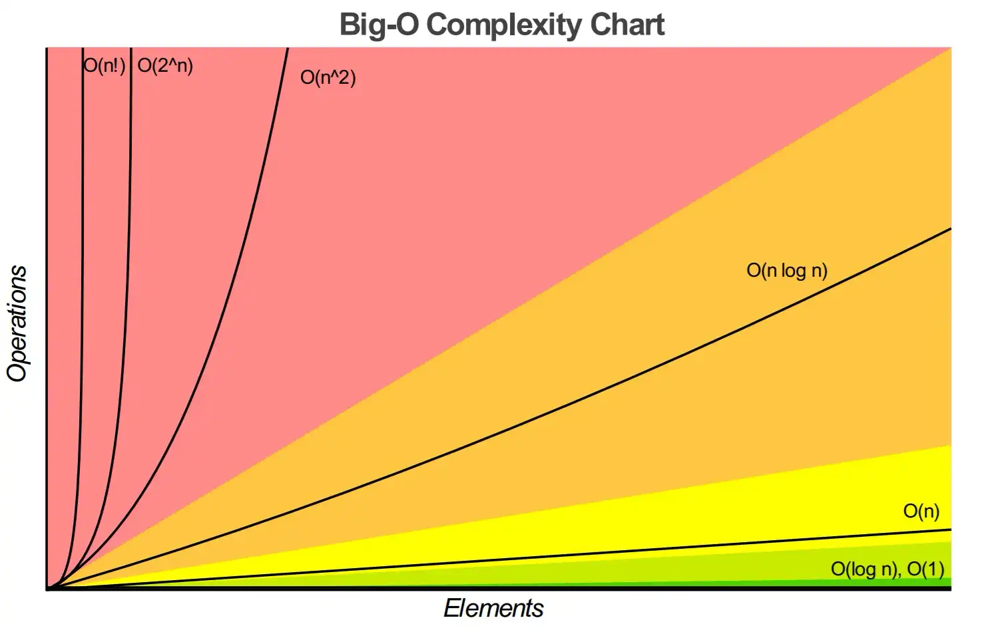

| No. | Topic                                                                                             |
| --- | ------------------------------------------------------------------------------------------------- |
| 1   | [Searching and Sorting](#searching-and-sorting)                                                   |
| 2   | [Linear Search](#linear-search)                                                                   |
| 3   | [Efficiency of Linear Search](#efficiency-of-linear-search)                                       |
| 4   | [Constant Runtime](#constant-runtime)                                                             |
| 5   | [Linear Runtime](#linear-runtime)                                                                 |
| 6   | [Quadratic Runtime](#quadratic-runtime)                                                           |
| 7   | [Linear Search Runtime](#linear-search-runtime)                                                   |
| 8   | [Binary Search](#binary-search)                                                                   |
| 9   | [Efficiency of Binary Search](#efficiency-of-binary-search)                                       |
| 10  | [Sorting Algorithms](#sorting-algorithms)                                                         |
| 11  | [Selection Sort](#selection-sort)                                                                 |
| 12  | [Insertion Sort](#insertion-sort)                                                                 |
| 13  | [Merge Sort](#merge-sort)                                                                         |
| 14  | [Efficiency of Searching and Sorting Algorithms](#efficiency-of-searching-and-sorting-algorithms) |

# Searching and Sorting

- Searching data involves determining whether a value (referred to as the search
  key) is present in the data and, if so, finding the value's location.
- Two popular search algorithms are the simple linear search and the faster, but
  more complex, binary search.
- Sorting places data in order, based on one or more sort keys.

## Linear Search

- The linear search algorithm searches each element in an array sequentially.
- If the search key does not match an element in the array, the algorithm tests
  each element and, when the end of the array is reached, informs the user that
  the search key is not present.
- If the search key is in the array, the algorithm tests each element until it
  finds one that matches the search key and returns the index of that element.
- As an example, consider an array containing $ 34, 56, 2, 10, 77, 51, 93, 30,
  5, 52` and a method that is searching for 51.
- Using the linear search algorithm, the method first checks whether 34 matches
  the search key.
- It does not, so the algorithm checks whether 56 matches the search key.
- The method continues moving through the array sequentially, testing 2, then
  10, then 77.
- When the method tests 51, which matches the search key, the method returns the
  index 5, which is the location of 51 in the array.
- If, after checking every array element, the method determines that the search
  key does not match any element in the array, the method returns -1.
- If there are duplicate values in the array, linear search returns the index of
  the first element in the array that matches the search key.

## Efficiency of Linear Search

- Searching algorithms all accomplish the same goal, finding an element that
  matches a given search key, if such an element exists.
- Many things, however, differentiate search algorithms from one another.
- The major difference is the amount of effort required to complete the search.
- One way to describe this effort is with Big O notation, which is a measure of
  the worst-case runtime for an algorithm, that is, how hard an algorithm may
  have to work to solve a problem.
- For searching and sorting algorithms, this is particularly dependent on how
  many elements there are in the data set and the algorithm used.

## Constant Runtime

- Suppose an algorithm is designed to test whether the first element of an array
  is equal to the second element.
- If the array has 10 elements, this algorithm requires one comparison.
- If the array has 1,000 elements, this algorithm still requires one comparison.
- In fact, this algorithm is completely independent of the number of elements in
  the array, and is thus said to have a constant runtime, which is represented
  in Big O notation as O(1).
- An algorithm that is O(1) does not necessarily require only one comparison.
- O(1) just means that the number of comparisons is constant, it does not grow
  as the size of the array increases.
- An algorithm that tests whether the first element of an array is equal to any
  of the next three elements is still O(1), even though it requires three
  comparisons.

## Linear Runtime

- An algorithm that tests whether the first element of an array is equal to any
  of the other elements of the array will require at most n–1 comparisons, where
  n is the number of elements in the array.
- If the array has 10 elements, this algorithm requires up to nine comparisons.
- If the array has 1,000 elements, this algorithm requires up to 999
  comparisons.
- As n grows larger, the n part of the expression dominates, and subtracting one
  becomes inconsequential.
- Big O is designed to highlight these dominant terms and ignore terms that
  become unimportant as n grows.
- For this reason, an algorithm that requires a total of n–1 comparisons (such
  as the one we described earlier) is said to be $O(n)$.
- An O(n) algorithm is referred to as having a linear runtime.
- O(n) is often pronounced "on the order of n" or more simply "order n."

## Quadratic Runtime

- Now suppose you have an algorithm that tests whether any element of an array
  is duplicated elsewhere in the array.
- The first element must be compared with every other element in the array.
- The second element must be compared with every other element except the first
  (it was already compared to the first).
- The third element must be compared with every other element except the first
  two.
- In the end, this algorithm will end up making $(n – 1) + (n – 2) + \cdots +
  2 + 1$ or $(n^2 \div 2) - (n \div 2)$ comparisons.
- As n increases, the $n^2$ term dominates and the n term becomes
  inconsequential.
- Again, $Big O$ notation highlights the $n^2$ term, leaving $n^2/2$.
- But as we'll soon see, constant factors are omitted in $Big O$ notation.
- $Big O$ is concerned with how an algorithm's runtime grows in relation to the
  number of items processed.
- Suppose an algorithm requires $n^2$ comparisons.
- With four elements, the algorithm will require 16 comparisons; with eight
  elements, the algorithm will require 64 comparisons.
- With this algorithm, doubling the number of elements quadruples the number of
  comparisons.
- Consider a similar algorithm requiring $n^2/2$ comparisons.
- With four elements, the algorithm will require eight comparisons; with eight
  elements, 32 comparisons.
- Again, doubling the number of elements quadruples the number of comparisons.
- Both of these algorithms grow as the square of n, so $Big O$ ignores the
  constant, and both algorithms are considered to be $O(n^2)$, referred to as
  quadratic runtime and pronounced "on the order of n-squared" or more simply
  "order n-squared."
- When n is small, $O(n^2)$ algorithms (running on today's
  billions-of-operations-persecond personal computers) will not noticeably
  affect performance.
- But as n grows, you'll start to notice the performance degradation.
- An $O(n^2)$ algorithm running on a million-element array would require a
  trillion "operations" (where each could actually require several machine
  instructions to execute).
- This could require many minutes to execute.
- A billion-element array would require a quintillion operations, a number so
  large that the algorithm could take decades!
- $O(n^2)$ algorithms are easy to write, as you'll see shortly.
- You'll also see algorithms with more favorable $Big O$ measures.
- These efficient algorithms often take more cleverness and effort to create,
  but their superior performance can be well worth the extra effort, especially
  as n gets large.

## Linear Search Runtime

- The linear search algorithm runs in O(n) time.
- The worst case in this algorithm is that every element must be checked to
  determine whether the search item exists in the array.
- If the size of the array is doubled, the number of comparisons that the
  algorithm must perform is also doubled.
- Linear search can provide outstanding performance if the element matching the
  search key happens to be at or near the front of the array.
- But we seek algorithms that perform well, on average, across all searches,
  including those where the element matching the search key is near the end of
  the array.
- Linear search is the easiest search algorithm to program, but it can be slow
  compared to other search algorithms.
- If an app needs to perform many searches on large arrays, it may be better to
  implement a different, more efficient algorithm, such as the binary search,
  which we present in the next section.
- Sometimes the simplest algorithms perform poorly.
- Their virtue is that they're easy to program, test and debug.
- Sometimes more complex algorithms are required to realize maximum performance.

## Binary Search

- The binary search algorithm is more efficient than the linear search
  algorithm, but it requires that the array first be sorted.
- The first iteration of this algorithm tests the middle element in the array.
- If this matches the search key, the algorithm ends.
- Assuming the array is sorted in ascending order, if the search key is less
  than the middle element, the search key cannot match any element in the second
  half of the array and the algorithm continues with only the first half of the
  array (i.e., the first element up to, but not including, the middle element).
- If the search key is greater than the middle element, the search key cannot
  match any element in the first half of the array, and the algorithm continues
  with only the second half of the array (i.e., the element after the middle
  element through the last element).
- Each iteration tests the middle value of the remaining portion of the array,
  called a subarray.
- A subarray can have no elements, or it can encompass the entire array.
- If the search key does not match the element, the algorithm eliminates half of
  the remaining elements.
- The algorithm ends by either finding an element that matches the search key or
  reducing the subarray to zero size.
- As an example, consider the sorted 15-element array
  `2 3 5 10 27 30 34 51 56 65 77 81 82 93 99` and a search key of 65.
- An app implementing the binary search algorithm would first check whether 51
  is the search key (because 51 is the middle element of the array).
- The search key (65) is larger than 51, so 51 is "discarded" (i.e., eliminated
  from consideration) along with the first half of the array (all elements
  smaller than 51).
- Next, the algorithm checks whether 81 (the middle element of the remainder of
  the array) matches the search key.
- The search key (65) is smaller than 81, so 81 is discarded along with the
  elements larger than 81.
- After just two tests, the algorithm has narrowed the number of values to check
  to three (56, 65 and 77).
- The algorithm then checks 65 (which indeed matches the search key) and returns
  the index of the array element containing 65.
- This algorithm required just three comparisons to determine whether the search
  key matched an element of the array.
- Using a linear search algorithm would have required 10 comparisons.
- In this example, we have chosen to use an array with 15 elements so that there
  will always be an obvious middle element in the array.
- With an even number of elements, the middle of the array lies between two
  elements.
- We implement the algorithm to choose the higher of the two elements.
- Recall that the binary search algorithm works only on sorted arrays.
- Loop until the user enters -1.
- For each other number the user enters, the app performs a binary search to
  determine whether the number matches an element in the array.
- The first line of output from this app is the array of ints, in increasing
  order.
- When the user instructs the app to search for 72, the app first tests the
  middle element (indicated by `*` in the sample output), which is 52.
- The search key is greater than 52, so the app eliminates from consideration
  the first half of the array and tests the middle element from the second half.
- The search key is smaller than 82, so the app eliminates from consideration
  the second half of the subarray, leaving only three elements.
- Finally, the app checks 72 (which matches the search key) and returns the
  index 9.

## Efficiency of Binary Search

- In the worst-case scenario, searching a sorted array of 1,023 elements will
  take only 10 comparisons when using a binary search.
- Repeatedly dividing 1,023 by 2 (because after each comparison, we are able to
  eliminate half of the array) and rounding down (because we also remove the
  middle element) yields the values $ 511, 255, 127, 63, 31, 15, 7, 3, 1, 0 $.
- The number 1023 (210 – 1) is divided by 2 only 10 times to get the value 0,
  which indicates that there are no more elements to test.
- Dividing by 2 is equivalent to one comparison in the binary search algorithm.
- Thus, an array of 1,048,575 (220 – 1) elements takes a maximum of 20
  comparisons to find the key, and an array of one billion elements (which is
  less than 230 – 1) takes a maximum of 30 comparisons to find the key.
- This is a tremendous improvement in performance over the linear search.
- The maximum number of comparisons needed for the binary search of any sorted
  array is the exponent of the first power of 2 greater than the number of
  elements in the array, which is represented as $log_2(n)$.
- All logarithms grow at roughly the same rate, so in $Big O$ notation the base
  can be omitted.
- This results in a $Big O$ of $O(log(n))$ for a binary search, which is also
  known as logarithmic runtime.

## Sorting Algorithms

- Sorting data (i.e., placing the data in some particular order, such as
  ascending or descending) is one of the most important computing applications.
- Virtually every organization must sort some data often, massive amounts of it.
- Sorting data is an intriguing, compute-intensive problem that has attracted
  substantial research efforts.
- It's important to understand about sorting that the end result—the sorted
  array will be the same no matter which (correct) algorithm you use to sort the
  array.
- The choice of algorithm affects only the runtime and memory use of the app.
- The rest of the chapter introduces three common sorting algorithms.
- The first two—selection sort and insertion sort are simple to program, but
  inefficient.
- The last—merge sort—is much faster than selection sort and insertion sort but
  more difficult to program. We focus on sorting arrays of simple-type data,
  namely ints.
- It's possible to sort arrays of objects as well.

## Selection Sort

- Selection sort is a simple, but inefficient, sorting algorithm.
- The first iteration of the algorithm selects the smallest element in the array
  and swaps it with the first element.
- The second iteration selects the second-smallest element (which is the
  smallest of the remaining elements) and swaps it with the second element.
- The algorithm continues until the last iteration selects the second-largest
  element and, if necessary, swaps it with the second-to-last element, leaving
  the largest element in the last position.
- After the ith iteration, the smallest i elements of the array will be sorted
  in increasing order in the first i positions of the array.
- As an example, consider the array `34 56 4 10 77 51 93 30 5 52`
- An app that implements selection sort first determines the smallest element
  (4) of this array, which is contained in index 2 (i.e., position 3).
- The app swaps 4 with 34, resulting in `4 56 34 10 77 51 93 30 5 52`
- The app then determines the smallest value of the remaining elements (all
  elements except 4), which is 5, contained in index 8.
- The app swaps 5 with 56, resulting in `4 5 34 10 77 51 93 30 56 52`
- On the third iteration, the app determines the next smallest value (10) and
  swaps it with 34.
- `4 5 10 34 77 51 93 30 56`
- The process continues until the array is fully sorted.
- `4 5 10 30 34 51 52 56 77 93`
- After the first iteration, the smallest element is in the first position.
- After the second iteration, the two smallest elements are in order in the
  first two positions.
- After the third iteration, the three smallest elements are in order in the
  first three positions.
- Line 22 calls method SelectionSort, which sorts the elements using selection
  sort.
- The output uses dashes to indicate the portion of the array that is sorted
  after each pass.
- An asterisk is placed next to the position of the element that was swapped
  with the smallest element on that pass.
- On each pass, the element next to the asterisk and the element above the
  rightmost set of dashes were the two values that were swapped.

## Insertion Sort

- Insertion sort is another simple, but inefficient, sorting algorithm.
- Its first iteration takes the second element in the array and, if it's less
  than the first, swaps them.
- The second iteration looks at the third element and inserts it in the correct
  position with respect to the first two elements (moving them as necessary), so
  all three elements are in order.
- At the ith iteration of this algorithm, the first i elements in the original
  array will be sorted.
- Consider as an example the following array, which is identical to the array we
  used in the discussions of selection sort and merge sort.
- `34 56 4 10 77 51 93 30 5 52`
- An app that implements the insertion sort algorithm first looks at the first
  two elements of the array, 34 and 56.
- These are already in order, so the app continues (if they were out of order,
  it would swap them).
- In the next iteration, the app looks at the third value, 4.
- This value is less than 56, so the app stores 4 in a temporary variable and
  moves 56 one element to the right.
- The app then checks and determines that 4 is less than 34, so it moves 34 one
  element to the right.
- The app has now reached the beginning of the array, so it places 4 in the
  zeroth position.
- The array now is `4 34 56 10 77 51 93 30 5 52`
- In the next iteration, the app stores the value 10 in a temporary variable.
- Then the app compares 10 to 56 and moves 56 one element to the right because
  it's larger than 10.
- The app then compares 10 to 34, moving 34 one element to the right. When the
  app compares 10 to 4, it observes that 10 is larger than 4 and places 10 in
  element 1.
- The array now is `4 10 34 56 77 51 93 30 5 52`
- Using this algorithm, at the ith iteration, the original array's first i
  elements are sorted, but they may not be in their final locations, smaller
  values may be located later in the array.

## Merge Sort

- Merge sort is an efficient sorting algorithm but is conceptually more complex
  than selection sort and insertion sort.
- The merge sort algorithm sorts an array by splitting it into two equalsized
  subarrays, sorting each subarray and merging them in one larger array.
- With an odd number of elements, the algorithm creates the two subarrays such
  that one has one more element than the other.
- The implementation of merge sort in this example is recursive. The base case
  is an array with one element.
- A one-element array is, of course, sorted, so merge sort immediately returns
  when it's called with a one-element array.
- The recursion step splits an array in two approximately equal-length pieces,
  recursively sorts them and merges the two sorted arrays in one larger, sorted
  array.
- Suppose the algorithm has already merged smaller arrays to create sorted
  arrays
- A: [4 10 34 56 77] and, B: [5 30 51 52 93]
- Merge sort combines these two arrays in one larger, sorted array.
- The smallest element in A is 4 (located in the zeroth element of A).
- The smallest element in B is 5 (located in the zeroth element of B).
- In order to determine the smallest element in the larger array, the algorithm
  compares 4 and 5.
- The value from A is smaller, so 4 becomes the first element in the merged
  array.
- The algorithm continues by comparing 10 (the second element in A) to 5 (the
  first element in B).
- The value from B is smaller, so 5 becomes the second element in the larger
  array.
- The algorithm continues by comparing 10 to 30, with 10 becoming the third
  element in the array, and so on.
- As you may have noticed, the key to achieving the high efficiency of the merge
  sort is cleverly using additional memory.
- This is another example of the spaceltime trade-off if you have more space you
  can get your algorithm to run in less time and if you have less space your
  algorithm may require more time.
- In industry, you might create apps for memory constrained devices, which might
  prevent you from using the merge sort algorithm.

# Efficiency of Algorithms

## Searching algorithms with Big O values.

| Searching Algorithms    |            $Big O$             |
| ----------------------- | :----------------------------: |
| Linear Search           |     $\color{yellow} O(n)$      |
| Binary Search           | $\color{lightgreen} O(log(n))$ |
| Recursive Linear Search |     $\color{yellow} O(n)$      |
| Recursive Binary Search | $\color{lightgreen} O(log(n))$ |

## Number of comparisons for common Big O notations.

|             $n$ | $\color{lightgreen} O(log(n))$ | $\color{orange} O(n \cdot log(n))$ | $\color{salmon} O(n^2)$ |
| --------------: | -----------------------------: | ---------------------------------: | ----------------------: |
|             $1$ |                            $0$ |                                $1$ |                     $0$ |
|             $2$ |                            $1$ |                                $2$ |                     $2$ |
|             $3$ |                            $1$ |                                $3$ |                     $3$ |
|             $4$ |                            $1$ |                                $4$ |                     $4$ |
|             $5$ |                            $1$ |                                $5$ |                     $5$ |
|            $10$ |                            $1$ |                               $10$ |                    $10$ |
|           $100$ |                            $2$ |                              $100$ |                   $200$ |
|         $1,000$ |                            $3$ |                            $1,000$ |                  $3000$ |
|     $1,000,000$ |                            $6$ |                        $1,000,000$ |             $6,000,000$ |
| $1,000,000,000$ |                            $9$ |                    $1,000,000,000$ |         $9,000,000,000$ |

## Array Sorting Algorithms

| Algorithm          |                                    |          Time Complexity           |                                    |        Space Complexity        |
| ------------------ | :--------------------------------: | :--------------------------------: | :--------------------------------: | :----------------------------: |
|                    |              **Best**              |            **Average**             |             **Worst**              |           **Worst**            |
| **Quicksort**      | $\color{orange} O(n \cdot log(n) $ | $\color{orange} O(n \cdot log(n))$ |      $\color{salmon} O(n^2)$       | $\color{lightgreen} O(log(n))$ |
| **Mergesort**      | $\color{orange} O(n \cdot log(n) $ | $\color{orange} O(n \cdot log(n))$ | $\color{orange} O(n \cdot log(n))$ |     $\color{yellow} O(n)$      |
| **Timsort**        |       $\color{yellow} O(n)$        | $\color{orange} O(n \cdot log(n))$ | $\color{orange} O(n \cdot log(n))$ |     $\color{yellow} O(n)$      |
| **Heapsort**       | $\color{orange} O(n \cdot log(n) $ | $\color{orange} O(n \cdot log(n))$ | $\color{orange} O(n \cdot log(n))$ |      $\color{green} O(1)$      |
| **Bubble Sort**    |       $\color{yellow} O(n)$        |      $\color{salmon} O(n^2)$       |      $\color{salmon} O(n^2)$       |      $\color{green} O(1)$      |
| **Insertion Sort** |       $\color{yellow} O(n)$        |      $\color{salmon} O(n^2)$       |      $\color{salmon} O(n^2)$       |      $\color{green} O(1)$      |
| **Selection Sort** |      $\color{salmon} O(n^2)$       |      $\color{salmon} O(n^2)$       |      $\color{salmon} O(n^2)$       |      $\color{green} O(1)$      |
| **Tree Sort**      | $\color{orange} O(n \cdot log(n) $ | $\color{orange} O(n \cdot log(n))$ |      $\color{salmon} O(n^2)$       |     $\color{yellow} O(n)$      |
| **Shell Sort**     | $\color{orange} O(n \cdot log(n) $ |  $\color{salmon} O(n(log(n))^2)$   |  $\color{salmon} O(n(log(n))^2)$   |      $\color{green} O(1)$      |
| **Bucket Sort**    |       $\color{green} O(n+k)$       |       $\color{green} O(n+k)$       |      $\color{salmon} O(n^2)$       |     $\color{yellow} O(n)$      |
| **Radix Sort**     |    $\color{green} O(n \cdot k)$    |    $\color{green} O(n \cdot k)$    |    $\color{green} O(n \cdot k)$    |    $\color{yellow} O(n+k)$     |
| **Counting Sort**  |       $\color{green} O(n+k)$       |       $\color{green} O(n+k)$       |       $\color{green} O(n+k)$       |     $\color{yellow} O(k)$      |
| **Cubesort**       |       $\color{yellow} O(n)$        | $\color{orange} O(n \cdot log(n))$ | $\color{orange} O(n \cdot log(n))$ |     $\color{yellow} O(n)$      |

## Legends: $\text{ { \color{salmon} Horrible } { \color{orange} Bad } { \color{yellow} Fair } { \color{lightgreen} Good } { \color{green} Excellent } }$

