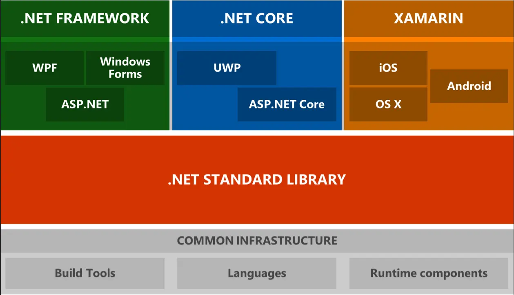
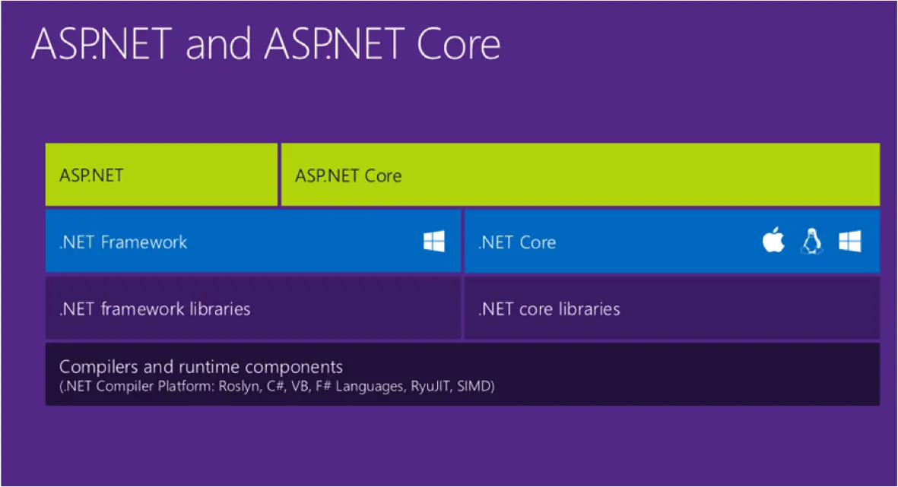

## What is ASP?

- Active Server Pages released by Microsoft in 1996
- A technology for generating dynamic web pages
- A mixture of HTML tags, ASP tags and VBscript
- Pages were interpreted at run time and HTML was rendered and delivered to
  client
- Often referred to as “Classic” ASP
- With any luck, you will never encounter it

## What is ASP.NET?

- A complete re-design, released in 2002
- Advantages over Classic ASP:
  - Makes use of .NET Framework
  - UI/Code separation via code-behind files
  - High performance (code is compiled)
  - Powerful new controls (Data, Client-side validation, and more)
  - Powerful IDE integration
  - Same toolset as Windows Forms development

## What is ASP.Net Core?

- Open source, cross platform framework released in 2016
  - Can develop and run on Windows, macOS or Linux
- Architected for testability
- Higher performance than ASP.NET
- More “modern” approach to web development
- The future of .NET web development

## ASP.NET Version History and Roadmap

- ASP.NET 1.0 – 2002
- ASP.NET 1.1 – 2003
- ASP.NET 2.0 – 2005
  - Master pages (Templates)
- ASP.NET 3.0 – 2006
- ASP.NET 3.5 – 2007
  - LINQ
  - ASP.NET AJAX
- ASP.NET 4.0 – 2010
- ASP.NET 4.5 – 2012
  - MVC
- ASP.NET 4.6 – 2015
- ~~ASP.NET 5.0~~ ASP.NET Core 1.0 – 2016
- ASP.NET Core 1.1 – 2016
- ASP.NET 4.7 – 2017
- ASP.NET Core 2.0 – 2017
- ASP.NET Core 2.1 – 2018
- ASP.NET Core 2.2 – 2018
- ASP.NET 4.8 – 2019
  - Last version with full .NET Framework
- ASP.NET Core 3.0 – 2019
- ASP.NET Core 3.1 – 2019 – LTS (Long Term Support)
- ASP.NET 5.0 – 2020
- ASP.NET 6.0 – 2021 – LTS
- ASP.NET 7.0 – 2022
- ASP.NET 8.0 – 2023 – LTS

## .NET Standard

- The .NET Standard is a formal specification of .NET APIs that are intended to
  be available on all .NET implementations
- The motivation behind the .NET Standard is establishing greater uniformity in
  the .NET ecosystem
- [.NET Standard](https://docs.microsoft.com/en-us/dotnet/standard/net-standard)

## ASP.NET Framework

- Collection of technologies
- ASP.NET is not a language, it is a framework to develop web applications and
  web - services
- Many supported languages and tools, main languages include C#, VB.NET and
  JavaScript
- Mature and considered feature complete

## ASP.NET Core

- Newer, portable version of ASP.NET that also runs on Linux and macOS
- Some features of ASP.NET were not brought forward to ASP.NET Core
- WebForms, WCF, and more
- All future development will take place here

## Mono/Xamarin

- Mono is an open-source project to create a .NET Framework-compatible software
  framework, initially released in 2004
- Mono’s goal is to be able to run Microsoft .NET applications cross-platform
  and bring better development tools to Linux developers
- Mono can be run on Android, most Linux distributions, BSD, macOS, Windows,
  Solaris, PlayStation, Wii and Xbox
- Mono was initially developed by Ximian
- In 2011 all Ximian staff working on Mono were laid off and formed Xamarin
  right away
- In 2016 Microsoft acquired Xamarin
- .NET Core is leveraging the work done by Xamarin

## .NET Architecture

## ASP.NET Architecture

## ASP.NET Languages

- ASP.NET supports development in C#, VB.NET, Perl, Python, Ruby, and more.
- C# was developed expressly for .NET
- Even though .NET is multi-lingual, many consider C# to be its native language

## ASP.NET Programming Models

| Feature                 | .NET Framework | .NET Core |
| ----------------------- | -------------- | --------- |
| Web Forms               | Yes            | No        |
| MVC                     | Yes            | Yes       |
| Web API                 | Yes            | Yes       |
| SignalR                 | Yes            | Yes       |
| Single Page Application | Yes            | No        |
| Web Application         | No             | Yes       |
| Blazor                  | No             | Yes       |

## Web Forms

- Control and event-based programming model similar to Windows Forms
- Controls encapsulate HTML, JavaScript and CSS
- Rich UI controls included – datagrids, charts, AJAX, and more
- Browser differences handled for you

## MVC

- Model View Controller
- Total control of HTML markup
- Supports unit testing
- Extremely flexible and extensible
- Emerging as preferred development technique

## Web API

- Application Programming Interface (API)
- Representational State Transfer (REST)
- Program to program calls across the Internet
- Allows passing complex objects back and forth
- Content is typically JavaScript Object Notation (JSON), can also be eXtensible
  Markup - Language (XML) or other schemes

## Web Application

- Better known as Razor Pages
- Similar to MVC
  - Total control of HTML markup
  - Supports unit testing
  - Extremely flexible and extensible
- Alternative to MVC

## Blazor

- Blazor is a framework for building interactive client-side web UI with .NET
- Blazor depends on WebAssembly, supported by most major browsers
  - Create rich interactive UIs using C# instead of JavaScript
  - Render the UI as HTML and CSS for wide browser support, including mobile
    browsers

## Security

- Normally, most websites should use HTTPS
- ASP.NET is fully capable of supporting HTTPS
