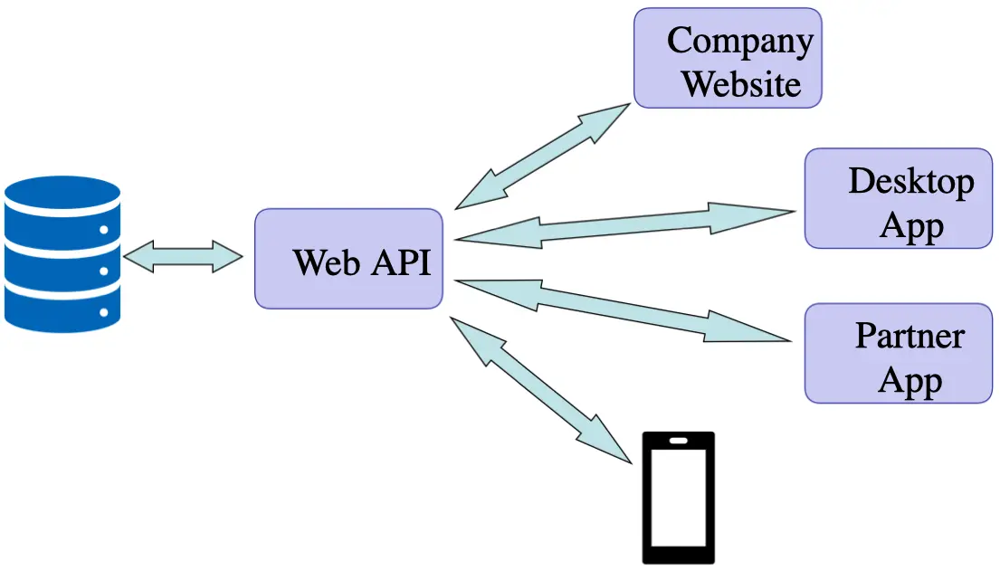

## Web API

- Used for building __HTTP__ Web Services
- Great for __RESTful__ services
- Methods return raw data which will automatically be converted into either
  __JSON__ or __XML__

## Web API Uses

## Web Services

- Web Services allow computer to computer **function calls** over the Internet
- Allow you to create/use best of breed or authoritative services from experts
  (credit card validators, weather reports, etc.)
- Two main approaches
- **REST** – Representational State Transfer
- **SOAP** – Simple Object Access Protocol
- _Cross-platform_ communication (OS, language)
- This was a big problem in the past
- Security administrators have had to close many ports
- Web services use __80__ & __443__
- Using __REST__, web services can pass complex objects back and forth

## Web API Controllers

- Controllers inherit from `Microsoft.AspNetCore.Mvc.ControllerBase`
- A base class for an MVC controller without view support
- Method names match HTTP verbs (__Get__, __Put__, __Post__, __Delete__)
- ASP.NET Routing maps URIs and HTTP Verbs to Controller actions (methods)
- This default routing can be overridden by annotating method names with
  attributes such as **[HttpGet]**, **[HttpPost]**, etc
- Method parameters are automatically bound to the request’s parameters by the
  _Model Binder_
- Actions must be `public`, can’t be `static`, no `ref` or `out` parameters

## Web API Routing

- Not specified in `Startup.cs`
- Specified in controller itself
- Uses `Route` attribute

## HTTP Verbs

| Verb   | Meaning                         |
| ------ | ------------------------------- |
| GET    | Retrieve existing data          |
| PUT    | Update or replace existing data |
| POST   | Add new data                    |
| DELETE | Remove data                     |

## Common HTTP Status Codes

- Common Groups, see
  [HTTP Status Codes](https://support.google.com/webmasters/answer/40132?hl=en)
  for more details
  - **2xx** (Successful)
  - **3xx** (Redirected)
  - **4xx** (Request error)
  - **5xx** (Server error)
- Common __StatusCodes__
  - **200** _OK_-  Success (Use for GET response)
  - **201** _Created_ - Used on POST request when creating a new resource
  - **204** _No Content_ - Used for DELETE or PUT response
  - **400** _Bad Request_ - Invalid Request
  - **401** _Unauthorized_ - Authentication
  - **403** _Forbidden_ - Authorization
  - **404** _Not Found_ - entity does not exist
  - **406** _Not Acceptable_ - bad params
  - **409** _Conflict_ - For POST / PUT requests if the resource already exists
  - **500** _Internal_ - Server Error
  - **503** _Service_ - Unavailable

## Model Binding

- Maps incoming data from the HTTP Body and/or query string (URI) to method
  parameters
- `MediaTypeFormatters` transform input and output data to/from .NET objects
- Transforms supplied data (even if it is JSON, XML or Form data) to the
  parameters

## Returning Results from Controller Actions

- Often the return type for _Web API_ Controllers is an `IActionResult` as it is
  for standard MVC Controllers
- The base controller class defines several useful methods for returning the
  most common status codes

## Return Status Codes

- **Ok()** – _Response Code __200___ (typical __GET__ response)
- **Created()** – _Response Code __201___ (typical __POST__ response)
- **CreatedAtRoute()** – _Response Code __201___ (typical __POST__ response) along with
  the new location and data for the object
- **NoContent()** – _Response Code __204___ (typical __DELETE__ or __PUT__ response)
- **BadRequest()** – _Response Code __400___ (general nonspecific request error)
- **Unauthorized()** – _Response Code __401___ (user lacks permissions for request)
- **NotFound()** – _Response Code __404___ (__GET__ request with invalid __ID__)

## Testing Web API Services

- For testing/sniffing Web API there are many options:
  - [Fiddler](https://www.telerik.com/fiddler)
  - [Advanced REST Client](https://install.advancedrestclient.com/install)
  - Swagger
  - Developer Tools in most browsers (F12) (monitoring only)
  - Writing client test code in .NET or JavaScript

## Web API Documentation

- Your partners will need to know how to use your web service
- Help documentation can be generated using [Swagger](https://swagger.io), also
  known as [OpenAPI](https://www.openapis.org)
- _Swagger_ can also be used for testing
- _Swashbuckler_ is an ASP.NET Core implementation of _Swagger_

## Unit Testing Web API Controllers

- Very similar to unit testing of MVC Controllers
  - Create a Test Project
  - Add `Microsoft.EntityFrameworkCore.InMemory` package
  - Use the constructor to initialize the test database
  - Write test methods to test the actions of the Web API Controller
