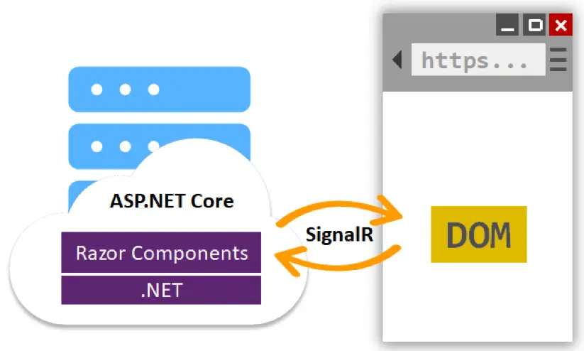
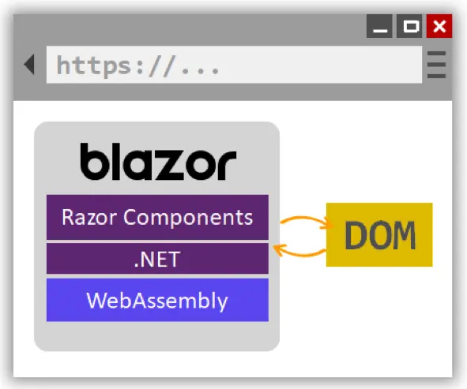

## What is Blazor

- Blazor is a **Single Page Application** development framework
- The name Blazor is a combination/mutation of the words Browser and Razor (the
  .NET HTML view generating engine)
- Blazor allows us to write C# instead of JavaScript for client-side code
- First released in 2018
- The implication being that instead of having to execute Razor views on the
  server in order to present HTML to the browser, Blazor is capable of executing
  these views on the client
- Blazor does not require any kind of plugin installed on the client in order to
  execute inside a browser
- Blazor either runs server-side, in which case it executes on a server and the
  browser acts like a dumb terminal, or it runs in the browser itself by
  utilising **WebAssembly**
- Because **WebAssembly** is a web standard, it is supported on all major
  browsers, which means also client-side Blazor apps will run inside a browser
  on Windows/Linux/Mac/Android and iOS

## WebAssembly

- **WebAssembly** (abbreviated **Wasm**) is a binary instruction format for a
  stack-based virtual machine
- **Wasm** is designed as a portable compilation target for programming
  languages, enabling deployment on the web for client and server applications
- [Languages that can target Wasm](https://github.com/appcypher/awesome-wasm-langs)

## Blazor Hosting Models

- Blazor Server
  - Blazor Server provides support for hosting Razor components on the server in
    an ASP.NET Core app
  - UI updates are handled over a **SignalR** connection
    - **SignalR** is a library that simplifies adding real-time web
      functionality to apps
    - Real-time web functionality enables server-side code to push content to
      clients instantly

## Blazor Server

- The runtime stays on the server and handles:
  - Executing the app's C# code
  - Sending UI events from the browser to the server
  - Applying UI updates to a rendered component that are sent back by the server

## Blazor Hosting Models

- Blazor WebAssembly
  - **WebAssembly** code can access the full functionality of the browser via
    **JavaScript**, called **JavaScript** interoperability, often shortened to
    **JavaScript** interop or JS interop
  - .NET code executed via **WebAssembly** in the browser runs in the browser's
    **JavaScript** sandbox with the protections that the sandbox provides
    against malicious actions on the client machine
- When a Blazor **WebAssembly** app is built and run in a browser
  - C# code files and Razor files are compiled into .NET assemblies
  - The assemblies and the .NET runtime are downloaded to the browser
  - Blazor **WebAssembly** bootstraps the .NET runtime and configures the
    runtime to load the assemblies for the app
  - The Blazor **WebAssembly** runtime uses **JavaScript** interop to handle
    **DOM** manipulation and browser API calls

## Server vs. WebAssembly

| Feature                                        | Server | WebAssembly |
| ---------------------------------------------- | ------ | ----------- |
| Complete .NET Core API compatibility           | ✅     | ❌          |
| Direct access to server sources                | ✅     | ❌          |
| Small payload size with fast initial load time | ✅     | ❌          |
| App code secure and private on the server      | ✅     | ❌*         |
| Run apps offline once downloaded               | ❌     | ✅          |
| Static site hosting                            | ❌     | ✅          |
| Offloads processing to clients                 | ❌     | ✅          |

*Blazor **WebAssembly** apps can use server-hosted APIs to access functionality
that must be kept **private** and **secure**

## Blazor Server Project Structure

- `Program.cs` is unchanged
- `Startup.cs` is similar
- `Pages/_Host.cshtml`, `App.razor`, `Shared/MainLayout.razor`, `NavMenu.razor`
  all work together to setup the overall page structure
- The Razor components are in the `Pages` and `Shared` folders

## Razor Components

- Blazor apps are built using Razor components
- A component is a self-contained portion of user interface (UI) with processing
  logic to enable dynamic behavior
- Components can be nested, reused, shared among projects, and used in MVC and
  Razor Pages apps

## @inject

- The `@inject` directive enables the Razor Page to inject a service from the
  service container into a view
- The service container is established in the `ConfigureServices` method of
  `Startup.cs`
