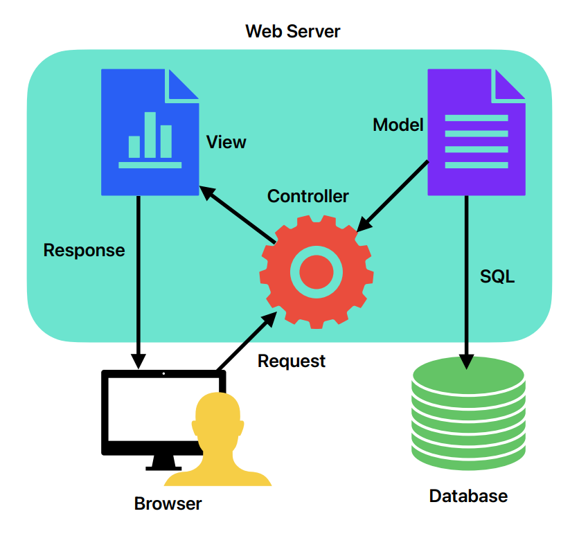

## Model View Controller

- **MVC** is a design pattern
- **Model** – contains domain classes and business logic
- **View** – displays model to the user using HTML, JavaScript, CSS, etc.
- **Controller** – handles user input, builds the model and passes it to the
  view to display the model

## Standard MVC Architecture

1. Incoming request directed to __Controller__
2. __Controller__ processes a request and forms a data __Model__
3. __Model__ is passed to __View__
4. __View__ transforms __Model__ into an appropriate output format
5. Response is rendered



## ASP.NET MVC

- Provides another approach to ASP.NET development instead of Web Forms with the
  following benefits:
  - Available in both .NET Framework and .NET Core
  - Improved testability (ideal for TDD - Test Driven Development)
  - Removes ViewState (`__VIEWSTATE`) and its overhead
  - Complete control over HTML markup
  - Better separation of concerns
  - Embraces web standards (HTML, JavaScript, CSS)
  - Open Source code available for modifications

## ASP.NET Core MVC Applications

- ASP.NET Core MVC applications are `Console` applications which start in the `Main`
  method of the `Program` class
- Startup code is placed in the `Startup` class. It configures:
  - Request Pipeline
  - Default Route
  - Logging
  - And more

## ASP.NET MVC Routing

- URLs in MVC do not map to a specific file but instead to a specific controller
  action
- Routing Engine parses URL, looks up the corresponding controller action and
  directs the request to it
- The action corresponds to a public method in the specified controller
- A Map Route provides a name, URL pattern and default values
- Configuration of the mapping happens in the `Configure` method of the `Startup`
  class
- Default Route: `{controller=Home}/{action=Index}/{id?}`
  - `HomeController` is the default controller
  - `Index` is the default action method
  - The `id` parameter is optional
- By default URLs map to `controller/action/id`
- `https://my.shopping.app/Products/Electronics/5` would:
  - Instantiate an instance of the `Products` controller
  - Invoke the `Register` method of the controller
  - Pass the `id` parameter set to `5`
- Provides clear and simple URLs which is great for Search Engine Optimization
  (SEO)
- HomeController
  - public Index()
- OtherController
  - public Index()
  - public Post(id)

| Controller | Action | Route            |
| ---------- | ------ | ---------------- |
| Home       | Index  | /home/index      |
| Other      | Index  | /other/index     |
| Other      | Post   | /other/post/{id} |

- Pattern: `{controller=Other}/{action=Post}/{id?}`
- Url: /other/post/1
  - Controller: Other
  - Action: Post
  - ID: 1
- Pattern: `{controller=Other}/{action=Post}/{id?}`
- Url: /other/post
  - Controller: Other
  - Action: Post
  - ID: null
- Pattern: `{controller=Other}/{action=Index}/{id?}`
- Url: /other
  - Controller: Other
  - Action: Index
  - ID: null
- Pattern: `{controller=Home}/{action=Index}/{id?}`
- Url: /
  - Controller: Home
  - Action: Index
  - ID: null

## Passing Data from Controllers to Views – Part 1

- ViewData
  - A dynamic dictionary object (key/value pairs) that can be passed from a
    controller to a view
  - It can contain nearly any type
- ViewBag is a wrapper for ViewData
- The two can be used interchangeably

## Route Customization

- Any controller method can be customized to respond to a different route
  pattern than the default
- A Route attribute is placed before the method to indicate the pattern

## Route Constraints

- Route constraints can be placed on the route place holders to limit the URLs
  that the route will match
- **Example:** `{controller=Home}/{action=Index}/{id:int?}` indicates that the `id`
  parameter must be an integer, but it is still optional
- A few other route constraints: double, datetime, min(value), range(min, max)
- These constraints should not be used for input validation

## ASP.NET MVC View

- Responsible for displaying the model to the user
- `cshtml` files are used and can be considered templates with static html and
  C# code (prefix with `@` symbol) for dynamically inserting the model’s
  properties
- Use Razor View Engine to display the View

## Razor Syntax

- Razor is a markup syntax for embedding server-based code into webpages
- The Razor syntax consists of Razor markup, C#, and HTML
- Consists of implicit Razor expressions, explicit Razor expressions and Razor
  code blocks
- `@@` to escape the `@` symbol
- Comment Syntax: `@* comment *@`
- `@` Implicit Razor expression
  - `<p>Today: @DateTime.Now</p>`
  - Renders as HTML, spaces not allowed (_Except when used with await_)
- `@()` Explicit Razor expression
  - `<p>Week ago: @(DateTime.Now - TimeSpan.FromDays(7))</p>`
  - Renders as HTML, spaces allowed
- `@{}` Razor code block

- Doesn’t render as HTML, semicolons required

```cs
@{
    var name = "Bob Loblaw";
    var len = name.Length;
}
```

- Then in the same file:

```html
<p>The length of @name is @len bytes.</p>
```

## IActionResult

- The most common return type for Controller Actions is `IActionResult`
- It is an interface that provides for a very flexible set of possible return
  types including
- `ViewResult`, `ContentResult`, `RedirectResult`, `JsonResult` and many more

## URL Helpers

- Simplifies HTML coding in Views by using metadata and annotations
- `@Url.Action("Action", "Controller")`
- Many more

## Layout

- Special Razor pages that help define the layout of the overall site
- Similar to Master Pages in Web Forms
- By convention stored in a folder named `Shared`
- `@RenderBody` and `@RenderSection` are placeholders for content on individual
  pages

## Passing Data from Controllers to Views – Part 2

- A Model property
  - Typically a class
  - Cleaner and clearer
  - Support IntelliSense

## Project Structure - Folders

- `Properties` contains `launchSettings.json` file
- `launchSettings.json` contains some environment settings including which IP
  ports to use during development
- `wwwroot` contains static files, such as HTML, CSS, images and JavaScript
- `Controllers` contains the MVC controllers
- `Models` contains the model classes for the app
- `Views` contains a folder for each controller, which contains the views for
  that controller
- `Views` also contains a shared folder that contains views used throughout the
  app
- `Views` also contains `_ViewImports.cshtml` and `_ViewStart.cshtml` which are
  used to help structure all views
- `appsettings.json` is the project configuration file which contains settings
  related to logging, connection strings and other items
- `Program.cs` is the file which starts the app
- `Startup.cs` configures the app’s services and request processing pipeline

## Data Annotations

- Data Annotations are rules applied to model properties
- MVC will take care of enforcing them and displaying appropriate messages to
  users
- Selected annotations: `[Key]`, `[Required]`, `[Range]`, `[Display]`, `[DataType]`
- [View complete list of annotations at docs.microsoft.com](https://docs.microsoft.com/en-us/dotnet/api/system.componentmodel.dataannotations?view=net-5.0)

## Scaffolding

- MVC Scaffolding uses a Wizard that can automatically generate much of the standard code for our `Controllers` and `Views`
- `VS Scaffolding` is a great example of Code Generation tools

## HTML Helpers

- Similar to URL helpers
- `@Html.DisplayNameFor` – plain text to display the read-only field name
- `@Html.DisplayFor` – figures out the best HTML5 for read-only display of the
  actual field value
- `@Html.ActionLink` – action link with anchor tag

## MVC Controller Actions

- Typically a controller will have the following actions (or methods)
  - `Index` which is the “first” page that shows a list of any existing items, and
    allows access to the other actions
  - `Details` which shows one item in full
  - `Create` which allows for the creation of a new item
  - `Edit` which allows for the editing of an existing item
  - `Delete` which allows for the deletion of an existing item
- The `Create`, `Edit` and `Delete` actions are comprised of two methods each, a `get`
  and a `post`

## Controller Method Attributes

- **HttpPost**
  - Typically two controller actions are required for modifying data (edit,
    create, delete)
  - One controller action for the HTTP GET displays the blank form (or the
    existing data)
  - The other controller actions for the HTTP POST validates the data and
    updates the data store if necessary
- **ValidateAntiForgeryToken**
  - Use for HTTP POST to ensure that the data is originating from the correct
    user to stop `Cross-Site Request Forgery` (CSRF) attacks

## Model Binding

- Request fields are mapped to controller action parameters automatically
- Can be almost any data type including objects
- Parameters can be automatically validated, if any errors are found they are
  added to the `ModelState`
- Sources of model binding values...
  - Form post values
  - Route data / URL parameters
  - QueryString parameters
  - User cookies

## ModelState

- When updating the model, the `ModelState` property (of the controller) indicates
  if the model is valid
- The `IsValid` property checks all properties of the model to ensure correct data
  type, appropriate values and any other specified attributes are correct
- There are other useful properties, such as `ErrorCount`, `Keys`, `Values`, etc.

## Tag Helpers

- Similar to HTML Helpers but rely on attributes for well known HTML tags
- Makes views look more like standard HTML
- Easier to read for HTML developers

```html
<label asp-for="DateSeen" class="control-label"></label>
<input asp-for="DateSeen" class="form-control" />
<span asp-validation-for="DateSeen" class="text-danger"></span>
```
