# Introduction to SQL

## Index

| Topic                  | Link                                              |
| ---------------------- | ------------------------------------------------- |
| SQL Join               | [SQL Join](#sql-join)                             |
| Stored Procedures      | [Stored Procedures](#stored-procedures)           |
| Triggers               | [Triggers](#triggers)                             |
| Concurrency Control    | [Concurrency Control](#concurrency-control)       |
| Normalization - Part 1 | [Normalization - Part 1](#normalization---part-1) |
| Normalization - Part 2 | [Normalization - Part 2](#normalization---part-2) |

# SQL Join

Frequently it is useful to join the data from multiple tables together.

```sql
-- Syntex;
SELECT column(x) FROM firsttable f
JOIN secondtable s ON f.column = s.column;

-- Select all columns from both tables; join on purchase_order number;
SELECT * FROM purchase_orders o
JOIN purchase_order_lines l
ON o.purchase_order_id = l.purchase_order_id;
```

## Type of sql join

- INNER JOIN (DEFAULT)
- LEFT JOIN
- RIGHT JOIN
- FULL OUTER JOIN
- CROSS JOIN
- SELF JOIN
- NATURAL JOIN

```sql
-- INNER JOIN
-- Rows that have matching values in both tables.
SELECT * FROM orders INNER JOIN customers ON orders.id = customers.id;
```

```sql
-- LEFT JOIN
-- All rows from the left and the matching rows from right table. Nullable.
SELECT * FROM customers LEFT JOIN orders ON customers.id = orders.id;
```

```sql
-- RIGHT JOIN
-- All rows from the right and the matching rows from left table. Nullable.
SELECT * FROM orders RIGHT JOIN customers ON orders.id = customers.id;
```

```sql
-- FULL OUTER JOIN
-- All rows from both tables, **NULL** for no matches.
SELECT * FROM customers FULL OUTER JOIN orders ON customers.id = orders.id;
```

```sql
-- CROSS JOIN
-- Cartesian product of both tables.
SELECT * FROM customers CROSS JOIN orders;
```

```sql
-- SELF JOIN
-- Joins a table with itself, comparing rows within the same table.
SELECT * FROM employees INNER JOIN employees AS managers ON employees.id = managers.id;
```

```sql
-- NATURAL JOIN
-- INNER JOIN where condition is based on all columns with the same names.
SELECT * FROM orders NATURAL JOIN customers;
```

### Example table : purchase_lines

| product_id | purchased |
| :--------- | :-------- |
| 100        | 15        |
| 102        | 25        |
| 103        | 10        |
| 106        | 10        |

### Example table : sales_lines

| product_id | sold |
| :--------- | :--- |
| 100        | 5    |
| 101        | 6    |
| 103        | 8    |
| 104        | 5    |
| 106        | 7    |

## Inner Join

```sql
-- Keyword `INNER` is optional.
-- ANSI 92 syntax. Most commonly used join type.
-- If the column is not unique, it must be qualified.
SELECT s.product_id, sold, purchased FROM sales_lines s
INNER JOIN purchase_lines p ON s.product_id = p.product_id;
```

Rows returned only if they exist in both tables.

| product_id | sold | purchased |
| :--------- | :--- | :-------- |
| 100        | 5    | 15        |
| 103        | 8    | 10        |
| 106        | 7    | 10        |

## Left Outer Join

```sql
-- Keyword `OUTER` is optional.
SELECT s.product_id, sold, purchased FROM sales_lines s
LEFT OUTER JOIN purchase_lines p ON s.product_id = p.product_id;
```

All rows from left (first) table, matching rows from right (second) table, and missing values as `NULL`.

| product_id | sold | purchased |
| :--------- | :--- | :-------- |
| 100        | 5    | 15        |
| 101        | 6    | NULL      |
| 103        | 8    | 10        |
| 104        | 5    | NULL      |
| 106        | 7    | 10        |

## Right Outer Join

```sql
-- Keyword `OUTER` is optional.
SELECT s.product_id, sold, purchased FROM sales_lines s
RIGHT OUTER JOIN purchase_lines p ON s.product_id = p.product_id;
```

All rows from the right (second) table, matching rows from left (first) table, and missing values as `NULL`.

| product_id | sold | purchased |
| :--------- | :--- | :-------- |
| 100        | 5    | 15        |
| NULL       | NULL | 25        |
| 103        | 8    | 10        |
| 106        | 7    | 10        |

## Right Outer Join

```sql
-- Keyword `OUTER` is optional.
SELECT p.product_id, sold, purchased FROM sales_lines s
RIGHT OUTER JOIN purchase_lines p ON s.product_id = p.product_id;
```

| product_id | sold | purchased |
| :--------- | :--- | :-------- |
| 100        | 5    | 15        |
| 102        | NULL | 25        |
| 103        | 8    | 10        |
| 106        | 7    | 10        |

## Full Outer Join

```sql
-- Keyword `OUTER` is optional.
SELECT s.product_id, p.product_id, sold, purchased FROM sales_lines s
FULL OUTER JOIN purchase_lines p ON s.product_id = p.product_id;
```

All rows from both tables, missing values as `NULL`.

| product_id | product_id | sold | purchased |
| :--------- | :--------- | :--- | :-------- |
| 100        | 100        | 5    | 15        |
| 101        | NULL       | 6    | NULL      |
| 103        | 103        | 8    | 10        |
| 104        | NULL       | 5    | NULL      |
| 106        | 106        | 7    | 10        |
| NULL       | 102        | NULL | 25        |

## Cross Join

```sql
SELECT p.product_id, sold, purchased FROM sales_lines s
CROSS JOIN purchase_lines p;
```

Each row from the left table is joined with each row from the right table, results are usually an error.

| product_id    | sold | purchased |
| :------------ | :--- | :-------- |
| 100           | 5    | 15        |
| 100           | 6    | 15        |
| 100           | 8    | 15        |
| 100           | 5    | 15        |
| 100           | 7    | 15        |
| 102           | 5    | 25        |
| 14 more rows… |      |           |

## Older Syntax – Inner Join

Pre ANSI 92 syntax, joins were inner, cross join if where clause omitted.

```sql
SELECT s.product_id, sold, purchased
FROM sales_lines s, purchase_lines p
WHERE s.product_id = p.product_id;
```

## Joining 3 Tables

```sql
SELECT first_name, last_name, med_desc, dosage FROM patients p
JOIN unit_dose_orders u ON p.patient_id = u.patient_id
JOIN medications m ON u.medication_id = m.medication_id
ORDER BY last_name, first_name, med_desc;
```

### Example table : employees

| employee_id | first_name | last_name | department | title | supervisor | salary        |
| :---------- | :--------- | :-------- | :--------- | :---- | :--------- | :------------ |
| 101         | Malcolm    |           | Reynolds   |       | Management | President     |
| 102         | Zoe        |           | Washburne  |       | Sales      | VP of Sales   |
| 103         | Jayne      |           | Cobb       |       | Sales      | Sales Rep     |
| 104         | Hoban      |           | Washburne  |       | Finance    | VP of Finance |
| 105         | Kaylee     |           | Frye       |       | Finance    | AP Clerk      |
| 106         | Inara      |           | Serra      |       | Finance    | AR Clerk      |
| 107         | Simon      |           | Tam        |       | Sales      | Sales Rep     |
| 108         | Derrial    |           | Book       |       | Sales      | Sales Rep     |
| 109         | River      |           | Tam        |       | Finance    | GL Clerk      |

## Joining a table with itself

```sql
-- Might miss some of the records.
SELECT
  e1.employee_id, e1.first_name, e1.last_name, e1.department,
  e1.title, e1.supervisor,
  e2.employee_id, e2.first_name, e2.last_name
FROM employees e1
JOIN employees e2
ON e1.supervisor = e2.employee_id
ORDER BY e1.department, e1.employee_id;
```

```sql
-- Includes all the records.
SELECT
  e1.employee_id, e1.first_name, e1.last_name,
  e1.department, e1.title, e1.supervisor,
  e2.employee_id, e2.first_name, e2.last_name
FROM employees e1
LEFT JOIN employees e2
ON e1.supervisor = e2.employee_id
ORDER BY e1.department, e1.employee_id;
```

## SQL Join Visualization

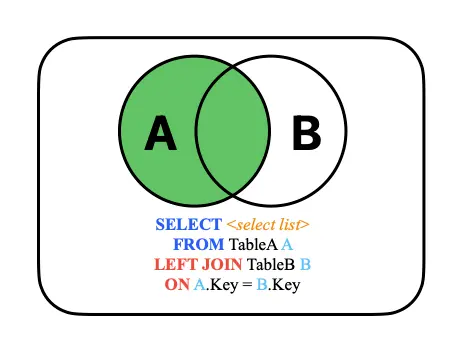 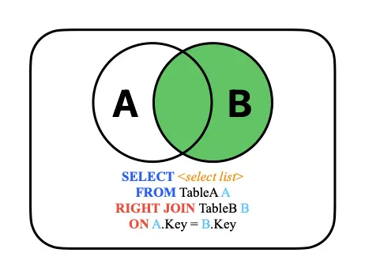 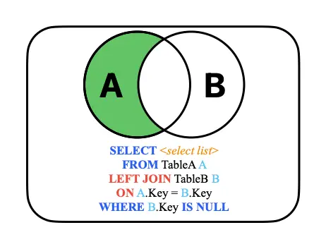 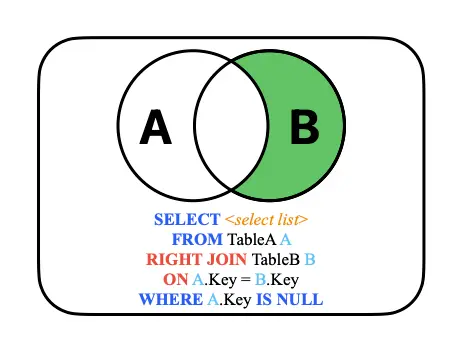 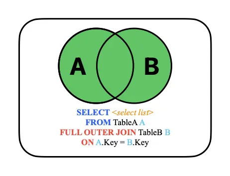 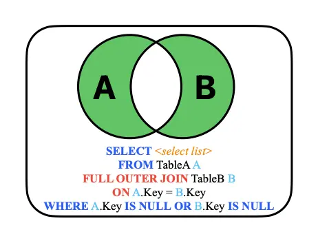 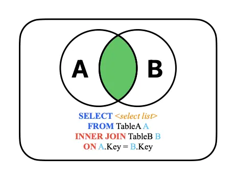

# Stored Procedures

- Pieces of executable code stored in the database (small programs)
- Best practice is for programming languages to call stored procedures for database access
- Compiled, therefore faster
- Reduces network traffic
- More secure
- Consistent
- DBA approved

## Body Statements

- SQL is non-procedural and set oriented
- Stored procedures require procedural code
- Each database vendor extends SQL with procedural code
- Microsoft uses T-SQL
- Oracle uses Procedural Language SQL (PL/SQL)
- IBM uses SQL Procedural Language (SQL PL)
- MySQL uses SQL/Persistent Stored Module (SQL/PSM)

## T-SQL Keywords

| BEGIN/END | BREAK     | CONTINUE |
| :-------- | :-------- | :------- |
| GOTO      | IF/ELSE   | RETURN   |
| TRY/CATCH | WAITFOR   | WHILE    |
| CASE      | DECLARE   | EXECUTE  |
| FETCH     | RAISERROR | ROLLBACK |
| SET       |           |          |

## Stored Procedures execution

- Invoked by `EXECUTE` (`EXEC`) statement in T-SQL. `EXEC` is optional, allows autocomplete to help
- Can accept command line parameters, separated by commas, parameters can be positional or named

## System Stored Procedures

- SQL Server provides many stored procedures
- Many are used for database administration
- Typing the name of a system stored procedure in a query window and pressing F1 will get help on the procedure
- Right clicking the procedure in the Object Explorer and selecting Modify will reveal the procedure code
- sp_columns, sp_help, sp_server_info, etc...

```sql
EXEC sp_columns 'patients'
EXEC sp_columns @table_name='patients'
EXEC sp_help
sp_help 'patients'
sp_server_info
```

## Stored Procedure Structure

- A stored procedure consists of:
- Procedure name
- Set of optional parameters
- Routine body

```sql
-- Increase and vendor are hard coded, not very flexible
CREATE PROCEDURE update_items_item_cost AS
UPDATE items SET item_cost = item_cost * (1 + 0.25)
WHERE primary_vendor_id = 1;

-- Test
PRINT '*Before Update*'
SELECT * FROM items ORDER BY primary_vendor_id;

EXEC update_items_item_cost;

PRINT '*After Update*'
SELECT * FROM items ORDER BY primary_vendor_id;
```

## ALTER SQL Statement

- `ALTER PROCEDURE` allows changing an existing stored procedure
- `ALTER TABLE` allows for changing table structure
- Adding/Removing/Changing of columns, constraints, etc...
- `ALTER DATABASE`, `ALTER VIEW`, etc...

```sql
-- Increase and vendor are parameters, improved flexibility
ALTER PROCEDURE update_items_item_cost
@increase DECIMAL(3, 2), @vendor_id INT AS
UPDATE items SET item_cost = item_cost * (1 + @increase)
WHERE primary_vendor_id = @vendor_id;

-- Test
PRINT '*Before Update*'
SELECT * FROM items WHERE primary_vendor_id = 1;

EXEC update_items_item_cost 0.25, 1;

PRINT '*After 1st Update*'
SELECT * FROM items WHERE primary_vendor_id = 1;

EXEC update_items_item_cost @increase=0.25, @vendor_id=1;

PRINT '*After 2nd Update*'
SELECT * FROM items WHERE primary_vendor_id = 1;
```

```sql
-- 3rd parameter allows conditional update, defaults to no update
ALTER PROCEDURE update_items_item_cost
  @increase DECIMAL(3, 2),
  @vendor_id INT,
  @update INT = 0 -- If 1, perform update, else show what would be updated
AS BEGIN
  IF @update = 1
    UPDATE items SET item_cost = item_cost * (1 + @increase)
    WHERE primary_vendor_id = @vendor_id;
  ELSE
    SELECT item_id, vendor_name, item_cost AS [existing_cost],
      item_cost * (1 + @increase) AS [proposed_cost]
    FROM items
    JOIN vendors ON primary_vendor_id = vendors.vendor_id
    WHERE primary_vendor_id = @vendor_id;
END

-- Test
PRINT '*Before Update*'
SELECT * FROM items WHERE primary_vendor_id = 1;

PRINT '*No Update*'
EXEC update_items_item_cost @increase=0.25, @vendor_id=1;

PRINT '*After No Update*'
SELECT * FROM items WHERE primary_vendor_id = 1;

PRINT '*Update*'
EXEC update_items_item_cost @increase=0.25, @vendor_id=1, @update=1;

PRINT '*After Update*'
SELECT * FROM items WHERE primary_vendor_id = 1;
```

```sql
-- 4th parameter will be returned to caller with number of rows affected
-- This version also makes use of a database cursor (more later)
ALTER PROCEDURE update_items_item_cost
  @increase DECIMAL(3, 2),
  @vendor_id INT,
  @update INT = 0, -- If 1, perform update, else show what would be updated
  @number_of_records INT OUTPUT
AS
  DECLARE items_cursor CURSOR
  FOR SELECT item_cost FROM items
  WHERE primary_vendor_id = @vendor_id
  FOR UPDATE;

  DECLARE @item_cost DECIMAL(9, 2);

  BEGIN
    IF @update = 1 BEGIN
      SET @number_of_records = 0;
      OPEN items_cursor;
      FETCH NEXT FROM items_cursor INTO @item_cost;
      WHILE @@FETCH_STATUS = 0 BEGIN
        SET @item_cost = @item_cost * (1 + @increase);
        UPDATE items SET item_cost = @item_cost
        WHERE CURRENT OF items_cursor;
        SET @number_of_records = @number_of_records + 1;
        FETCH NEXT FROM items_cursor INTO @item_cost;
      END
      CLOSE items_cursor;
    END
    ELSE -- No Update
      SELECT item_id, vendor_name, item_cost AS [existing_cost],
      item_cost * (1 + @increase) AS [proposed_cost]
      FROM items
      JOIN vendors ON primary_vendor_id = vendors.vendor_id
      WHERE primary_vendor_id = @vendor_id;
    DEALLOCATE items_cursor;
  END

-- Test
PRINT '*Before Update*'
SELECT * FROM items WHERE primary_vendor_id = 1;

-- Need to declare a variable to receive output
DECLARE @num_of_rows INT;

PRINT '*No Update*'
EXEC update_items_item_cost @increase=0.25, @vendor_id=1, @update=0, @number_of_records=@num_of_rows OUTPUT;
SELECT @num_of_rows AS [number_of_rows];

PRINT '*After No Update*'
SELECT * FROM items WHERE primary_vendor_id = 1;

PRINT '*Update*'
EXEC update_items_item_cost @increase=0.25, @vendor_id=1, @update=1, @number_of_records=@num_of_rows OUTPUT;
SELECT @num_of_rows AS [number_of_rows];

PRINT '*After Update*'
SELECT * FROM items WHERE primary_vendor_id = 1;
```

## Variable Declarations

- Declare local variables used for
- Calculations
- Assignment to output parameters
- Assignment to columns for database updates
- As input parameters passed by calling programs
- Error handling

```sql
DECLARE @total_sales DECIMAL(11,2);
DECLARE @number_customers INT;
DECLARE @error_msg CHAR(10);
DECLARE @order_date DATETIME;
DECLARE @picture VARBINARY(MAX);
```

## Assignment Statement SET

- Used to assign values to
- Input and output parameters
- Local variables
- Conform to SQL arithmetic operators
- Compatible data types of target and source

```sql
SET @record_count = @record_count + 1;
SET @credit_limit = @credit_limit * 1.20;
SET @num_orders = NULL;
SET @max_credit_limit = (SELECT MAX(credit_limit) FROM customers);
```

### IF

- Tests a simple condition
- If the condition evaluates to TRUE, the next line of code is executed
- If the condition evaluates to FALSE, the control of the program is passed to the next statement after the test

```sql
IF @ref_error = 1
SET @error_msg = 'NOT FOUND';
```

### IF-ELSE

- Similar to the IF structure
- The difference is that when the condition evaluates to FALSE, the statement following the ELSE keyword is executed

```sql
IF @ref_error = 0
SET @error_msg = 'FOUND';
ELSE
SET @error_msg = 'NOT FOUND';
```

### BEGIN-END

- Used to enclose a block of statements where a single statement can be used

```sql
IF @ref_error = 0 BEGIN
  SET @error_msg = 'FOUND';
  SET @found = @found + 1;
END ELSE BEGIN
  SET @error_msg = 'NOT FOUND';
  SET @not_found = @not_found + 1;
END
```

### Nested IFs

```sql
IF @evaluation = 100
  SET @new_salary = salary * 1.3;
ELSE BEGIN
  IF @evaluation >= 90
    SET @new_salary = salary * 1.2;
  ELSE
    SET @new_salary = salary * 1.1;
END
```

### CASE

- Permits you to select an execution path based on multiple cases
- Two options for coding a CASE structure

```sql
-- Using the first option
CASE @evaluation
WHEN 100 THEN
    UPDATE employees SET salary = salary * 1.3;
WHEN 90 THEN
  UPDATE employees SET salary = salary * 1.2;
WHEN 80 THEN
  UPDATE employees SET salary = salary * 1.1;
ELSE
  UPDATE employees SET salary = salary * 1.05;
END
```

```sql
-- Using the second option
CASE
WHEN @evaluation = 100 THEN
  UPDATE employees SET salary = salary * 1.3;
WHEN @evaluation = 90 THEN
  UPDATE employees SET salary = salary * 1.2;
WHEN @evaluation = 80 THEN
  UPDATE employees SET salary = salary * 1.1;
ELSE
  UPDATE employees SET salary = salary * 1.05;
END
```

### WHILE

- Loop while the condition is true
- Used with BEGIN-END
- Frequently used with cursors

```sql
WHILE @@FETCH_STATUS = 0 BEGIN
  -- loop processing
END
```

### BREAK

- Used to exit a WHILE loop

```sql
WHILE @@FETCH_STATUS = 0 BEGIN
  -- loop processing
  IF @count = 5
    BREAK;
END
```

### CONTINUE

- Used to advance to the next iteration of a WHILE loop

```sql
WHILE @@FETCH_STATUS = 0 BEGIN
  -- loop processing
  IF @price = 5.0
    CONTINUE;
  -- loop processing
END
```

## Deleting A Procedure

- To delete an existing procedure use:

```sql
DROP PROCEDURE procedure_name;
```

## Data Dictionary Tables For Procedures

- Every `CREATE PROCEDURE` statement generates entries in
- `sys.procedures`
- `sys.sql_modules`

## Cursors

- Used to access a `SELECT` result set one row at a time
- Steps to use a cursor
- `DECLARE` a cursor with a `SELECT` statement
- `OPEN` the cursor
- This executes the `SELECT` statement and populates the cursor
- `FETCH` one row at a time from the result set `INTO` variables
- Each column fetched must have a correlating variable
- Perform whatever processing desired for each row
- `CLOSE` the cursor
- `DEALLOCATE` the cursor

### @@FETCH_STATUS

- Returns the status of the last cursor `FETCH` statement
- 0: The `FETCH` statement was successful
- -1: The `FETCH` statement failed or the row was beyond the result set
- -2: The row fetched is missing

# Triggers

A trigger is a special stored procedure attached to a specific table. Managed by DBMS.

## Triggers Versus Stored Procedures

| Triggers                                   | Stored Procedures                                |
| :----------------------------------------- | :----------------------------------------------- |
| Attached to a specific table               | Not attached to a specific table                 |
| Can’t pass values to a trigger             | Can pass values to a procedure                   |
| “Fired” automatically in response to event | Must be called by programs, triggers or manually |
| Event-driven                               | Not event-driven                                 |
| e.g. `INSERT`, `UPDATE`, `DELETE`          | Can be scheduled                                 |

## Why use Triggers?

- Enforce business rules too complex for CHECK constraints or Referential Integrity
- Automate activity
- Access or modify other tables
- Downside: will slow down triggering operation (`INSERT`, `UPDATE` or `DELETE`)

## Use a Trigger to enforce a business rule

- **Business rule #1**:
- No more than three suppliers are permitted to supply any single part
- A trigger can check how many rows already exist for a specific part and prevent an `INSERT`
- **Business rule #2**:
- The lowest cost supplier will always be used
- A trigger can disallow any order that does not use the lowest quote for a part

## Use a Trigger to perform calculations

- Use a trigger to calculate the order amount for the part based on the supplier chosen to provide the parts

## Trigger syntax

```sql
CREATE TRIGGER Trigger_Name ON Table_Name
AFTER [INSERT] [,] [UPDATE] [,] [DELETE]
AS
  -- Optionally declare variables here
BEGIN
  -- Insert statements for trigger here
END
```

### Example

```sql
CREATE TRIGGER employees_insert ON employees
AFTER INSERT AS
UPDATE company_stats SET num_of_emp = num_of_emp + 1;

-- Test
PRINT '*Before Insert*'
SELECT * FROM employees;
SELECT * FROM company_stats;

PRINT '*Insert*'
INSERT INTO employees (employee_id, first_name, last_name)
VALUES(110, 'Bob', 'Loblaw');

PRINT '*After Insert*'
SELECT * FROM employees;
SELECT * FROM company_stats;
```

## Deleted and Inserted

- During trigger execution, two special tables are used: deleted and inserted
- SQL Server automatically creates and manages these tables
- They have identical schema to the table being modified

| Trigger Event | deleted    | inserted   |
| :------------ | :--------- | :--------- |
| DELETE        | Old row(s) | Not used   |
| INSERT        | Not used   | New row(s) |
| UPDATE        | Old row(s) | New row(s) |

### Trigger 1

```sql
CREATE TRIGGER employees_update ON employees
-- Trigger will run AFTER modification occurs
AFTER UPDATE AS
  DECLARE @new_salary MONEY;
  DECLARE @old_salary MONEY;
BEGIN
  SELECT @new_salary = (
    -- `inserted` used for values before the update
    SELECT salary FROM inserted
  );

  SELECT @old_salary = (
    -- `deleted` used for values after the update
    SELECT salary FROM deleted
  );

  IF @new_salary > (@old_salary * 1.5)
    ROLLBACK TRANSACTION; -- Cancel the UPDATE
END

-- Test
PRINT '*Before Update*'
SELECT * FROM employees WHERE employee_id = 102;

PRINT '*Attempted Update*'
UPDATE employees SET salary = 1500 WHERE employee_id = 102;
GO

PRINT '*After Attempted Update*'
SELECT * FROM employees WHERE employee_id = 102;

PRINT '*Successful Update*'
UPDATE employees SET salary = 850 WHERE employee_id = 102;
GO

PRINT '*After Successful Update*'
SELECT * FROM employees WHERE employee_id = 102;

-- employees_update Trigger
-- If multiple rows are updated employees_update will fail
SELECT @new_salary = (SELECT salary FROM inserted);

-- Test
PRINT '*Before Update*'
SELECT * FROM employees WHERE department = 'Sales';

PRINT '*Attempted Multiple Row Update*'
UPDATE employees SET salary = 700 WHERE department = 'Sales';
GO

PRINT '*After Update*'
SELECT * FROM employees WHERE department = 'Sales';
```

### Trigger 2

```sql
ALTER TRIGGER employees_update ON employees
AFTER UPDATE AS
BEGIN
  IF EXISTS (
    SELECT i.salary FROM inserted i
    JOIN deleted d ON i.employee_id = d.employee_id
    WHERE i.salary > (d.salary * 1.5)
  ) ROLLBACK TRANSACTION;
END

-- Test
PRINT '*Before Update*'
SELECT * FROM employees WHERE department = 'Sales';

PRINT '*Successful Multiple Row Update*'
UPDATE employees SET salary = 600 WHERE department = 'Sales';
GO

PRINT '*Attempted Single Row Update of 102*'
UPDATE employees SET salary = 1500 WHERE employee_id = 102;
GO

PRINT '*After Update*'
SELECT * FROM employees WHERE department = 'Sales';
```

### Trigger 3

```sql
ALTER TRIGGER employees_update ON employees
AFTER UPDATE AS
  DECLARE @new_salary MONEY;
  DECLARE @old_salary MONEY;
  DECLARE employees_cursor CURSOR
  FOR SELECT i.salary, d.salary FROM inserted i
  JOIN deleted d ON i.employee_id = d.employee_id;
BEGIN
  OPEN employees_cursor;
  FETCH NEXT FROM employees_cursor
  INTO @new_salary, @old_salary;
  WHILE @@FETCH_STATUS = 0 BEGIN
    IF @new_salary > @old_salary * 1.5 BEGIN
      ROLLBACK TRANSACTION;
      BREAK;
    END
    FETCH NEXT FROM employees_cursor INTO @new_salary, @old_salary;
  END
  CLOSE employees_cursor;
END

-- Test
PRINT '*Before Update*'
SELECT * FROM employees WHERE department = 'Sales';

PRINT '*Successful Multiple Row Update*'
UPDATE employees SET salary = 750 WHERE department = 'Sales';
GO

PRINT '*Attempted Single Row Update of 102*'
UPDATE employees SET salary = 1500 WHERE employee_id = 102;
GO

PRINT '*After Update*'
SELECT * FROM employees WHERE department = 'Sales';
```

## Firing Triggers

- Timing choices
- `AFTER`: after firing activity occurs
- `INSTEAD OF`: allows DBA to take complete control of modification
- Oracle, MySQL and DB2 also support `BEFORE` triggers
- `AFTER` example
- **Insert**, **update** or **delete** occurs first
- Trigger logic is executed
- Trigger can **roll back** data modification

```sql
-- PurchaseOrderLineInsert
CREATE TRIGGER purchase_order_lines_insert ON purchase_order_lines
AFTER INSERT AS
UPDATE purchase_orders SET total_amount = total_amount + (
  SELECT SUM(quantity * unit_cost) FROM inserted
  WHERE purchase_orders.purchase_order_id = inserted.purchase_order_id
)
WHERE purchase_orders.purchase_order_id IN (
  SELECT purchase_order_id FROM inserted
);

-- Test
PRINT '*Before Insert*'
SELECT po.purchase_order_id, total_amount, SUM(quantity * unit_cost) AS Actual
FROM purchase_orders po
JOIN purchase_order_lines pol
ON po.purchase_order_id = pol.purchase_order_id
WHERE po.purchase_order_id = 50
GROUP BY po.purchase_order_id, total_amount;

PRINT '*Insert*'
INSERT INTO purchase_order_lines
VALUES(50, 2, 20, 10, 24.89, 0, 0, NULL);

PRINT '*After Insert*'
SELECT po.purchase_order_id, total_amount, SUM(quantity * unit_cost) AS Actual
FROM purchase_orders po
JOIN purchase_order_lines pol
ON po.purchase_order_id = pol.purchase_order_id
WHERE po.purchase_order_id = 50
GROUP BY po.purchase_order_id, total_amount;
```

## One Trigger causes need for others

- If an `INSERT` trigger is keeping the master table updated when new records are inserted into a child table
- What happens on `UPDATE`s or `DELETE`s to the child table?
- Additional triggers are required to keep the tables in sync

```sql
-- purchase_order_lines_update
CREATE TRIGGER purchase_order_lines_update ON purchase_order_lines
AFTER UPDATE AS
UPDATE purchase_orders SET total_amount = total_amount + (
  SELECT SUM(quantity * unit_cost) FROM inserted
  WHERE purchase_orders.purchase_order_id = inserted.purchase_order_id
) - (
  SELECT SUM(quantity * unit_cost) FROM deleted
  WHERE purchase_orders.purchase_order_id = deleted.purchase_order_id
)
WHERE purchase_orders.purchase_order_id IN (
  SELECT purchase_order_id FROM inserted
);

-- Test
PRINT '*Before Update*'
SELECT po.purchase_order_id, total_amount, SUM(quantity * unit_cost) AS Actual
FROM purchase_orders po
JOIN purchase_order_lines pol
ON po.purchase_order_id = pol.purchase_order_id
WHERE po.purchase_order_id = 50
GROUP BY po.purchase_order_id, total_amount;

UPDATE purchase_order_lines SET quantity = 1
WHERE purchase_order_id = 50 AND line_num = 2;

PRINT '*After Update*'
SELECT po.purchase_order_id, total_amount, SUM(quantity * unit_cost) AS Actual
FROM purchase_orders po
JOIN purchase_order_lines pol
ON po.purchase_order_id = pol.purchase_order_id
WHERE po.purchase_order_id = 50
GROUP BY po.purchase_order_id, total_amount;
```

### Sample Trigger

```sql
-- purchase_order_lines_delete
CREATE TRIGGER purchase_order_lines_delete ON purchase_order_lines
AFTER DELETE
AS
UPDATE purchase_orders SET total_amount = total_amount - (
  SELECT SUM(quantity * unit_cost) FROM deleted
  WHERE purchase_orders.purchase_order_id = deleted.purchase_order_id
)
WHERE purchase_orders.purchase_order_id IN (
  SELECT purchase_order_id FROM deleted
);

-- Test
PRINT '*Before Delete*'
SELECT po.purchase_order_id, total_amount, SUM(quantity * unit_cost) AS Actual
FROM purchase_orders po
JOIN purchase_order_lines pol
ON po.purchase_order_id = pol.purchase_order_id
WHERE po.purchase_order_id = 50
GROUP BY po.purchase_order_id, total_amount;

PRINT '*Delete*'
DELETE FROM purchase_order_lines
WHERE purchase_order_id = 50 AND line_num = 2

PRINT '*After Delete*'
SELECT po.purchase_order_id, total_amount, SUM(quantity * unit_cost)
AS Actual
FROM purchase_orders po
JOIN purchase_order_lines pol
ON po.purchase_order_id = pol.purchase_order_id
WHERE po.purchase_order_id = 50
GROUP BY po.purchase_order_id, total_amount;
```

## Deleting a Trigger

```sql
DROP TRIGGER Trigger_Name;
```

## Data Dictionary Tables For Triggers

- Every `CREATE TRIGGER` statement generates entries in
- `sys.triggers`
- `sys.trigger_events`
- `sys.events`
- `sys.sql_modules`

# Concurrency Control

- Transactions
- Locks
- Concurrent processing

## Scenario

- You’re about to buy a new hoodie at the Campus Store
- Here is what three records in the database might look like before you make your purchase at the checkout counter
- How many database operations are involved in this case?

| student_id | name  |
| :--------- | :---- |
| balance    | 12345 |
| Stu Dent   | 95.00 |

| prod_code  | Item         |
| :--------- | :----------- |
| unit_price | on_hand      |
| H1200      | Black Hoodie |
| 40.00      | 9            |

| account_no | description |
| :--------- | :---------- |
| balance    | 101         |
| Cash       | 750.00      |

### SQL For Scenario (Simplified)

```sql
UPDATE one_card
SET balance = balance – 40
WHERE student_id = 12345;

UPDATE inventory
SET on_hand = on_hand – 1
WHERE prod_code = 'H1200';

UPDATE account
SET balance = balance + 40
WHERE account_no = 101;
```

### Scenario (Realistic)

```sql
CREATE PROCEDURE purchase
  @student_id INT,
  @qty INT,
  @prod_code VARCHAR(25),
  @return_code INT = 0 OUTPUT -- Assume transaction doesn’t succeed
AS
  DECLARE @available MONEY;
  DECLARE @extended_price MONEY;
BEGIN
  SET @available = (
    SELECT balance FROM one_card
    WHERE student_id = @student_id
  );

  SET @extended_price = @qty * (
    SELECT unit_price FROM inventory
    WHERE prod_code = @prod_code
  );

  IF @available >= @extended_price BEGIN
    UPDATE one_card
    SET balance = balance – @extended_price
    WHERE student_id = @student_id;

    UPDATE inventory
    SET on_hand = on_hand – @qty
    WHERE prod_code = @prod_code;

    UPDATE account
    SET balance = balance + @extended_price
    -- This value likely wouldn’t be hardcoded.
    WHERE account_no = 101;

    SET @return_code = 1;
  END
END
```

### Scenario

- After the transaction, the rows will look like this

| student_id | name  |
| :--------- | :---- |
| balance    | 12345 |
| Stu Dent   | 55.00 |

| prod_code  | item         |
| :--------- | :----------- |
| unit_price | on_hand      |
| H1200      | Black Hoodie |
| 40.00      | 8            |

| account_no | description |
| :--------- | :---------- |
| balance    | 101         |
| Cash       | 790.00      |

## Transactions

- Definition: A logical unit of work that must be completed in its entirety or be aborted
- A transaction is created every time you read from and/or write to a database
- Many transactions consist of two or more database requests
- A transaction that changes the contents of the database must alter the database from one consistent state to another
- A consistent database state is one in which all integrity constraints are satisfied

### Transaction Properties

- All transactions must adhere to the ACID rules
- Atomicity
- Consistency
- Isolation
- Durability

#### Atomicity

- Either the effects of all or none of its operations remain when a transaction is completed (committed or aborted respectively)
- In other words, to the outside world a committed transaction appears to be indivisible, atomic
- A transaction is a unit of work that appears as if it is either performed in its entirety, or not performed at all ("all or nothing" semantics)
- How does this property apply to our scenario?
- One Card, Inventory and Account must be successfully updated, otherwise changes are not made

#### Consistency

- Every transaction must leave the database in a consistent state, i.e., maintain the predetermined integrity rules of the database
- All constraints (Entity, Domain and Referential Integrity) must be satisfied with each update
- A transaction must transform a database from one consistent state to another consistent state

#### Isolation

- Transactions cannot interfere with each other
- The effects of an incomplete transaction are not visible to another transaction
- A lock guarantees exclusive use of a data item to a current transaction
- Providing isolation is the main goal of concurrency control

#### Durability

- Effects of successful (committed) transactions must persist through crashes or system failure
- Typically by recording the transaction's effects and its commit event in a non-volatile memory (disk)

### Transaction Management

- ANSI standard to govern database transactions supported by SQL commands `BEGIN TRANSACTION`, `COMMIT` and `ROLLBACK`
- `BEGIN TRANSACTION` starts the transaction
- `COMMIT` completes the transaction
- `ROLLBACK` aborts all changes, returning the database to its previous consistent state
- Transaction logs are used to keep track of all transactions that update the database in case of `ROLLBACK`, a bend or system failure

### ROLLBACK

```sql
SELECT * FROM physicians WHERE physician_id = 2;
SELECT * FROM patients WHERE patient_id = 1251;

BEGIN TRANSACTION;

UPDATE physicians SET specialty = 'Hematology' WHERE physician_id = 2;
UPDATE patients SET allergies = 'Almonds' WHERE patient_id = 1251;

SELECT * FROM physicians WHERE physician_id = 2;
SELECT * FROM patients WHERE patient_id = 1251;

ROLLBACK TRANSACTION;

SELECT * FROM physicians WHERE physician_id = 2;
SELECT * FROM patients WHERE patient_id = 1251;
```

### COMMIT

```sql
SELECT * FROM physicians WHERE physician_id = 2;
SELECT * FROM patients WHERE patient_id = 1251;

BEGIN TRANSACTION T1; -- Optional transaction name

UPDATE physicians SET specialty = 'Hematology' WHERE physician_id = 2;
UPDATE patients SET allergies = 'Almonds' WHERE patient_id = 1251;

SELECT * FROM physicians WHERE physician_id = 2;
SELECT * FROM patients WHERE patient_id = 1251;

COMMIT TRANSACTION T1;

SELECT * FROM physicians WHERE physician_id = 2;
SELECT * FROM patients WHERE patient_id = 1251;
```

## Concurrent Processing

- The co-ordination of simultaneous execution of transactions in a multi-processing database system
- To ensure serialize-ability of transactions
- Execution of transactions in the correct sequence

## Concurrency Control Use Cases

- Need to avoid data integrity and consistency problems
- Lost update
- One record simultaneously updated by two different users
- Uncommitted data
- Two concurrent transactions, the first is rolled back after the second has accessed the uncommitted data, violating isolation property
- Inconsistent retrievals
- One transaction is executing calculations on a set of data while a second transaction is updating the same data

## Locks

- Guarantee exclusive use of a data item to a current transaction
- Released when transaction is committed
- Managed by a lock manager
- Lock levels:
- Database
- Table
- Page
- Row
- Field

## Two Phase Locking Protocol (2PL)

- Defines how transactions acquire and release locks
- Guarantees serialize-ability
- Does not prevent deadlocks
- Two phases
- Growing phase: a transaction acquires all required locks, without unlocking any data, until lock point
- Shrinking phase: a transaction releases all locks and cannot obtain any new lock

  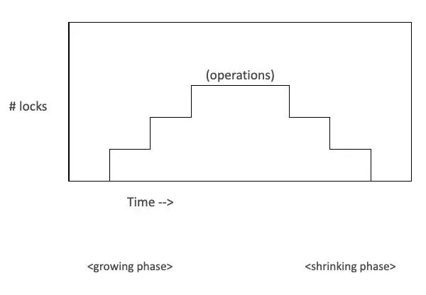

## 2PL Protocol

- Rules
- Two transactions cannot have conflicting locks
- No unlock operation can precede a lock operation in the same transaction
- No data are affected until all locks have been obtained

## Lock Modes

- Shared lock
- One user asks to read a record
- Other users may read it
- No user can update it
- Update lock
- Temporary state before Exclusive lock
- Exclusive lock
- One user asks to modify a record
- No other user can read it or modify it
- Which SQL statement results in a shared lock?
- Why bother locking a record being read?
- Why is an exclusive lock necessary?
- Why prevent users from reading the record?

## Deadlock

- Occurs when two transactions wait for each other to unlock data
- T1 obtains a lock on X
- T2 obtains a lock on Y
- T1 requests a lock on Y
- T2 requests a lock on X
- Only exists with exclusive locks

## Deadlock Control

- Prevention
- Transaction is aborted and rescheduled if possibility of deadlock exists
- Detection
- If a deadlock is found, one transaction is aborted (rolled back) and rescheduled while the other continues
- Avoidance
- Obtain all locks, in succession, before executing
- increase action response times
- Recommendations:
- Low probability: detection
- High probability: prevention
- Use avoidance where response time is a low priority

## Database Recovery Management

- The database failing for unexpected reasons occurs occasionally
- Possible causes are power or hardware failure
- Recovery restores the database from a given state, usually inconsistent, to a previously consistent state
- Techniques used based on atomic transaction property

## Recovery in SQL Server

- As each modification to the database, it goes to the transaction log first, it will be written to the database at a later time
- Log records for data modifications record either the logical operation performed or they record the before and after images of the modified data
- The before image is a copy of the data before the operation is performed; the after image is a copy of the data after the operation has been performed
- In the event of a crash, the Database Administrator restores the database from the latest backup and then applies the transaction log

# Normalization - Part 1

## Relational Concepts For The Design Process

- We use the normalization process to group data elements into tables that represent entities

## Introduction

- We want to develop a conceptual model that represents the entities of the enterprise and the relationships between them
- This model is independent of any DBMS package, hardware or the physical model
- Later on, it will be mapped to an internal model that complies with the chosen DBMS
- Normalization is the process of organizing data to minimize redundancy
- Normalized data doesn't have storage anomalies
- The organizing of data is done by applying a series of rules to a data model
- While normalization makes databases more efficient to maintain, they can also make them more complex because data is separated into many different tables
- This will require most queries to use table joins

## Normal Forms

- **0 Normal Form** (0NF): un-normalized model before the normalization rules have been applied
- **First Normal Form** (1NF)
- **Second Normal Form** (2NF)
- **Third Normal Form** (3NF)
- Boyce Codd Normal Form (BCNF)
- Fourth Normal Form (4NF)
- Fifth Normal Form (5NF)
- Domain Key Normal Form (DKNF)
- Each previous level must be applied before proceeding to the next

## First Normal Form (1NF)

- Reduce entities to first normal form (1NF) by removing repeating or multi-valued attributes to another, child entity
- To simplify, you cannot have multiple fields to capture multiple values
- Most common ‘sins’ against the first normal form are the lack of a primary key and the use of repeating columns
- Also, remove calculated fields

## 0NF (un-normalized)

- No rules have been applied to this model
- Note the repeating product columns
- This does not allow for more products to be added and creates cells with null values
- Also note the calculated fields: ExtPrice1 = Qty1 * Price1, Amount = ExtPrice1 + ExtPrice2 + ExtPrice3

| Order | OrderDate  | CustId | LName  | FName | Prov | TaxRate | Prod | ProdDesc      | Qty1 | Price | ExtPrice1 | Prod2 | ProdDesc2   | Qty2 | Price2 | ExtPrice2 | Prod3 | ProdDesc   | Qty3 | Price3 | ExtPrice3 | Amount |
| :---- | :--------- | :----- | :----- | :---- | :--- | :------ | :--- | :------------ | :--- | :---- | :-------- | :---- | :---------- | :--- | :----- | :-------- | :---- | :--------- | :--- | :----- | :-------- | :----- |
| 239   | 2017-01-08 | 1135   | Black  | John  | ON   | 0.08    | 555  | Cheese Tray   | 10   | 10.00 | 100.00    | 444   | Wine Gift   | 15   | 20.00  | 300.00    |       |            |      |        |           | 400.00 |
| 240   | 2017-01-10 | 1135   | Black  | John  | ON   | 0.08    | 343  | Bottle Opener | 15   | 2.00  | 30.00     | 555   | Cheese Tray | 20   | 10.00  | 200.00    | 111   | Wine Glass | 25   | 4.00   | 100.00    | 330.00 |
| 241   | 2017-01-11 | 1140   | Brown  | Jack  | ON   | 0.08    | 231  | Hat           | 5    | 7.50  | 37.50     | 123   | Bat         | 2    | 25.00  | 50.00     |       |            |      |        |           | 87.50  |
| 243   | 2017-01-15 | 1140   | Brown  | Jack  | ON   | 0.08    | 321  | Cards         | 25   | 3.00  | 75.00     |       |             |      |        |           |       |            |      |        |           | 75.00  |
| 245   | 2017-01-16 | 1152   | Mills  | Mike  | BC   | 0.07    | 451  | Shoes         | 4    | 30.00 | 120.00    | 321   | Cards       | 15   | 3.00   | 45.00     |       |            |      |        |           | 165.00 |
| 246   | 2017-01-20 | 1156   | Levey  | Kyle  | MB   | 0.07    | 555  | Cheese Tray   | 5    | 10.00 | 50.00     | 231   | Hat         | 10   | 7.50   | 75.00     | 321   | Cards      | 20   | 3.00   | 60.00     | 185.00 |
| 255   | 2017-01-22 | 1174   | Little | Tony  | SK   | 0.05    | 444  | Wine Gift     | 8    | 20.00 | 160.00    | 12    | Soccer Ball | 12   | 10.00  | 120.00    |       |            |      |        |           | 280.00 |
| 256   | 2017-01-25 | 1174   | Little | Tony  | SK   | 0.05    | 945  | Chair         | 2    | 50.00 | 100.00    | 932   | Table       | 1    | 100.00 | 100.00    | 910   | Couch      | 1    | 300.00 | 300.00    | 500.00 |
| 260   | 2017-01-26 | 1180   | Nye    | Bill  | PE   | 0.10    | 800  | Glasses       | 100  | 2.50  | 250.00    |       |             |      |        |           |       |            |      |        |           | 250.00 |

## 1NF

- Two tables have been created: Order and Product
- They are linked by the Order field
- This eliminates the repeating fields in a record
- Calculated values ExtPrice1, ExtPrice2, ExtPrice3 and Amount have been discarded

| Order | OrderDate  | Custld | LName  | FName | Prov | TaxRate |
| :---- | :--------- | :----- | :----- | :---- | :--- | :------ |
| 239   | 2017-01-08 | 1135   | Black  | John  | ON   | 0.08    |
| 240   | 2017-01-10 | 1135   | Black  | John  | ON   | 0.08    |
| 241   | 2017-01-11 | 1140   | Brown  | Jack  | ON   | 0.08    |
| 243   | 2017-01-15 | 1140   | Brown  | Jack  | ON   | 0.08    |
| 245   | 2017-01-16 | 1152   | Mills  | Mike  | BC   | 0.07    |
| 246   | 2017-01-20 | 1156   | Levey  | Kyle  | MB   | 0.07    |
| 255   | 2017-01-22 | 1174   | Little | Tony  | SK   | 0.05    |
| 256   | 2017-01-25 | 1174   | Little | Tony  | SK   | 0.05    |
| 260   | 2017-01-26 | 1180   | Nye    | Bill  | PE   | 0.10    |

| Order | Prod | ProdDesc      | Qty  | Price  |
| :---- | :--- | :------------ | :--- | :----- |
| 239   | 555  | Cheese Tray   | 10   | 10.00  |
| 239   | 444  | Wine Gift     | 15   | 20.00  |
| 240   | 343  | Bottle Opener | 15   | 2.00   |
| 240   | 555  | Cheese Tray   | 20   | 10.00  |
| 240   | 111  | Wine Glass    | 25   | 4.00   |
| 241   | 231  | Hat           | 5    | 7.50   |
| 241   | 123  | Bat           | 2    | 25.00  |
| 243   | 321  | Cards         | 25   | 3.00   |
| 245   | 451  | Shoes         | 4    | 30.00  |
| 245   | 321  | Cards         | 15   | 3.00   |
| 246   | 555  | Cheese Tray   | 5    | 10.00  |
| 246   | 231  | Hat           | 10   | 7.50   |
| 246   | 321  | Cards 20      | 3.00 | 00 255 |
| 444   | Wine | Gift          | 8    | 20.00  |
| 255   | 12   | Soccer Ball   | 12   | 10.00  |
| 256   | 945  | Chair         | 2    | 50.00  |
| 256   | 932  | Table         | 1    | 100.00 |
| 256   | 910  | Couch         | 1    | 300.00 |
| 260   | 800  | Glasses       | 100  | 2.50   |

## Second Normal Form (2NF)

- Reduce first normal form entities to second normal form (2NF) by removing attributes that are not dependent on the whole primary key
- The primary key for each record must be able to determine the value for all of the other fields in the records

## 1NF

- Here knowledge of the Product# alone provides the product description and price without the Order#
- We must create another table for this to conform to 2NF

| Order | Prod | ProdDesc      | Qty  | Price  |
| :---- | :--- | :------------ | :--- | :----- |
| 239   | 555  | Cheese Tray   | 10   | 10.00  |
| 239   | 444  | Wine Gift     | 15   | 20.00  |
| 240   | 343  | Bottle Opener | 15   | 2.00   |
| 240   | 555  | Cheese Tray   | 20   | 10.00  |
| 240   | 111  | Wine Glass    | 25   | 4.00   |
| 241   | 231  | Hat           | 5    | 7.50   |
| 241   | 123  | Bat           | 2    | 25.00  |
| 243   | 321  | Cards         | 25   | 3.00   |
| 245   | 451  | Shoes         | 4    | 30.00  |
| 245   | 321  | Cards         | 15   | 3.00   |
| 246   | 555  | Cheese Tray   | 5    | 10.00  |
| 246   | 231  | Hat           | 10   | 7.50   |
| 246   | 321  | Cards 20      | 3.00 | 00 255 |
| 444   | Wine | Gift          | 8    | 20.00  |
| 255   | 12   | Soccer Ball   | 12   | 10.00  |
| 256   | 945  | Chair         | 2    | 50.00  |
| 256   | 932  | Table         | 1    | 100.00 |
| 256   | 910  | Couch         | 1    | 300.00 |
| 260   | 800  | Glasses       | 100  | 2.50   |

## 2NF

- Another table has been created: OrderLine
- It is linked to the product table with the common field product
- Therefore each product description is entered once in the database rather than each time someone purchases the item
- The combination of Order# and Product# are needed to identify quantity

| Order | Prod | Qty |
| :---- | :--- | :-- |
| 239   | 555  | 10  |
| 239   | 444  | 15  |
| 240   | 343  | 15  |
| 240   | 555  | 20  |
| 240   | 111  | 25  |
| 241   | 231  | 5   |
| 241   | 123  | 2   |
| 243   | 321  | 25  |
| 245   | 451  | 4   |
| 245   | 321  | 15  |
| 246   | 555  | 5   |
| 246   | 231  | 10  |
| 246   | 321  | 20  |
| 255   | 444  | 8   |
| 255   | 12   | 12  |
| 256   | 945  | 2   |
| 256   | 932  | 1   |
| 256   | 910  | 1   |
| 260   | 800  | 100 |

| Prod | ProdDesc      | Price  |
| :--- | :------------ | :----- |
| 12   | Soccer Ball   | 10.00  |
| 111  | Wine Glass    | 4.00   |
| 123  | Bat           | 25.00  |
| 231  | Hat           | 7.50   |
| 321  | Cards         | 3.00   |
| 343  | Bottle Opener | 2.00   |
| 444  | Wine Gift     | 20.00  |
| 451  | Shoes         | 30.00  |
| 555  | Cheese Tray   | 10.00  |
| 800  | Glasses       | 2.50   |
| 910  | Couch         | 300.00 |
| 932  | Table         | 100.00 |
| 945  | Chair         | 50.00  |

## Getting Smaller

- The order table that started with 23 fields has now shrunk considerably
- 3NF will reduce this further by removing the redundant names, provinces and tax rates

| Order | OrderDate  | Custld | LName  | FName | Prov | TaxRate |
| :---- | :--------- | :----- | :----- | :---- | :--- | :------ |
| 239   | 2017-01-08 | 1135   | Black  | John  | ON   | 0.08    |
| 240   | 2017-01-10 | 1135   | Black  | John  | ON   | 0.08    |
| 241   | 2017-01-11 | 1140   | Brown  | Jack  | ON   | 0.08    |
| 243   | 2017-01-15 | 1140   | Brown  | Jack  | ON   | 0.08    |
| 245   | 2017-01-16 | 1152   | Mills  | Mike  | BC   | 0.07    |
| 246   | 2017-01-20 | 1156   | Levey  | Kyle  | MB   | 0.07    |
| 255   | 2017-01-22 | 1174   | Little | Tony  | SK   | 0.05    |
| 256   | 2017-01-25 | 1174   | Little | Tony  | SK   | 0.05    |
| 260   | 2017-01-26 | 1180   | Nye    | Bill  | PE   | 0.10    |

## Third Normal Form (3NF)

- Third normal form is violated when a non-key field is a fact about another non-key field
- Reduce second normal form entities to third normal form (3NF) by removing attributes that are dependent on other attributes

## 3NF

- By creating another two tables our order table is down to 3 fields
- We've eliminated the name fields by linking the CustID to a separate Customer table, and likewise for the tax rate using the province abbreviation

| Order | OrderDate  | Custld |
| :---- | :--------- | :----- |
| 239   | 2017-01-08 | 1135   |
| 240   | 2017-01-10 | 1135   |
| 241   | 2017-01-11 | 1140   |
| 243   | 2017-01-15 | 1140   |
| 245   | 2017-01-16 | 1152   |
| 246   | 2017-01-20 | 1156   |
| 255   | 2017-01-22 | 1174   |
| 256   | 2017-01-25 | 1174   |
| 260   | 2017-01-26 | 1180   |

- This removes the redundancy of the customer name and province each time an order is placed

| Custld | LName       | FName | Prov |
| :----- | :---------- | :---- | :--- |
| 1135   | Black John  | ON    |      |
| 1140   | Brown Jack  | ON    |      |
| 1152   | Mills Mike  | BC    |      |
| 1156   | Levey Kyle  | MB    |      |
| 1174   | Little Tony | SK    |      |
| 1180   | Nye Bill    | PE    |      |

- Here the redundancy of the tax rate is removed by creating a table with province tax information

| Prov | TaxRate |
| :--- | :------ |
| BC   | 0.07    |
| MB   | 0.07    |
| ON   | 0.08    |
| PE   | 0.10    |
| SK   | 0.05    |

## Order Normalization

- The original un-normalized Order table became 5 normalized tables
- Customer
- Order
- OrderLine
- Prod
- Prov

## **Third Normal Form Tables**

| customer_id | lname | fname | province_id |
| :---------- | :---- | :---- | :---------- |

| order_id | order_date | customer_id |
| :------- | :--------- | :---------- |

| order_id | product_id | qty |
| :------- | :--------- | :-- |

| product_id | product_description | price |
| :--------- | :------------------ | :---- |

| province_id | tax_rate |
| :---------- | :------- |

## Creating the ERD

- Draw the entities with their primary keys

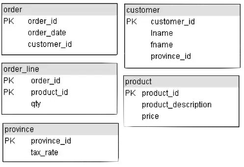

- Examine each primary key to see if it appears in another table, if so it is a foreign key in the other table

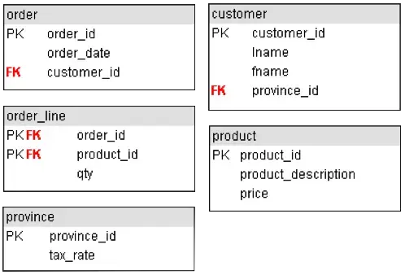

- Each foreign key means there is a relationship between the two tables
- The primary key is on the **one** side and the foreign key is on the **many** side

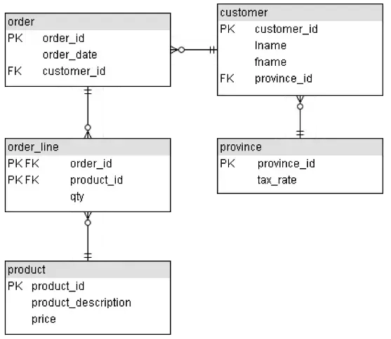

## Normalization Good News/Bad News

- The bad news is that this increases processing complexity
- In order to get any useful information out of the database, most queries will need to join 2 or more tables
- The good news is that the data is organized and unique
- Each fact is only stored in one place

## Normalization Quick Summary

**1NF** - Eliminate Repeating Groups And Derived Attributes

- Make a separate table for each set of related attributes, and give each table a primary key

**2NF** - Eliminate Redundant Data

- If an attribute depends on only part of a composite key, remove it to a separate table

**3NF** - Eliminate Columns Not Dependent On Key

- If attributes do not contribute to a description of the key, remove them to a separate table

## More Examples

- [http://www.bkent.net/Doc/simple5.htm](http://www.bkent.net/Doc/simple5.htm)
- [http://www.troubleshooters.com/littstip/ltnorm.html](http://www.troubleshooters.com/littstip/ltnorm.html)
- [http://www.databasejournal.com/sqletc/article.php/1428511](http://www.databasejournal.com/sqletc/article.php/1428511)
- [http://databases.about.com/library/weekly/aa080501a.htm](http://databases.about.com/library/weekly/aa080501a.htm)
- [http://phlonx.com/resources/nf3](http://phlonx.com/resources/nf3)

## Normalization Case Study

Pipes N Things Inc.

- A distributor of plumbing parts and fixtures
- Purchase from manufacturers
- Supply retailers
- Designing corporate database

## Purchasing Department

- Determine vital entities
- Purchase Order document is critical

## List The Entities Found

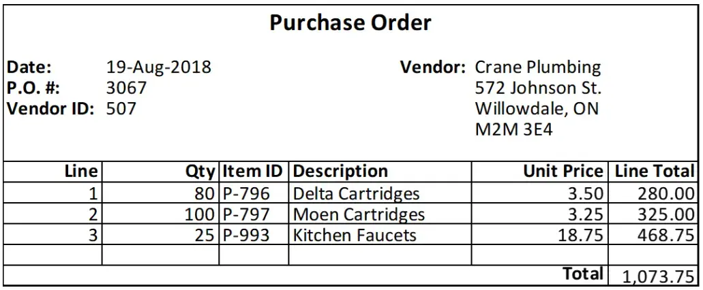

- Hint, look for keys
- Keys will usually identify entities

## A Second Purchase Order

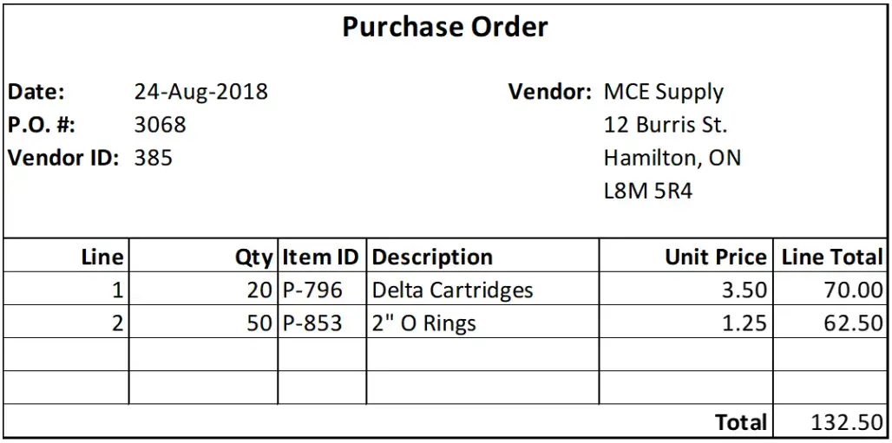

## Convert The Purchase Order Documents Into A Two Dimensional Table

| PO_No | Date       | Vend_ID | Name           | Address         | City       | Prov | Postal  | Qty | Item_ID | Description      | Price | Line_Total | Total   |
| :---- | :--------- | :------ | :------------- | :-------------- | :--------- | :--- | :------ | :-- | :------ | :--------------- | :---- | :--------- | :------ |
| 3067  | 2018-08-19 | 507     | Crane Plumbing | 572 Johnson St. | Willowdale | ON   | M2M 3Е4 | 80  | P-796   | Delta Cartridges | 3.50  | 280.00     | 1073.75 |
|       |            |         |                |                 |            |      |         | 100 | P-797   | Moen Cartridges  | 3.25  | 325.00     |         |
|       |            |         |                |                 |            |      |         | 25  | P-993   | Kitchen Faucets  | 18.75 | 468.75     |         |
| 3068  | 2018-08-24 | 385     | MCE Supply     | 12 Burris St.   | Hamilton   | ON   | L8M 5R4 | 20  | P.796   | Delta Cartridges | 3.50  | 70.00      | 132.50  |
|       |            |         |                |                 |            |      |         | 50  | P-853   | 2" O Rings       | 1.25  | 62.50      |         |

- Results in an unnormalized table
- Multiple occurrences of data exist
- We can find cells that have more than one value:

| Item_ID | Desc | Qty | Description | Price | Line_Total |
| :------ | :--- | :-- | :---------- | :---- | :--------- |

## Normalization – The First Step

- Transforming an un-normalized table into one that is in First Normal Form
- 1NF has no repeated occurrences of data items in any of its cells
- Go back to the table and put it into 1NF by repeating some of the data values and removing calculated values
- Repeating Values For Attributes

| PO_No | Date | Vend_ID | Name | Address | City | Prov | Postal |
| :---- | :--- | :------ | :--- | :------ | :--- | :--- | :----- |

- Calculated values (Line_Total, Total) removed

| PO_No | Date       | Vend_ID | Name           | Address         | City       | Prov | Postal  | Qty | Item_ID | Description      | Price |
| :---- | :--------- | :------ | :------------- | :-------------- | :--------- | :--- | :------ | :-- | :------ | :--------------- | :---- |
| 3067  | 2018-08-19 | 507     | Crane Plumbing | 572 Johnson St. | Willowdale | ON   | M2M 3E4 | 80  | P_796   | Delta Cartridges | 3.50  |
| 3067  | 2018-08-19 | 507     | Crane Plumbing | 572 Johnson St. | Willowdale | ON   | M2M 3E4 | 100 | P-797   | Moen Cartridges  | 3.25  |
| 3067  | 2018-08-19 | 507     | Crane Plumbing | 572 Johnson St. | Willowdale | ON   | M2M 3E4 | 25  | P-993   | Kitchen Faucets  | 18.75 |
| 3068  | 2018-08-24 | 385     | MCE Supply 12  | Burris St.      | Hamilton   | ON   | L8M 5R4 | 20  | P-796   | Delta Cartridges | 3.50  |
| 3068  | 2018-08-24 | 385     | MCE Supply 12  | Burris St.      | Hamilton   | ON   | L8M 5R4 | 50  | P-853   | 2" O Rings       | 1.25  |

- What is the table’s key?
- ...PO_No + Item_ID

## Normalization – The Second Step

- Isolating
- What data items are dependent on parts of the key
- What data items are left dependent on the whole key
- Dependent on PO_No
- Date
- Vend_ID
- Name
- Address, City, Prov, Postal
- The resulting table with PO_No as the key

| po_no | date | vend_id | name | address | city | prov | postal |
| :---- | :--- | :------ | :--- | :------ | :--- | :--- | :----- |

- Dependent on Item_ID
- Description
- Price
- The resulting table with Item_ID as the key

| item_id | description | price |
| :------ | :---------- | :---- |

- The attribute(s) remaining as dependent on the original key is/are
- Qty
- The third table

| po_no | item_id | qty |
| :---- | :------ | :-- |

## Normalization – The Third Step

- Separating any entity that deserves its own relation in the database
- Name each entity
- Look for a key field that has a dependent attribute; a key for another entity
- Is this occurring in our 2NF tables?
- If so, where?

## Third Normal Form Tables

### po_header

| po_no | date | vend_id |
| :---- | :--- | :------ |

### vendor

| vend_id | name | address | city | prov | postal |
| :------ | :--- | :------ | :--- | :--- | :----- |

### item

| item_id | description | price |
| :------ | :---------- | :---- |

### po_line

| po_no | item_id | qty |
| :---- | :------ | :-- |

## Creating the ERD

- Draw the entities with their primary keys

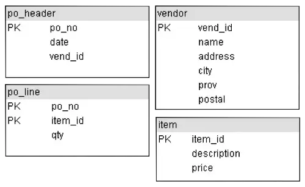

- Examine each primary key to see if it appears in another table, if so it is a foreign key in the other table

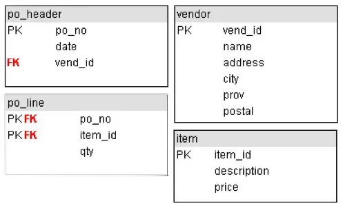

- Each foreign key means there is a relationship between the two tables
- The primary key is on the **one** side and the foreign key is on the **many** side

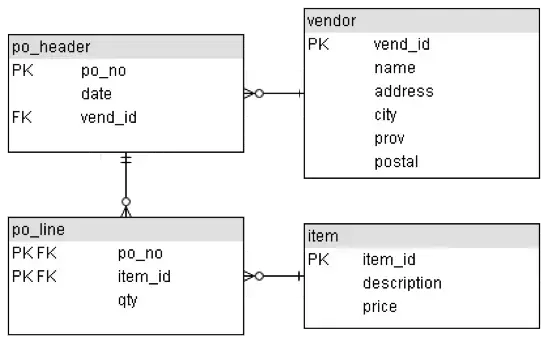

## Storage Anomalies of the First Normal Form

- Insertion Anomaly
- Update Anomaly
- Deletion Anomaly

### For reference

| PO_No | Date       | Vend_ID | Name           | Address         | City       | Prov | Postal  | Qty | Item_ID | Description      | Price |
| :---- | :--------- | :------ | :------------- | :-------------- | :--------- | :--- | :------ | :-- | :------ | :--------------- | :---- |
| 3067  | 2018-08-19 | 507     | Crane Plumbing | 572 Johnson St. | Willowdale | ON   | M2M 3E4 | 80  | P_796   | Delta Cartridges | 3.50  |
| 3067  | 2018-08-19 | 507     | Crane Plumbing | 572 Johnson St. | Willowdale | ON   | M2M 3E4 | 100 | P-797   | Moen Cartridges  | 3.25  |
| 3067  | 2018-08-19 | 507     | Crane Plumbing | 572 Johnson St. | Willowdale | ON   | M2M 3E4 | 25  | P-993   | Kitchen Faucets  | 18.75 |
| 3068  | 2018-08-24 | 385     | MCE Supply 12  | Burris St.      | Hamilton   | ON   | L8M 5R4 | 20  | P-796   | Delta Cartridges | 3.50  |
| 3068  | 2018-08-24 | 385     | MCE Supply 12  | Burris St.      | Hamilton   | ON   | L8M 5R4 | 50  | P-853   | 2" O Rings       | 1.25  |

## 1NF Insertion Anomaly

- Recall the first normal form again for the Purchase Order
- If the database had only this table in it, we could not set up a Vendor or Item unless we had all the PO information

### 1NF Update Anomaly

- If the Description for an item changed, we would have to find the Description and change all occurrences

### 1NF Deletion Anomaly

- Deleting the rows for a Purchase Order causes the loss of Vendor and Item information

## Storage Anomalies of the Second Normal Form

### Advantages of 2NF

- **INSERTION**
- An item can be added by itself without PO information
- **UPDATE**
- If the Description for an item changed, only one occurrence would be affected
- **DELETION**
- deleting a row for a PO has no effect on an Item record

### Disadvantages of 2NF

- **INSERTION**
- Vendor cannot be set up by itself
- **UPDATE**
- multiple records may need to be updated if Vendor address information changed
- **DELETION**
- deleting rows for a PO causes loss of Vendor information

| po_no | date | vend_id | name | address | city | prov | postal |
| :---- | :--- | :------ | :--- | :------ | :--- | :--- | :----- |

## The Absence of Storage Anomalies In The Third Normal Form

- In one of the 2NF relations, we have a transitive dependency between one non-key attribute, vend_id, and other non-key attributes, name, address, city, prov and postal
- The transitivity is removed when VENDOR has its own relation in the database

| po_no | date | vend_id | name | address | city | prov | postal |
| :---- | :--- | :------ | :--- | :------ | :--- | :--- | :----- |

## Advantages Of Third Normal Form

- Vendor can be set up by itself
- Only one record needs updating if vendor address changes
- Deleting rows for a PO does not cause loss of vendor information

| vend_id | name | address | city | prov | postal |
| :------ | :--- | :------ | :--- | :--- | :----- |

## Summary

- **Normalization** is the process of organizing data to minimize redundancy
- **Normalized data** doesn't have storage anomalies
- **1NF** - Eliminate Repeating Groups And Derived Attributes
- **2NF** - Eliminate Redundant Data
- **3NF** - Eliminate Columns Not Dependent On Key

# Normalization - Part 2

## An Unnormalized Table

| STU_NO | FEE     | PAID | AMOUNT |
| :----- | :------ | :--- | :----- |
| 302910 | Co-op   | Y    | 400.00 |
|        | Parking | N    | 150.00 |
|        | Site    | Y    | 100.00 |
| 319825 | Parking | Y    | 150.00 |
|        | Site    | Y    | 100.00 |
| 327447 | Site    | Y    | 100.00 |
| 349223 | Parking | Y    | 150.00 |
|        | Site    | N    | 100.00 |

- What would you do to put the table in 1NF? **Populate STU_NO**

## A 1NF Table

| STU_NO | FEE     | PAID | AMOUNT |
| :----- | :------ | :--- | :----- |
| 302910 | Co-op   | Y    | 400.00 |
| 302910 | Parking | N    | 150.00 |
| 302910 | Site    | Y    | 100.00 |
| 319825 | Parking | Y    | 150.00 |
| 319825 | Site    | Y    | 100.00 |
| 327447 | Site    | Y    | 100.00 |
| 349223 | Parking | Y    | 150.00 |
| 349223 | Site    | N    | 100.00 |

- What would you do to put the table in 1NF? **Populate STU_NO**
- What is the key for the table when it is in 1NF? **STU_N0 + FEE**

## Three Basic Requirements Of 1NF Table

- Cells must be single valued
- All values in a column must have the same domain
- Each row must be unique

## 1NF Anomalies

- If the information on STU_NO 302910 is dropped, a deletion anomaly arises. What does this mean? **Information is lost - Amount for Co-op**
- What other anomalies exist? **Insertion, Update**

## Second Normal Form

- A relation is in second normal form if all of its non-key attributes are dependent on all of the key
- Normalize this 1NF table to 2NF.
- What would it look like?
- **STU_NO + FEE PAID**
- **FEE AMOUNT**

## Third Normal Form

- A relation is in 3NF if it is in 2NF and has no transitive dependencies

| STU_NO | PROGRAM                | TUITION   |
| :----- | :--------------------- | :-------- |
| 349207 | Business               | $1,800.00 |
| 350194 | Computer Systems Tech. | $2,200.00 |
| 352896 | Nursing                | $2,000.00 |
| 357104 | Business               | $1,800.00 |

- Verify that this table is in 1NF and 2NF.
- What is the key for the table?
- Where is the transitive dependency?
- A deletion anomaly occurs when the second row is removed. What does this mean?
- **Normalize the table into two 3NF tables.**

## 2NF to 3NF

| PROGRAM                | TUITION   |
| :--------------------- | :-------- |
| Business               | $1,800.00 |
| Computer Systems Tech. | $2,200.00 |
| Nursing                | $2,000.00 |

| STU_NO | PROGRAM                |
| :----- | :--------------------- |
| 349207 | Business               |
| 350194 | Computer Systems Tech. |
| 352896 | Nursing                |
| 357104 | Business               |

## Normalization Case Study Revisited

Pipes N Things Inc. is a distributor of plumbing parts and fixtures. They purchase from manufacturers and supply retailers. Additionally, they design corporate databases.

## Purchasing Department

Determine vital entities. Purchase Order documents are crucial. This purchase order has a line number, which simply counts the number of items on each purchase order. Sometimes, this is referred to as a sequence number.

## OLTP

All the examples discussed so far have been related to Online Transaction Processing (OLTP), which is the most common type of transaction processing. Normalization rules are designed to ensure that data is unique and not redundant.

## Normalized Data

Normalized data is complex to work with due to the numerous joins required to obtain meaningful results. Additionally, derived columns cannot be indexed, which can slow down the data processing. However, in OLTP scenarios, these tradeoffs are acceptable for the sake of data integrity.

## OLAP

- OLTP, while not the sole purpose of data collection, plays a crucial role. Why would data be gathered if it wouldn't be analyzed further? Online Analytical Processing (OLAP) emerges as another significant database application. Business Intelligence (BI) tools utilize OLAP data to empower end users with the ability to analyze and report on the data in a manner that aligns with the specific business requirements.
- OLAP prioritizes speed and simplicity of access over data integrity. In fact, OLAP databases are deliberately de-normalized for this very reason. Data is also pre-summarized based on anticipated queries. These databases are commonly referred to as Big Data or Data Warehouses.
- OLAP databases are typically fed from OLTP databases on a schedule that reflects the complexity of the cube and the volatility of the data. This schedule can span daily, weekly, or monthly intervals. Consequently, OLAP cubes are not usually real-time data. However, since analysis often involves analyzing trends, this limitation is usually not a significant concern.

## OLAP Cube

OLAP databases often conceptualize data around a cube, with one of its dimensions being time. OLAP data is typically manipulated through techniques like slicing, dicing, and drilling down.

## OLAP Cube Slices

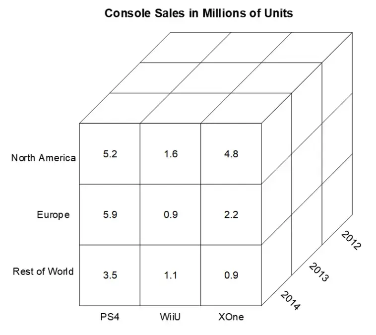 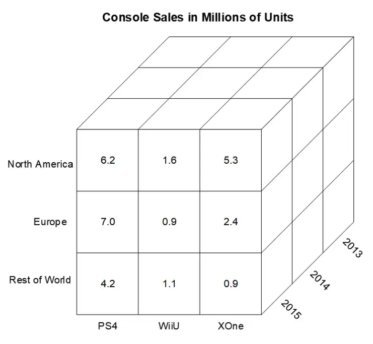 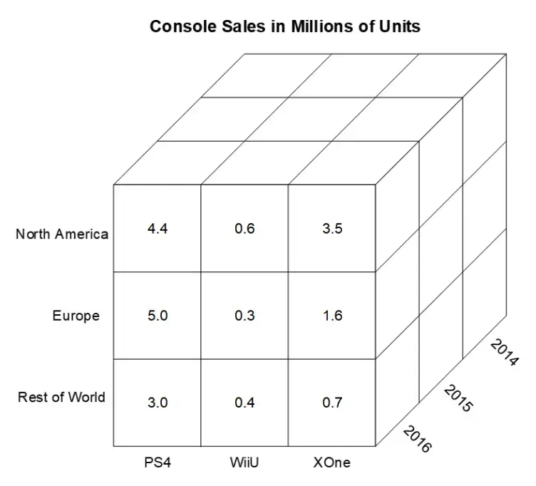 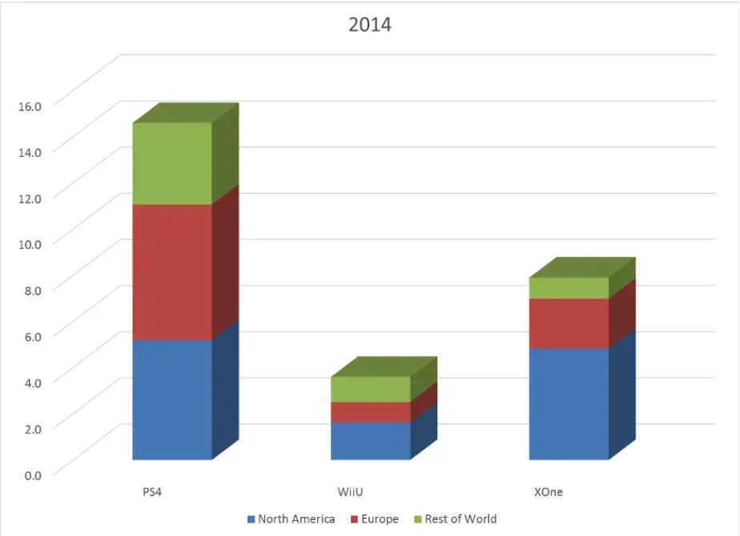 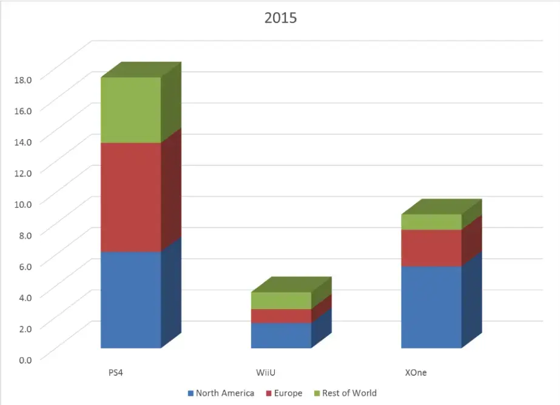 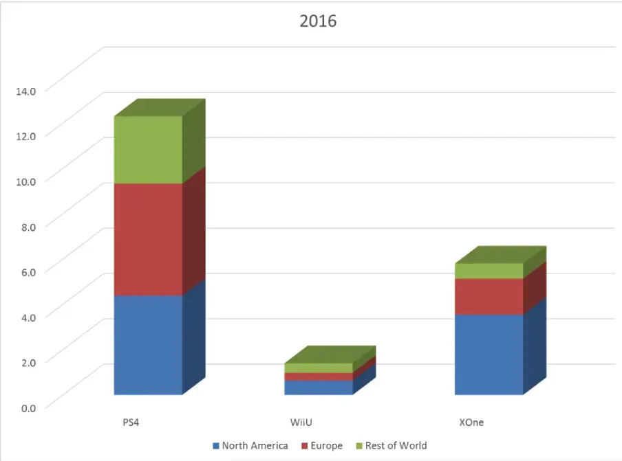

## Data Warehouse

Offloading data from the OLTP to the OLAP database enables each database to be optimized for its specific task. This separation ensures that complex, heavy queries in the OLAP database don't slow down the production database.

## Summary

Normalizing data to 3NF is almost always sufficient for "real-world" processing. On the other hand, OLAP de-normalizes and summarizes data to facilitate quick and easy analysis.
