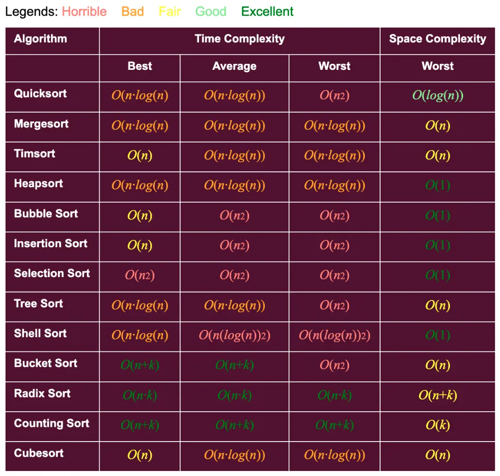
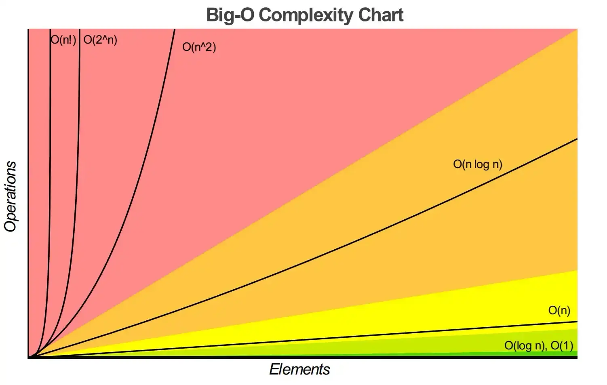

# Introduction to C#

- In 2000, Microsoft announced the C# programming language.
- C# has roots in the C, C++ and Java programming languages.

### INDEX

| No  | Topic                                                       |
| :-: | :---------------------------------------------------------- |
|  1  | [Introduction to C#](#introduction-to-c)                    |
|  2  | [Object-Oriented Programming](#object-oriented-programming) |
|  3  | [Event-Driven Programming](#event-driven-programming)       |
|  4  | [Visual Programming](#visual-programming)                   |
|  5  | [Generic Programming](#generic-programming)                 |
|  6  | [Functional Programming](#functional-programming)           |
|  7  | [Microsoft's .NET](#microsofts-net)                         |
|  8  | [.NET Framework](#net-framework)                            |
|  9  | [Common Language Runtime](#common-language-runtime)         |
| 10  | [Language Interoperability](#language-interoperability)     |

## Object-Oriented Programming

- C# is object oriented.
- C# has access to the powerful .NET Framework Class Library — a vast collection of prebuilt classes that enable you to develop apps quickly.
- Some key capabilities in the NET Framework Class Library.

| Database          | Debugging       | Computer networking | Web communication              |
| :---------------- | :-------------- | :------------------ | :----------------------------- |
| Building web apps | Multithreading  | Permissions         | Graphical user interface       |
| Graphics          | File processing | Mobile              | Data structures                |
| Input/output      | Security        | String processing   | Universal Windows Platform GUI |

- The .NET Framework allows C# to operate seamlessly with Windows so that programs can make use of familiar Windows features.

## Event-Driven Programming

- C# Graphical user interfaces (GUIs) are event driven.
- You can write programs that respond to user-initiated events such as mouse clicks, keystrokes, timer expirations and touches and finger swipes—gestures that are widely used on smartphones and tablets.

## Visual Programming

- Microsoft's Visual Studio enables you to use C# as a visual programming language.
- You'll use Visual Studio to conveniently drag and drop predefined GUI objects like buttons and textboxes into place on your screen, and label and resize them.
- Visual Studio will write much of the GUI code for you.

## Generic Programming

- It's common to write a program that processes a collection of things.
- Historically, you had to program separately to handle each type of collection.
- With generic programming, you write code that handles a collection "in the general" and C# handles the specifics for each different type of collection.

## Functional Programming

- With functional programming, you specify what you want to accomplish in a task, but not how to accomplish it.
- For example, with Microsoft's LINQ you can say, "Here's a collection of numbers, give me the sum of its elements."
- You do not need to specify the mechanics of walking through the elements and adding them into a running total one at a time—LINQ handles all that for you.
- Functional programming speeds application development and reduces errors.

## Microsoft's .NET

- In 2000, Microsoft announced its .NET initiative (www.microsoft.com/net), a broad vision for using the Internet and the web in the development, engineering, distribution and use of software.
- Rather than forcing you to use a single programming language, .NET permits you to create apps in any .NET-compatible language (such as C#, Visual Basic, Visual C++ and others).

## .NET Framework

- The .NET Framework Class Library provides many capabilities that you'll use to build substantial C# apps quickly and easily.
- It contains thousands of valuable prebuilt classes that have been tested and tuned to maximize performance.
- You should re-use the .NET Framework classes whenever possible to speed up the software-development process, while enhancing the quality and performance of the software you develop.

## Common Language Runtime

- The Common Language Runtime (CLR) executes .NET programs and provides functionality to make them easier to develop and debug.
- The CLR is a virtual machine (VM)—software that manages the execution of programs and hides from them the underlying operating system and hardware.
- The source code for programs that are executed and managed by the CLR is called managed code.
- The CLR provides various services to manage code integrating software components written in different .NET languages, error handling between such components, enhanced security, automatic memory management and more.
- Unmanaged-code programs do not have access to the CLR's services, which makes unmanaged code more difficult to write.
- Managed code is compiled into machine-specific instructions in the following steps:
- First, the code is compiled into Microsoft Intermediate Language (MSIL).
- Code converted into MSIL from other languages and sources can be woven together by the CLR—this allows programmers to work in their preferred .NET programming language.
- The MSIL for an app's components is placed into the app's executable file— the file that causes the computer to perform the app's tasks.
- When the app executes, another compiler (known as the just-in-time compiler or JIT compiler) in the CLR translates the MSIL in the executable file into machine-language code (for a particular platform).
- The machine-language code executes on that platform.

## Language Interoperability

- The .NET Framework provides a high level of language interoperability.
- Because software components written in different .NET languages (such as C# and Visual Basic) are all compiled into MSIL, the components can be combined to create a single unified program.
- Thus, MSIL allows the .NET Framework to be language independent.

| No  | Topic                                                                                                                                                                   |
| :-: | :---------------------------------------------------------------------------------------------------------------------------------------------------------------------- |
|  1  | [Classes and Objects](#classes-and-objects)                                                                                                                             |
|  2  | [Association](#association)                                                                                                                                             |
|  3  | [Composition](#composition)                                                                                                                                             |
|  4  | [Encapsulation](#encapsulation)                                                                                                                                         |
|  5  | [Specialization](#specialization)                                                                                                                                       |
|  6  | [Polymorphism](#polymorphism)                                                                                                                                           |
|  7  | [Defining a Class](#defining-a-class)                                                                                                                                   |
|  8  | [Instantiating Objects](#instantiating-objects)                                                                                                                         |
|  9  | [Classes Versus Objects](#classes-versus-objects)                                                                                                                       |
| 10  | [Access Modifiers](#access-modifiers)                                                                                                                                   |
| 11  | [Access modifier Restrictions](#access-modifer-restrictions)                                                                                                            |
| 12  | [Constructors](#composition)                                                                                                                                            |
| 13  | [The this Keyword](#the-this-keyword)                                                                                                                                   |
| 14  | [Static and Instance Modifiers](#static-and-instance-modifiers)                                                                                                         |
| 15  | [Invoking Static Methods](#invoking-static-methods)                                                                                                                     |
| 16  | [Using Static Fields](#using-static-fields)                                                                                                                             |
| 17  | [Memory Allocation](#memory-allocation)                                                                                                                                 |
| 18  | [Encapsulating Data with Properties](#encapsulating-data-with-properties)                                                                                               |
| 19  | [The get Accessor](#the-get-accessor)                                                                                                                                   |
| 20  | [The set Accessor](#the-set-accessor)                                                                                                                                   |
| 21  | [Class with a Property Rather Than Set and Get Methods](#class-with-a-property-rather-than-set-and-get-methods)                                                         |
| 22  | [Class with an Instance Variable and a Property](#class-with-an-instance-variable-and-a-property)                                                                       |
| 23  | [UML Class Diagram with a Property](#uml-class-diagram-with-a-property)                                                                                                 |
| 24  | [Auto-Implemented Properties](#auto-implemented-properties)                                                                                                             |
| 25  | [Automatic Properties](#automatic-properties)                                                                                                                           |
| 26  | [Garbage Collection and Destructors](#garbage-collection-and-destructors)                                                                                               |
| 27  | [readonly Variables](#readonly-variables)                                                                                                                               |
| 28  | [const Variables](#const-variables)                                                                                                                                     |
| 29  | [Getter-Only Auto-Implemented Properties and readonly](#getter-only-auto-implemented-properties-and-readonly)                                                           |
| 30  | [Object Initializers](#object-initializers)                                                                                                                             |
| 31  | [Operator Overloading](#operator-overloading)                                                                                                                           |
| 32  | [Creating Value Types with struct](#creating-value-types-with-struct)                                                                                                   |
| 33  | [Extension Methods](#extension-methods)                                                                                                                                 |
| 34  | [Base Classes and Derived Classes](#base-classes-and-derived-classes)                                                                                                   |
| 35  | [Protected Members](#protected-members)                                                                                                                                 |
| 36  | [Inheritance Hierarchy Using Private Instance Variables](#inheritance-hierarchy-using-private-instance-variables)                                                       |
| 37  | [Constructors in Derived Classes](#constructors-in-derived-classes)                                                                                                     |
| 38  | [Software Engineering with Inheritance](#software-engineering-with-inheritance)                                                                                         |
| 39  | [Polymorphism Example](#polymorphism-example)                                                                                                                           |
| 40  | [Demonstrating Polymorphic Behavior](#demonstrating-polymorphic-behavior)                                                                                               |
| 41  | [Abstract Classes and Methods](#abstract-classes-and-methods)                                                                                                           |
| 42  | [Case Study: Payroll System Using Polymorphism](#case-study-payroll-system-using-polymorphism)                                                                          |
| 43  | [Creating Abstract Base Class](#creating-abstract-base-class)                                                                                                           |
| 44  | [Summary of the Allowed Assignments Between Base-Class and Derived-Class Variables](#summary-of-the-allowed-assignments-between-base-class-and-derived-class-variables) |
| 45  | [sealed Methods and Classes](#sealed-methods-and-classes)                                                                                                               |
| 46  | [Interfaces](#interfaces)                                                                                                                                               |
| 47  | [Common interfaces of the .NET Framework Class Library](#common-interfaces-of-the-net-framework-class-library)                                                          |

## Classes and Objects

- Object-Oriented Programming Helps to manage complexity of a program
- Well-designed programs are filled with objects
- An object's state is the set of its current values
- An object's capabilities are what actions it can perform
- The object's responsibilities are to be able to know how to perform its own action and maintain its own state
- The ability of an object to own responsibility for its own internal state and actions is known as encapsulation
- All objects in a program are metaphors for real-world objects
- The process of creating objects is called modeling
- A class defines a new type of thing
- Defines common characteristics of every object
- Defines common behaviors every object can perform
- Acts as a blueprint for a house
- An object is an individual instance of a class
- Objects have unique values for their characteristics
- Is the actual house once constructed
- If Dog was a class, then Fido, Spot and Rover could all be specific objects (or instances) of that class

### Association

- The simplest interaction is when a method in one class is used to call a method in a second class
- A Manager class may have a method to call the UpdateSalary method on an object of type Employee
- The Manager class and the Employee class are then said to be associated
- This relationship is referred to as the uses-a relationship

### Composition

- Some complicated types are composed of other types
- An automobile might be composed of wheels, engine, transmission, etc.
- An Automobile object would have four instances of the Wheel class and one instance each of the Engine and Transmission class
- The Automobile class aggregates (or is composed of) the Wheel, Engine and Transmission classes
- This relationship is referred to as the has-a relationship

### Encapsulation

- Keep each type or class discrete and self-contained
- Allows the private implementation of the class to be changed without affecting any other class
- A class providing a method that other classes can use is called a server
- A class that uses that method is called a client
- The public interface is a contract that:
- Promises to do a specific task if provided with certain parameters and return a value
- Allows access to specific values only
- Clients rely on public interfaces not to change

### Specialization

- Implemented through inheritance
- Declares that a new class derives from an existing class
- The specialized (derived) class inherits the characteristics of the more general (base) class
- This relationship is referred to as the is-a relationship
- A Dog is a Mammal
- A Car is a Vehicle
- A Manager is a special type of Employee
- Has new capabilities (hiring, firing) and new characteristics
- Inherits the characteristics and capabilities common to all Employees

### Polymorphism

- Refers to the ability of a single type or class to take many forms
- Allows a collection of disparate derived types to be treated as a group
- Buttons, listboxes, textboxes, etc, can all be treated as controls
- All inherit shared abilities such as the Draw() method
- The Draw() method may be implemented differently for each control, but each control will be drawn correctly using its own variation of the Draw() method

### Defining a Class

- Characteristics are described with member fields
- Hold each object's state
- Behaviors are defined with member methods

```cs
class Dog {
  // Member field
  private int weight;
  private string name;

  // Member method
  public void Bark() {
    // Code here to bark
  }
}
```

- Keywords public and private are access modifiers
- An OOP language's power is that new types can be created to suit particular problems
- A class is a new data type
- Describes attributes or characteristics
- Maintained in fields or member variables
- Describes actions or behaviors
- Maintained in methods or member functions
- A particular instance of a class is an object
- Classes encapsulate the characteristics and capabilities of a type, in a single, self-contained unit
- Access modifiers are either public or private and applies to the class, its fields and its methods
- The identifier is the name of the provided class

### Instantiating Objects

- To make an actual instance, or object, of a class, it must be declared and memory allocated to it
- These steps instantiate the object:

```cs
// declare fido to be an instance of Dog
Dog fido;

// allocate memory for fido
fido = new Dog();

// Or can be combined into one statement
Dog rover = new Dog();
```

### Classes Versus Objects

- Understand the difference between class and object:
  - Compare with the difference between the type int and a variable of type `int`
  - Can't assign a value to a type: `int = 5; // error`
  - Instead, assign a value to an object of that type: `int myInteger; myInteger = 5; // ok`
  - Similarly, can't assign values to fields in a class: `Dog.weight = 5; // error`
  - Not every dog is 5 pounds, so assign values to fields in an object: `fido.weight = 5; // ok`

### Access Modifiers

- An access modifier determines which class methods (including members of other classes) can see and use a member variable or method within a class
- Public methods are part of the class's public interface, defining how this class behaves
- Private methods are "helper methods" used by the public methods to accomplish the work of the class
- Because the internal workings of the class are private, helper methods should not be exposed to other classes

### Access modifier Restrictions

- `public`: No restriction, members are visible to any method of any class.
- `private`: The members in the class are accessible only to methods of the same class.

### Constructors

- Whenever an object is instantiated a special method known as a constructor is called
- Constructors are provided by the compiler unless one has been defined explicitly
- The job of the constructor is to create an instance of the object and put it into a valid state
- A default constructor is a constructor with no arguments, whether it has been coded or provided by the compiler
- If member variables are not explicitly initialized, the constructor will initialize them to default values
- The constructor must be the same name as the class
- Constructors have no return types

```cs
// Constructor for class Box
public Box(int inWidth, int inHeight, int inLength) {
  width = inWidth;
  height = inHeight;
  length = inLength;
}
```

- Instantiating a Box object: `Box boxObject = new Box(4, 8, 3);`

## The this Keyword

- The keyword this refers to the current object instance
- Used to quality instance members that have the same name as parameters:

```cs
public void SomeMethod(int length) {
  this.length = length;
}
```

- length refers to the parameter
- this.length refers to the member variable
- A second use of the this reference is to pass the current object as a parameter to another method:

```cs
class SomeClass {
  public void FirstMethod(OtherClass otherObject) {
    otherObject.SecondMethod(this);
  }
}
```

- Uses two classes, SomeClass and OtherClass
- FirstMethod() belongs to SomeClass, and SecondMethod() belongs to OtherClass
- Inside FirstMethod(), the SecondMethod() is invoked, passing in the current object for further processing

### Static and Instance Modifiers

- Fields and methods of a class can be either instance members or static members
- Instance members – associated with instances of a type
- Static members – associated with the class itself
- All methods are instance methods unless marked as static
- Occasionally it is convenient to invoke a method without having to create an instance of that class
- Access a static member through the name of the class, not through an instance of the class
- Static methods do not have a this reference

### Invoking Static Methods

- Static methods cannot directly access non-static members
- To call a non-static method of any class, it must be instantiated first

```cs
public class Tester {
  public void Run() {
    Console.WriteLine("Hello World");
  }

  public static void Main() {
    Tester t = new Tester();
    t.Run();
  }
}
```

### Using Static Fields

- A common use of static member fields is to keep track of the number of objects that currently exist for a class

```cs
public class Cat {
  // static value for number of Cat objects
  private static int count = 0;
  private int weight;
  private String name;

  // constructor increments the count of Cat objects
  public Cat(String name, int weight) {
    count++;
    this.name = name;
    this.weight = weight;
  }

  //static method to retrieve the count of Cats
  public static void HowManyCats() {
    Console.WriteLine("{0} cats adopted", count);
  }

  public void TellWeight() {
    Console.WriteLine("{0} is {1} pounds", name, weight);
  }
}

public class Tester {
  public void Run() {
    Cat.HowManyCats();
    Cat frisky = new Cat("Frisky", 5);
    frisky.TellWeight();
    Cat.HowManyCats();

    Cat whiskers = new Cat("Whiskers", 7);
    whiskers.TellWeight();
    Cat.HowManyCats();
  }

  static void Main() {
    Tester t = new Tester();
    t.Run();
  }
}
```

### Output:

```
0 cats adopted
Frisky is 5 pounds
1 cats adopted
Whiskers is 7 pounds
2 cats adopted
```

- There's only one static variable for all Cats

## Memory Allocation

- Variables created within methods are local variables
- Allocated (created) in a memory area called the stack
- When a method ends, local variables are destroyed
- De-allocated (removed) from the stack
- Value types (int, float) are created in the stack
- Reference types (objects) are created in a memory area called the heap
- When an instance of a reference type is declared, a reference is actually created
- A variable that refers to another object
- The reference acts like an alias for the object

## Encapsulating Data with Properties

- Most member variables should be set to private
- This aspect of encapsulation enforces data hiding
- Other classes may access these data through properties
- Properties allow other methods (clients) to access the class state as though they were accessing them directly
- External classes could read a field but not change it
- The field could accept only values in a certain range

```cs
public class Box {
  // private variables
  private int length;
  private int width;
  private int height;

  // property
  public int Length {
    get {
      return length;
    }
    set {
      length = value;
    }
  }

  // public methods
  public void DisplayBox() {
    Console.WriteLine("Length: {0}, Width: {1}, Height: {2}", length, width, height);
  }

  // constructor
  public Box(int length, int width, int height) {
    this.length = length;
    this.width = width;
    this.height = height;
  }
}

public class Tester {
  public void Run() {
    // create a box for testing and display it
    Box testBox = new Box(3, 5, 7);
    testBox.DisplayBox();

    // access the length, store it in a local variable
    int testLength = testBox.Length;
    Console.WriteLine("Length of box is: {0}", testLength);

    // increment the length
    testLength++;

    // assign the new value to the member variable
    testBox.Length = testLength;

    // display the box again to test the new value
    testBox.DisplayBox();
  }

  public static void Main() {
    Tester t = new Tester();
    t.Run();
  }
}
```

### Output:

```
Length: 3, Width: 5, Height: 7
Length of box is: 3
Length: 4, Width: 5, Height: 7
```

- Create a property by writing the property type and name
- Within braces, declare the get and set accessors
- Very similar to methods but are part of the property
- Provides the client with simple ways to retrieve and change the value of the private member length
- The set accessor has an implicit parameter called value used to set the value of the member variable

## The get Accessor

- Similar to a class method that returns an object of the type of the property
- Sometimes called a getter
- The get accessor is invoked when value is retrieved
- To the client, the local variable testLength is assigned the value of the Length property of testBox
- To the creator, the get accessor is called which returns the value of the length member variable

```cs
Box testBox = new Box(3, 5, 7);
int testLength = testBox.Length;
```

## The set Accessor

- Sets the value of a property
- Sometimes called setter
- The keyword value is used to represent the argument whose value is assigned to the property
- When code assigns a value to the property, the set accessor is automatically invoked, and the implicit parameter value is set to the value assigned

```cs
testLength++;
testBox.Length = testLength;
```

- Appears to the client as if assigning to a public variable
- To the creator, the set accessor is used to pass value

### Class with a Property Rather Than Set and Get Methods

- Our class contained a private instance variable name and public methods SetName and GetName.
- C# provides a more elegant solution—called properties to accomplish the same tasks.
- A property encapsulates a set accessor for storing a value into a variable and a get accessor for getting the value of a variable.
- To access a property, you specify the object's name, followed by the member-access operator (.) and the property's name.
- This notation implicitly executes the property's get accessor.

### Class with an Instance Variable and a Property

- The property's get and set accessors handle the details of getting and setting data, respectively.
- Unlike method names, the accessor names get and set each begin with a **lowercase** letter.

```cs
public string Name;
```

- The Name property declaration, which specifies that the property is public so it can be used by the class's clients, the property's type is string and the property's name is Name.
- By convention, a property's identifier is the capitalized identifier of the instance variable that it manipulates
- C# is case sensitive, so Name and name are distinct identifiers.
- The property's body is enclosed in braces {}.
- A get accessor begins with the keyword get, and its body is delimited by braces
- A get accessor's body contains a return statement that typically returns the value of an instance variable.
- The property notation person1.Name allows the client to think of the property as the underlying data, but the client still cannot directly manipulate the private instance variable name.
- Keyword get is a contextual keyword, because it's a keyword only in a property's context (that is, its body) in other contexts, get can be used as an identifier.
- A set accessor begins with the identifier set followed by its body, which is delimited by braces.
- A set accessor uses the keyword value as its parameter.
- value is implicitly declared and initialized for you with the value that the client code assigns to the property.
- Like get, the keywords set and value are contextual keywords
- set is a keyword only in a property's context
- value is a keyword only in a set assessor's context

## UML Class Diagram with a Property

- We model C# properties in the UML as attributes.
- A property is followed by the word "property" in guillemets (« and »).
- Using descriptive words in guillemets (called stereotypes in the UML) helps distinguish properties from other attributes and operations.
- The UML indicates the type of a property by placing a colon and a type after the property name.
- A class diagram helps you design a class, so it's not required to show every implementation detail.
- Since an instance variable that's manipulated by a property is really an implementation detail of that property, the class diagram does not show the corresponding instance variable.
- A programmer implementing the class based on a class diagram would create the instance variables as part of the implementation process.
- Similarly, a property's get and set accessors are implementation details, so they're not listed in the UML diagram.

## Auto-Implemented Properties

- When a property's get accessor simply returns private instance variable value and its set accessor simply assigns a value to the instance variable you can use an auto-implemented property.
- The C# compiler automatically creates a hidden private instance variable, and the get and set accessors for getting and setting that hidden instance variable.
- This enables you to implement the property trivially, which is handy when you're first designing a class.
- To use an auto-implemented property in the class, you'd replace the private instance variable and the separate property with the following single line of code:

```cs
public string Name { get; set; }
```

- Initializing an auto-implemented property in its declaration is another C# 6 features known as auto-property initializers.

```cs
Type PropertyName { get; set; } = initializer;
```

- Prior to C# 6, auto-implemented properties required both a get and a set accessor.
- C# 6 getter-only auto-implemented properties are read only.

```cs
public string Name { get; }
```

- Getter-only auto-implemented properties can be initialized only either in their declarations or in all of the type's constructors.
- Type decimal is designed to precisely represent numbers with decimal points, especially monetary amounts.
- A decimal instance variable is initialized to zero by default.
- The decimal property's set accessor performs validation (also known as validity checking).
- In 0.0m the letter m (or M) indicates that 0.0 is a decimal literal.
- The m is required to indicate a decimal literal.
- C# treats numeric literals with decimal points as type double by default, and doubles and decimals cannot be intermixed.
- By default, a property's get and set accessors have the same access as the property e.g., a public property accessors are public.
- It's possible to declare the get and set accessors with different access modifiers.
- In this case, one of the accessors must implicitly have the same access as the property and the other must be explicitly declared with a more restrictive access modifier than the property.
- You can specify formatting in a C# 6 string interpolation expression by following the value in the braces with a colon and a format specifier: {account1.Balance:C} uses the format specifier C to format account1.Balance as currency.
- The Windows culture settings on the user's machine determine the format for displaying currency amounts, such as the commas vs. periods for separating thousands, millions, etc.
- Unlike instance variables, local variables are not initialized by default, so they normally must be initialized explicitly.
- decimal's Parse method returns the decimal value, Each simple type has a Parse method.

## Automatic Properties

- If there are a lot of private member fields in the class, creating accessors for all of them repetitive and time-consuming
- If all that is meant to be done is to retrieve or set a private member, then the shortcut syntax called automatic properties can be used:

```cs
public int Length { get; set; }
```

- When using automatic properties, don't also create the private members as the compiler will do that behind the scenes

## Garbage Collection and Destructors

- The Common Language Runtime (CLR) uses a garbage collector to reclaim the memory occupied by objects that are no longer in use.
- When there are no more references to an object, the object becomes eligible for destruction.
- Every object has a destructor that's invoked by the garbage collector to perform termination housekeeping before its memory is reclaimed.
- A destructor's name is the class name, preceded by a tilde (\~), and it has no access modifier in its header.
- After an object's destructor is called, the object becomes eligible for garbage collection the memory for the object can be reclaimed by the garbage collector.
- Memory leaks are less likely in C# than languages like C and C++ (but some can still happen in subtle ways).

## readonly Variables

- The principle of least privilege states that code should be granted the amount of privilege and access needed to accomplish its designated task, but no more.
- Constants declared with const must be initialized to a constant value when they're declared.
- C# provides keyword readonly to specify that an instance variable of an object is not modifiable and that any attempt to modify it after the object is constructed is an error.
- A readonly variable's identifier uses PascalCase by convention.
- Although readonly instance variables can be initialized when they're declared, this isn't required.
- A readonly variable should be initialized by each of the class's constructors or in the variable's declaration.
- Each constructor can assign values to a readonly instance variable multiple times the variable doesn't become unmodifiable until after the constructor completes execution.
- If a constructor does not initialize the readonly variable, the variable uses the same default value as any other instance variable.

## const Variables

- const members must be assigned values at compile time.
- const members can be initialized only with other constant values, such as integers, string literals, characters and other const members.
- Constant members with values that cannot be determined at compile time such as constants that are initialized with the result of a method call must be declared with keyword readonly, so they can be initialized at execution time.
- Variables that are readonly can be initialized with more complex expressions, such as an array initializer or a method call that returns a value or a reference to an object.

## Getter-Only Auto-Implemented Properties and readonly

- When an auto-implemented property has only a get accessor, the property can be used only to read the value, so the compiler implicitly declares the corresponding private instance variable as readonly.
- Getter-only auto-implemented properties can be initialized in their declarations or in constructors.

## Object Initializers

- Object initializers allow you to create an object and initialize its public properties (and public instance variables, if any) in the same statement.
- This can be useful when a class does not provide an appropriate constructor to meet your needs, but does provide a constructor that can be called with no arguments and properties that you can use to set the class's data
- Each property name can appear only once in the object-initializer list.
- The object initializer executes the property initializers in the order in which they appear.

## Operator Overloading

- You can create operators that work with objects of your own types via a process called operator overloading.
- You can overload most operators.
- Keyword operator, followed by an operator symbol (such as +), indicates that a method overloads the specified operator.
- Overloaded operator methods are required to be public and static.
- Methods that overload binary operators must take two arguments, the first is the left operand and the second is the right operand.

## Creating Value Types with struct

- C#'s simple numeric types are value types.
- C# Simple types like int and double are actually aliases for struct types; an int is defined by the struct System.Int32, a long by System.Int64, a double by System.Double and so on.
- Operator overloading also can be applied to classes.
- When to Declare a struct Type
- Microsoft recommends using classes for most new types, but recommends a struct if:
- the type represents a single value
- the size of an object is 16 bytes or smaller
- For the complete list of [struct recommendations](https://msdn.microsoft.com/library/ms229017)
- Unlike a class, you cannot define a parameterless constructor for a struct.
- The compiler always provides a default constructor that initializes the struct's instance variables to their default values.
- structs cannot specify initial values in instance variables or property declarations.

## Extension Methods

- You can use extension methods to add functionality to an existing type without modifying the type's source code.
- LINQ's capabilities are implemented as extension methods.
- The this keyword before a method's first parameter notifies the compiler that the method extends an existing class.
- The type of the first parameter specifies the type of object on which you can call the extension method.
- Extension methods must be defined as static methods in a static class.
- A static class can contain only static members and cannot be instantiated.
- When you call an extension method, you do not provide an argument for the first parameter.
- The compiler implicitly passes the object that calls the method as the extension method's first argument.
- This allows you to call the extension method as if it were an instance method.
- IntelliSense displays extension methods with the class's instance methods and identifies them with a similar icon that also has a down arrow.
- Multiple method calls in the same statement are known as cascaded method calls.
- When a method returns an object, you can follow the method call with a member access operator (.) then call a method on the object that was returned.
- The methods are called from left to right.
- You can call an extension method via its fully qualified name by using the name of the class in which the extension method is defined, followed by the member access operator (.), the method name and its argument list.
- When using the fully qualified method name, you must specify an argument for the extension method's first parameter.
- If a type for which you declare an extension method already defines an instance method with the same name and a compatible signature, the instance method will shadow (i.e., hide) the extension method.
- If a predefined type is later updated to include an instance method that shadows an extension method, the compiler does not report any errors and the extension method does not appear in IntelliSense.

## Inheritance

- Inheritance allows a new class to absorb an existing class's members.
- A derived class normally adds its own fields and methods to represent a more specialized group of objects.
- Inheritance saves time by reusing proven and debugged high-quality software.
- The direct base class is the base class which the derived class explicitly inherits.
- An indirect base class is any class above the direct base class in the class hierarchy.
- The class hierarchy begins with a class object.
- The is-a relationship represents inheritance.
- For example, a car is a vehicle, and a truck is a vehicle.
- New classes can inherit from thousands of pre-built classes in class libraries.
- A dog is a specialized kind of mammal
- Has characteristics of any mammal (live young, nurses, hair), but specialized to the characteristics of Canis domesticus
- A cat is a specialized kind of mammal
- Cats share certain characteristics with dogs that are generalized in mammals, but differ in those characteristics that are specialized in Felis domesticus

## Base Classes and Derived Classes

- Note that base classes are "more general", and derived classes are "more specific".
- These relationships are hierarchical because they create a relationship tree, with specialized types branching off from more generalized types
- Move up the tree towards to generalize
- Move down the tree to specialize
- The UML class diagram below shows an inheritance hierarchy representing a university community.
- Each arrow represents an is-a relationship.
- Now consider the Shape hierarchy below:
- We can follow the arrows to identify the is-a relationships.
- Objects of all classes that extend a common base class can be treated as objects of that base class.
- However, base-class objects cannot be treated as objects of their derived classes.
- A derived class can customize methods it inherits from its base class.
- In such cases, the derived class can override (redefine) the base-class method with an appropriate implementation.

## Protected Members

- A base class's private members are inherited by derived classes, but are not directly accessible by derived-class methods and properties.
- A base class's protected members can be accessed by members of that base class and by members of its derived classes, but not by clients of the class.
- A colon (:) followed by a class name at the end of the class declaration header indicates that the class extends the class to the right of the colon.
- Every C# class directly or indirectly inherits object's methods.
- If a class does not specify that it inherits from another class, it implicitly inherits from object.
- Declaring instance variables as private and providing public properties to manipulate and validate them helps enforce good software engineering.
- Constructors are not inherited.
- Either explicitly or implicitly, a call to the base-class constructor is made.
- Class object's default (empty) constructor does nothing.
- Even if a class does not have constructors, the default constructor will call the base class's default or parameterless constructor.
- Method ToString is special; it's one of the methods that every class inherits directly or indirectly from a class object.
- Method ToString returns a string representing an object.
- Class object's ToString method is primarily a placeholder that typically should be overridden by a derived class.
- To override a base-class method, a derived class must declare a method with keyword override.
- The method must have the same signature (method name, number of parameters and parameter types) and return type as the base-class method.
- Factoring:
- When classes are designed from scratch there are often several classes that do the same thing
- When this occurs, these commonalities can be factored out into a shared base class which is more general than the specialized classes
- This allows common code to be reused
- Common code is easier to maintain because changes are located in a single class instead of being scattered among numerous classes
- Each derived-class constructor must implicitly or explicitly call its base class constructor to ensure that the instance variables inherited from the base class are initialized properly.
- A constructor initializer with keyword base invokes the base-class constructor.
- The virtual and abstract keywords indicate that a base-class method can be overridden in derived classes.
- The override modifier declares that a derived-class method overrides a virtual or abstract base-class method.
- This modifier also implicitly declares the derived-class method virtual.
- Properties and methods of a derived class cannot directly access private members of the base class.
- A derived class can change the state of private base-class fields only through non-private methods and properties provided in the base class.
- Declaring private fields in a base class helps you test, debug and correctly modify systems.
- If a derived class could access its base class's private fields, classes that inherit from that derived class could access the fields as well.
- This would propagate access to what should be private fields, and the benefits of information hiding would be lost.

## Inheritance Hierarchy Using Private Instance Variables

- Using protected instance variables creates several potential problems.
- The derived-class object can set an inherited variable's value directly without validity checking.
- Derived-class methods would need to be written to depend on the base class's data implementation.
- You should be able to change the base-class implementation while still providing the same services to the derived classes.
- It's a compilation error to override a method with one that has a different access modifier.
- Overriding a method with a more restrictive access modifier would break the is-a relationship.
- If a public method could be overridden as a protected or private method, the derived-class objects would not be able to respond to the same method calls as base-class objects.
- In particular, once a method is declared in a base class, the method must have the same access modifier for all that class's direct and indirect derived classes.
- Copying and pasting code from one class to another can spread errors across multiple source-code files.
- To avoid duplicating code (and possibly errors) in situations where you want one class to "absorb" the members of another class, use inheritance rather than the "copy-and-paste" approach.

## Constructors in Derived Classes

- The derived-class constructor, before performing its own tasks, invokes its direct base class's constructor.
- This is done either explicitly or implicitly.
- If the base class is derived from another class, the base-class constructor invokes the constructor of the next class up in the hierarchy, and so on.
- A compilation error occurs if a derived-class constructor calls one of its base-class constructors with arguments that do not match the number and types of parameters specified in one of the base-class constructor declarations.

## Software Engineering with Inheritance

- When a new class extends an existing class, the new class inherits the members of the existing class.
- We can customize the new class to meet our needs by including additional members and by overriding base-class members.
- Independent software vendors (ISVs) can develop and sell proprietary classes.
- Users then can derive new classes from these library classes without accessing the source code.
- Effective software reuse improves the software-development process.
- Object-oriented programming facilitates software reuse, potentially shortening development time.
- The availability of substantial and useful class libraries helps deliver the maximum benefits of software reuse through inheritance.
- With inheritance, the common members of all the classes in the hierarchy are declared in a base class.
- When changes are required for these common features, you need to make the changes only in the base class-derived classes then inherit the changes.
- Without inheritance, changes would need to be made to all the source-code files that contain a copy of the code in question.
- Declaring base-class instance variables private (as opposed to protected) enables the base-class implementation of these instance variables to change without affecting derived-class implementations.
- When a base-class method is overridden in a derived class, the derived-class version often calls the base-class version to do a portion of the work.
- Failure to prefix the base-class method name with the keyword base and the member access (.) operator when referencing the base class's method from the derived-class version causes the derived-class method to call itself, creating infinite recur-sion.
- Although inheriting from a class does not require access to the class's source code, developers often insist on seeing the source code to understand how the class is implemented.
- They may, for example, want to ensure that they're extending a class that performs well and is implemented securely.
- At the design stage in an object-oriented system, the designer often finds that certain classes are closely related.
- The designer should "factor out" common members and place them in a base class.
- Then the designer should use inheritance to develop derived classes, specializing them with capabilities beyond those inherited from the base class.
- Declaring a derived class does not affect its base class's source code.
- Inheritance preserves the integrity of the base class.

## Polymorphism and Interfaces

- Polymorphism enables you to write apps that process objects that share the same base class in a class hierarchy as if they were all objects of the base class.
- Polymorphism promotes extensibility.

### Polymorphism Example

- If class Rectangle is derived from class Quadrilateral, then a Rectangle is a more specific version of a Quadrilateral.
- Any operation that can be performed on a Quadrilateral object can also be performed on a Rectangle object.
- These operations also can be performed on other Quadrilaterals, such as Squares, Parallelograms and Trapezoids.
- The polymorphism occurs when an app invokes a method through a base-class variable.
- As another example, suppose we design a video game that manipulates objects of many different types, including objects of the classes Martian, Venusian, Plutonian, SpaceShip and LaserBeam.
- Each class inherits from the common base class SpaceObject, which contains method Draw.
- A screen-manager app maintains a collection (e.g., a SpaceObject array) of references to objects of the various classes.
- To refresh the screen, the screen manager periodically sends each object the same message—namely, Draw, while the object responds in a unique way.
- Polymorphism promote extensibility:
  - Software that invokes polymorphic behavior is independent of the object types to which messages are sent.
  - New object types that can respond to existing method calls can be incorporated into a system without requiring modification of the polymorphic system logic.
  - Only client code that instantiates new objects must be modified to accommodate new types.

### Demonstrating Polymorphic Behavior

- In a method call on an object, the type of the actual referenced object, not the type of the reference, determines which method is called.
- An object of a derived class can be treated as an object of its base class.
- A base-class object is not an object of any of its derived classes.
- The is-a relationship applies from a derived class to its direct and indirect base classes, but not vice versa.
- The compiler allows the assignment of a base-class reference to a derived-class variable if we explicitly cast the base-class reference to the derived-class type.
- If an app needs to perform a derived-class-specific operation on a derived-class object referenced by a base-class variable, the app must first cast the base-class reference to a derived-class reference through a technique known as downcasting.
- This enables the app to invoke derived-class methods that are not in the base class.
- When the compiler encounters a virtual method call made through a variable, the compiler checks the variable's class type to determine if the method can be called.
- At execution time, the type of the object to which the variable refers determines the actual method to use.
- A base-class variable that contains a reference to a derived-class object and is used to call a virtual method actually calls the overriding derived-class version of the method.
- An abstract class declares common attributes and behaviors of the various classes that inherit from it, either directly or indirectly, in a class hierarchy.
- An abstract class typically contains one or more abstract methods or properties that concrete derived classes must override.
- The instance variables, concrete methods and concrete properties of an abstract class are subject to the normal rules of inheritance.

## Abstract Classes and Methods

- Abstract classes, or abstract base classes cannot be used to instantiate objects.
- Abstract base classes are too general to create real objects—they specify only what is common among derived classes.
- Classes that can be used to instantiate objects are called concrete classes.
- Concrete classes provide the specifics that make it reasonable to instantiate objects.
- An abstract class normally contains one or more abstract methods, which have the keyword abstract in their declaration.
- A class that contains abstract methods must be declared as an abstract class even if it contains concrete (non-abstract) methods.
- Abstract methods do not provide implementations.
- Abstract property declarations have the form:

```cs
public abstract PropertyType MyProperty { get; set; }
```

- An abstract property omits implementations for the get accessor and/or the set accessor.
- Concrete derived classes must provide implementations for every accessor declared in the abstract property.
- Constructors and static methods cannot be declared abstract or virtual
- We can use abstract base classes to declare variables that can hold references to objects of any concrete classes derived from those abstract classes.
- You can use such variables to manipulate derived-class objects polymorphically and to invoke static methods declared in those abstract base classes.
- Attempting to instantiate an object of an abstract class is a compilation error.
- Failure to implement a base class's abstract methods and properties in a derived class is a compilation error unless the derived class is also declared abstract.

## Case Study: Payroll System Using Polymorphism

- A company pays its employees on a weekly basis.
- The employees are of four types:
  - Salaried employees are paid a fixed weekly salary regardless of the number of hours worked,
  - hourly employees are paid by the hour and receive "time-and-a-half" overtime pay for all hours worked in excess of 40 hours,
  - commission employees are paid a percentage of their sales, and
  - salaried-commission employees receive a base salary plus a percentage of their sales.
- For the current pay period, the company has decided to reward salaried-commission employees by adding 10% to their base salaries.
- The company wants to implement an app that performs its payroll calculations polymorphically.
- We use the abstract class Employee to represent the general concept of an employee.
- SalariedEmployee, CommissionEmployee and HourlyEmployee extend Employee.
- Class BasePlusCommissionEmployee which extends CommissionEmployee represents the last employee type.

## Creating Abstract Base Class

- Class Employee provides methods Earnings and ToString, in addition to the properties that manipulate Employee's instance variables.
- Each earnings calculation depends on the employee's class, so we declare Earnings as abstract.
- The app iterates through the array and calls method Earnings for each Employee object.
- These method calls are processed polymorphically.
- Each derived class overrides method ToString to create a string representation of an object of that class.
- You can avoid a potential InvalidCastException by using the as operator to perform a downcast rather than a cast operator.
- If the downcast is invalid, the expression will be null instead of throwing an exception.
- Method GetType returns an object of class Type (of namespace System), which contains information about the object's type, including its class name, the names of its methods, and the name of its base class.
- The Type class's ToString method returns the class name.
- Assigning a base-class variable to a derived-class variable (without an explicit downcast) is a compilation error.
- If at execution time the reference to a derived-class object has been assigned to a variable of one of its direct or indirect base classes, it's acceptable to cast the reference stored in that base-class variable back to a reference of the derived-class type.
- Before performing such a cast, use the is operator to ensure that the object is indeed an object of an appropriate derived-class type.

### Summary of the Allowed Assignments Between Base-Class and Derived-Class Variables

- Assigning a base-class reference to a base-class variable is straightforward.
- Assigning a derived-class reference to a derived-class variable is straightforward.
- Assigning a derived-class reference to a base-class variable is safe, because the derived-class object is an object of its base class.
- However, this reference can be used to refer only to base-class members.
- Attempting to assign a base-class reference to a derived-class variable is a compilation error.
- To avoid this error, the base-class reference must be cast to a derived-class type explicitly.

## sealed Methods and Classes

- A method declared sealed in a base class cannot be overridden in a derived class.
- Methods that are declared private are implicitly sealed.
- Methods that are declared static also are implicitly sealed, because static methods cannot be overridden either.
- A derived-class method declared both override and sealed can override a base-class method, but cannot be overridden in classes further down the inheritance hierarchy.
- Calls to sealed methods (and non-virtual methods) are resolved at compile time—this is known as static binding.
- A class that is declared sealed cannot be a base class (i.e., a class cannot extend a sealed class).
- All methods in a sealed class are implicitly sealed.
- Class string is a sealed class
- This class cannot be extended, so apps that use strings can rely on the functionality of string objects as specified in the Framework Class Library.
- The compiler can decide to inline a sealed method call and will do so for small, simple sealed methods.
- Inlin-ing does not violate encapsulation or information hiding, but does improve performance, because it eliminates the overhead of making a method call.
- Attempting to declare a derived class of a sealed class is a compilation error.
- It's a compilation error to explicitly declare an interface member public or abstract, because they're redundant in interface-member declarations.
- It's also a compilation error to specify in an interface any implementation details, such as concrete method declarations.

## Interfaces

- Interfaces define and standardize the ways in which people and systems can interact with one another.
- A C# interface describes a set of methods that can be called on an object to tell it, for example, to perform some task or return some piece of information.
- An interface declaration begins with the keyword interface and can contain only abstract methods, abstract properties, abstract indexers and abstract events
- All interface members are implicitly declared public and abstract.
- An interface can extend one or more other interfaces to create a more elaborate interface that other classes can implement.
- To use an interface, a class must specify that it implements the interface by listing the interface after the colon (:) in the class declaration.
- A concrete class implementing an interface must declare each member of the interface with the signature specified in the interface declaration.
- A class that implements an interface but does not implement all its members is an abstract class; it must be declared abstract and must contain an abstract declaration for each unimplemented member of the interface.
- An interface is typically used when unrelated classes need to share common methods so that they can be processed polymorphically
- You can create an interface that describes the desired functionality, then implement this interface in any classes requiring that functionality.
- An interface often is used in place of an abstract class when there is no default implementation to inherit, that is, no fields and no default method implementations.
- Like abstract classes, interfaces are typically public types, so they are normally declared in files by themselves with the same name as the interface and the .cs file-name extension.
- Failing to define or declare any member of an interface in a class that implements the interface results in a compilation error.
- By convention, the name of an interface begins with I (e.g., IPayable).
- This helps distinguish interfaces from classes, improving code readability.
- When declaring a method in an interface, choose a name that describes the method's purpose in a general manner, because the method may be implemented by a broad range of unrelated classes.
- C# does not allow derived classes to inherit from more than one base class, but it does allow a class to inherit from a base class and implement any number of interfaces.
- Inheritance and interfaces are similar in their implementation of the is-a relationship.
- An object of a class that implements an interface may be thought of as an object of that interface type.
- An object of any derived classes of a class that implements an interface also can be thought of as an object of the interface type.
- The is-a relationship that exists between base classes and derived classes, and between interfaces and the classes that implement them, holds when passing an object to a method.
- When a method parameter receives an argument of a base class or interface type, the method polymorphically processes the object received as an argument.
- All methods of a class object can be called by using a reference of an interface type, the reference refers to an object, and all objects inherit the methods of the class object.

## Common interfaces of the .NET Framework Class Library.

1. **IComparable**

- C# contains several comparison operators (e.g., <, <=, >, >=, ==, !=) that allow you to compare simple-type values
- Interface IComparable can be used to allow objects of a class that implements the interface to be compared to one another
- The interface contains one method, CompareTo, which compares the object that calls the method to the object passed as an argument
- Classes must implement CompareTo to return a value indicating whether the object on which it's invoked is less than (negative integer return value), equal to (0 return value) or greater than (positive integer return value) the object passed as an argument, using any criteria you specify
- For example, if class Employee implements ICompara-ble, its CompareTo method could compare Employee objects by their earnings amounts
- Interface IComparable is commonly used for ordering objects in a collection such as an array.

2. **IComponent**

- Implemented by any class that represents a component, including Graphical User Interface (GUI) controls (such as buttons or labels)
- Interface IComponent defines the behaviors that components must implement.

3. **IDisposable**

- Implemented by classes that must provide an explicit mechanism for releasing resources
- Some resources can be used by only one program at a time
- In addition, some resources, such as files on disk, are unmanaged resources that, unlike memory, cannot be released by the garbage collector
- Classes that implement interface IDisposable provide a Dispose method that can be called to explicitly release resources that are explicitly associated with an object.

4. **IEnumerator**

- Used for iterating through the elements of a collection (such as an array or a List) one element at a time the foreach statement uses an IEnumerator object to iterate through elements
- Interface IEnumerator contains method MoveNext to move to the next element in a collection, method Reset to move to the position before the first element and property Current to return the object at the current location.

| No | Topic                                                                                         |
| :- | :-------------------------------------------------------------------------------------------- |
| 1  | [Exception Handling](#exception-handling)                                                     |
| 2  | [Enclosing Code in a try Block](#enclosing-code-in-a-try-block)                               |
| 3  | [Catching Exceptions](#catching-exceptions)                                                   |
| 4  | [Uncaught Exceptions](#uncaught-exceptions)                                                   |
| 5  | [The using statement](#the-using-statement)                                                   |
| 6  | [Exception Properties](#exception-properties)                                                 |
| 7  | [Property InnerException](#property-innerexception)                                           |
| 8  | [Other Exception Properties](#other-exception-properties)                                     |
| 9  | [Throwing an Exception with an InnerException](#throwing-an-exception-with-an-innerexception) |
| 10 | [Displaying Information About the Exception](#displaying-information-about-the-exception)     |
| 11 | [User-Defined Exception Classes](#user-defined-exception-classes)                             |
| 12 | [Checking for null References](#checking-for-null-references)                                 |
| 13 | [Null-Conditional Operator (?.)](#null-conditional-operator)                                  |
| 14 | [Operators is and as](#operators-is-and-as)                                                   |
| 15 | [Nullable Types](#nullable-types)                                                             |
| 16 | [Null Coalescing Operator (??)](#null-coalescing-operator)                                    |
| 17 | [Exception Filters and the when Clause](#exception-filters-and-the-when-clause)               |

## Exception Handling

- An exception is an indication of a problem that occurred during a program's execution.
- Exception handling enables you to create apps that can handle exceptions in many cases allowing a program to continue executing as if no problems were encountered.
- Exception handling enables you to write clear, robust and more fault tolerant programs.
- A stack trace includes the exception class's name in a message indicating the problem that occurred and the path of execution that led to the exception, method by method.
- Stack traces help you debug a program.
- The first line of the error message specifies the exception that occurred.
- When a program divides an integer by 0, the CLR throws a DivideByZeroException.
- Division by zero is not allowed in integer arithmetic.
- A FormatException occurs when int.Parse receives a string that does not represent a valid integer.
- This program terminates when an unhandled exception occurs.
- This does not always happen, sometimes a program may continue executing even though an exception has occurred and a stack trace has been displayed.
- In such cases, the app may produce incorrect results.
- The Int32.TryParse method converts a string to an int value if possible.
- The method requires two arguments: one is the string to parse and the other is the variable in which the converted value is to be stored.
- The method returns a bool value that's true if the string was parsed successfully.
- If the string could not be converted, the value 0 is assigned to the second argument.
- Method TryParse can be used to validate input in code rather than allowing the code to throw an exception, this technique is generally preferred.

## Enclosing Code in a try Block

- A try block encloses code that might throw exceptions, as well as the code that's skipped when an exception occurs.

## Catching Exceptions

- When an exception occurs in a try block, a corresponding catch block catches the exception and handles it.
- At least one catch block must immediately follow a try block.
- A catch block specifies an exception parameter representing the exception that the catch block can handle.
- Optionally, you can include a catch block that does not specify an exception type to catch all exception types.

## Uncaught Exceptions

- An uncaught exception (or unhandled exception) is an exception for which there is no matching catch block.
- If you run the app by using Debug > Start Debugging and the runtime environment detects an uncaught exception, the app pauses, and the Exception Assistant appears.

## The using statement

- The using statement simplifies writing code in which you obtain a resource. The general form of a using statement is:

```cs
using (var exampleObject = new ExampleClass()) {
  exampleObject.SomeMethod();
}
```

- The using statement code is equivalent to

```cs
{
  var exampleObject = new ExampleClass();
  try {
    exampleObject.SomeMethod();
  } finally {
    if (exampleObject != null) {
      ((IDisposable) exampleObject).Dispose();
    }
  }
}
```

## Exception Properties

- Class Exception's properties are used to formulate error messages indicating a caught exception.
- Property Message stores the error message associated with an Exception object.
- Property StackTrace contains a string that represents the method-call stack.
- If the debugging information that's generated by the compiler for the method is accessible to the IDE, the stack trace also includes line numbers; the first line number indicates the throw point, and subsequent line numbers indicate the locations from which the methods in the stack trace were called.
- The IDE creates PDB files to maintain the debugging information for your projects.

## Property InnerException

- When an exception occurs, a programmer might use a different error message or indicate a new exception type.
- The original exception object is stored in the InnerException property.

## Other Exception Properties

- Class Exception provides other properties:
- HelpLink specifies the location of a help file that describes the problem.
- Source specifies the name of the app or object that caused the exception.
- TargetSite specifies the method where the exception originated.

## Throwing an Exception with an InnerException

- The Exception class's two-argument constructor receives the custom error message and the InnerException to provide as additional information

## Displaying Information About the Exception

- Exception method ToString returns a string that begins with the name of the exception class followed by the Message property value.
- The next items present the stack trace of the InnerExceptionobject.
- The remainder of the block of output shows the StackTrace for the exception.
- The StackTrace represents the state of the method-call stack at the throw point of the exception, rather than at the point where the exception eventually is caught.
- Each StackTrace line that begins with "at" represents a method on the call stack.
- These indicate the method in which the exception occurred, the file in which the method resides and the line number of the throw point in the file.
- The inner-exception information includes the inner-exception stack trace.
- When catching and rethrowing an exception, provide additional debugging information in the rethrown exception.
- To do so, create an object of an Exception subclass containing more specific debuging informaton, then pass the original caught exception to the new exception object's constructor to initialize the InnerException property.

## User-Defined Exception Classes

- In some cases, you might create exception classes specific to the problems that occur in your programs.
- User-defined exception classes should derive directly or indirectly from class Exception.
- Exceptions should be documented so that other developers will know how to handle them.
- User Defined exceptions should define three constructors:
  - a parameterless constructor
  - a constructor that receives a string argument (the error message)
  - a constructor that receives a string argument and an Exception argument (the error message and the inner exception object)
- Associating each type of malfunction with an appropriately named exception class improves program clarity.
- Before creating a user-defined exception class, investigate the existing exceptions in the NET Framework Class Library to determine whether an appropriate exception type already exists.

## Checking for null References

- Checking whether a reference is null before using it to call a method or access a property avoids NullReferenceExceptions.
- Always ensure that a reference is not null before using it to call a method or access a property of an object.

## Null-Conditional Operator (?.)

- C# 6's new null-conditional operator (?.) provides an elegant way to check for null.
- The following statement calls Dispose only if exampleObject is not null exampleObject?.Dispose();
- This eliminates the need to wrap the statement in and if statement that checks exampleObject to see if it's null

## Operators is and as

- Downcasting with an operator is can cause InvalidCastExceptions.
- You can avoid the InvalidCastException by using the as operator:

```cs
var employee = currentEmployee as BasePlusCommissionEmployee;
```

- If currentEmployee is a BasePlusCommissionEmployee, the employee is assigned the BasePlusCommissionEmployee; otherwise, it's assigned null.
- employee could be null, so you must check before using it.
- For example, to give the BasePlusCommissionEmployee a 10% raise, we could use the following statement, which accesses and modifies the BaseSalary property only if employee is not null

```cs
employee?.BaseSalary *= 1.10M;
```

## Nullable Types

- Suppose you'd like to capture the value of employee?.BaseSalary

```cs
decimal salary = employee?.BaseSalary;
```

- This statement actually results in a compilation error indicating that you cannot implicitly convert type decimal? to type decimal.
- Normally a value-type variable cannot be assigned null.
- Because the employee reference might be null, the expression returns a nullable type, a value type that also can be null.
- You specify a nullable type by following a value type's name with a question mark (?) so decimal? represents a nullable decimal.

```cs
decimal? salary = employee?.BaseSalary;
```

- indicates that salary either will be null or the employee's BaseSalary.
- Before using a nullable-type variable's Value property, use the HasValue property to check whether the variable has a value.
- If the nullable-type variable is null, accessing Value results in an InvalidOperationException.
- Nullable types have the following capabilities:
- The GetValueOrDefault method checks whether a nullable type variable contains a value.
- If so, the method returns that value; otherwise, it returns the value type's default value.
- An overload of this method receives one argument that enables you to specify a custom default value.
- The HasValue property returns true if a nullable-type variable contains a value; otherwise, it returns false.
- The Value property returns the nullable-type variable's underlying value or throws an InvalidOperationException if the underlying value is null.
- Variables of nullable types also may be used as the left operand of the null-conditional operator (?.) or the null coalescing operator (??).

## Null Coalescing Operator (??)

- C# also offers the null coalescing operator (??) for working with values that can be null.
- The operator has two operands.
- If the left operand is not null, the entire ?? expression evaluates to the left operand's value; otherwise, it evaluates to the right operand's value.

```cs
decimal salary = employee?.BaseSalary ?? 0M;
```

- if employee is not null, salary is assigned the employee's BaseSalary; otherwise, salary is assigned 0M.
- The preceding statement is equivalent to:

```cs
decimal salary = (employee?.BaseSalary).GetValueOrDefault();
```

- More elegant and more compact than writing the following equivalent code, which must explicitly test for null:

```cs
decimal salary = 0M; if (employee != null) {
  salary = employee.BaseSalary;
}
```

## Exception Filters and the when Clause

- Prior to C# 6, you could catch an exception based only on its type.
- C# 6 introduces exception filters that enable you to catch an exception based on a catch's exception type and a condition that's specified with a when clause, as: catch(ExceptionType name) when(condition)
- You also can specify an exception filter for a general catch clause that does not provide an exception type.
- This allows you to catch an exception based only on a condition, as: catch when(condition)
- The exception is caught only if the when clause's condition is true
- A typical use of an exception filter is to determine whether a property of an exception object has a specific value.
- Following a try block with multiple catch clauses for the same type results in a compilation error, unless they provide different when clauses.
- If there are multiple such catches and one does not have a when clause, it must appear last; otherwise, a compilation error occurs.

| No | Topic                                                                                            |
| :- | :----------------------------------------------------------------------------------------------- |
| 1  | [Collections and Generics](#collections-and-generics)                                            |
| 2  | [Collections](#collections)                                                                      |
| 3  | [List Collection](#listt-collection)                                                             |
| 4  | [Dynamically Resizing a List Collection](#dynamically-resizing-a-listt-collection)               |
| 5  | [Collection Initializers](#collection-initializers)                                              |
| 6  | [Collection Interfaces](#collection-interfaces)                                                  |
| 7  | [Creating Indexers](#creating-indexers)                                                          |
| 8  | [Indexers and Assignment](#indexers-and-assignment)                                              |
| 9  | [Indexing on Other Values](#indexing-on-other-values)                                            |
| 10 | [Generics](#generics)                                                                            |
| 11 | [Generic Collection Interfaces](#generic-collection-interfaces)                                  |
| 12 | [Interface Purpose](#interface-purpose)                                                          |
| 13 | [The IEnumerable Interface](#the-ienumerablet-interface)                                         |
| 14 | [Framework Generic Collections](#framework-generic-collections)                                  |
| 15 | [Generic Lists: List](#generic-lists-listt)                                                      |
| 16 | [Aside – The Random Class](#aside-%E2%80%93-the-random-class)                                    |
| 17 | [Sorting Objects with the Generic List](#sorting-objects-with-the-generic-list)                  |
| 18 | [Controlling Sorting by Implementing IComparer](#controlling-sorting-by-implementing-icomparert) |
| 19 | [Generic Queues](#generic-queues)                                                                |
| 20 | [Generic Stacks](#generic-stacks)                                                                |
| 21 | [Stack methods and properties](#stack-methods-and-properties)                                    |
| 22 | [Dictionaries](#dictionaries)                                                                    |

## Collections

- Arrays are useful with a group of objects of the same type that need to be treated as a group or a collection
- Arrays are the simplest collection but are probably the least flexible of the standard collections
- Must define the array size when created
- The five most commonly used collection classes are:
  - Array
  - List
  - Stack
  - Queue
  - Dictionary
- The .NET Framework Class Library provides several classes, called collections, used to store groups of related objects.
- These classes provide efficient methods that organize, store and retrieve your data without requiring knowledge of how the data is being stored.

### `List<T>` Collection

- The generic collection class `List<T>` (from namespace System.Collections.Generic) does not need to be reallocated to change its size.
- `List<T>` is called a generic class because it can be used with any type of object.
- T is a placeholder for the type of the objects stored in the list.

### Dynamically Resizing a `List<T>` Collection

- The Count property returns the number of elements currently in the List.
- The Capacity property indicates how many items the List can hold without having to grow.
- When the List is created, both are initially 0 though the Capacity is implementation dependent.
- The Add method appends its argument to the end of the List.
- The Insert method inserts a new element at the specified position.
- The first argument is an index as with arrays, collection indices start at zero.
- The second argument is the value that's to be inserted at the specified index.
- The indices of elements at the specified index and above increase by one.
- Lists can be indexed like arrays by placing the index in square brackets after the List variable's name.
- The Remove method is used to remove the first instance of an element with a specific value.
- If no such element is in the List, Remove does nothing.
- RemoveAt removes the element at the specified index.
- The indices of all elements above that index decrease by one.
- The Contains method returns true if the element is found in the List, and false otherwise.
- Contains compares its argument to each element of the List in order, so using Contains on a large List is inefficient.
- When the List grows, it must create a larger internal array and copy each element to the new array.
- A List grows only when an element is added and there is no space for the new element.
- Doubling a List's Capacity is an efficient way for a List to grow quickly to be "about the right size."
- This operation is much more efficient than growing a List by only as much space as it takes to hold the elements being added.
- A disadvantage is that the List might occupy more space than it requires.
- This is a classic example of the spacetime trade-off.
- It can be wasteful to double a List's size when more space is needed.
- For example, a full List of 1,000,000 elements resizes to accommodate 2,000,000 elements when one new element is added.
- This leaves 999,999 unused elements.
- You can use TrimExcess (as in yourListObject.TrimExcess()) to reduce a List's Capacity to its current Count.
- You also can set the Capacity directly to control space usage better for example, if you know a List will never grow beyond 100 elements, you can preallocate that space by assigning 100 to the List's Capacity or using the List constructor that receives an initial capacity.
- The string method ToUpper to converts a string to uppercase.
- The string method StartsWith performs a case sensitive comparison to determine whether a string starts with the string received as an argument.

### Collection Initializers

- Collection initializers provide a convenient syntax (similar to array initializers) for initializing a collection

```cs
var items = new `List<string>` {"aQua", "RusT", "yElLow", "rEd"};
```

- Explicitly creates the `List<string>` with new, so the compiler knows that the initializer list contains elements for a `List<string>`
- The following declaration would generate a compilation error, because the compiler cannot determine whether you wish to create an array or a collection

```cs
var items = {"aQua", "RusT", "yElLow", "rEd"};
```

### Collection Interfaces

- The .NET Framework provides a number of interfaces, such as IEnumerable and ICollection, which the designer of a collection must implement to provide full collection semantics
- IEnumerable allows a collection to be enumerated in a foreach loop
- The goal in creating a collection is to make them similar to the standard .NET collections as much as possible
- This reduces confusion, and makes for easier-to-use classes and easier-to-maintain code

### Creating Indexers

- One feature that should be provided is to allow users of the collection to add or to extract from the collection with an indexer similar to an array
- Suppose a ListBox control named myListBox contains a list of strings stored in a one-dimensional array as a private member variable named myStrings
- A ListBox control contains member properties and methods in addition to its array of strings, so the ListBox itself is not an array
- It would be convenient to be able to access the ListBox array with an index just as though it were an array
- An indexer is a construct that allows the class to be treated as though it were an array

```cs
string theFirstString = myListBox[0];
string theLastString = myListBox[Length-1];
```

- An indexer is a special kind of property but like all properties, it has get and set accessors
- An indexer property is declared within a class: type this [type argument] {get; set;}
- For example:

```cs
public string this[int index] {
  get { /* ... */ };
  set { /* ... */ };
}
```

- The return type determines the type of object returned by the indexer
- The type argument specifies what kind of argument will be used to index into the collection containing the target objects
- It is common to use integers as index values, but other types can be used as well, such as strings
- An indexer can be provided with multiple parameters to create a multidimensional array
- The this keyword is a reference to the object in which the indexer appears
- get and set must also be defined to determine how the object is retrieved from or assigned to its collection
- This listing ignores everything else a ListBox can do and focuses only on the list of strings the ListBox maintains using System.Collections.Generic;

```cs
// a simplified ListBox control
public class ListBoxTest {
  private string[] strings; // maintain a list of strings

  // keep track of how many strings in the array
  private int ctr = 0;

  // initialize the ListBox with strings
  public ListBoxTest(params string[] initialStrings) {
    // allocate space for the strings
    strings = new String[256];

    // copy the strings passed in to the constructor
    foreach (string s in initialStrings) {
      strings[ctr++] = s;
    }
  }

  // add a single string to the end of the ListBox
  public void Add(string theString) {
    if (ctr >= strings.Length) {
      // handle bad index
    } else {
      strings[ctr++] = theString;
    }
  }

  // publish how many strings you hold
  public int GetNumEntries() {
    return ctr;
  }

  // allow array-like access
  // the syntax of the indexer is very similar to that for properties
  public string this[int index] {
    // implement some basic bounds checking
    get {
      if (index < 0 || index >= strings.Length) {
        // handle bad index
      }
      return strings[index];
    }

    // make sure the index being set already has a value in the ListBox
    set {
      // add new items only through the Add method (illegal to try to add with set)
      if ( index >= ctr ) {
        // handle error
      } else {
        strings[index] = value;
      }
    }
  }
}

public class Tester {
  static void Main() {
    // create a new ListBox and initialize
    ListBoxTest lbt = new ListBoxTest("Hello", "World");

    // add a few strings
    lbt.Add("Proust");
    lbt.Add("Faulkner");
    lbt.Add("Mann");
    lbt.Add("Hugo");

    // test the access by modifying the second value
    string subst = "Universe";
    lbt[1] = subst;

    // access all the strings
    for (int i = 0; i < lbt.GetNumEntries(); i++) {
      Console.WriteLine("lbt[{0}]: {1}", i, lbt[i]);
    }
  }
}
```

### Indexers and Assignment

```
lbt[0]: Hello
lbt[1]: Universe
lbt[2]: Proust
lbt[3]: Faulkner
lbt[4]: Mann
lbt[5]: Hugo
```

- Cannot assign to an index that does not have a value

```
lbt[10] = "wow!";
```

- Triggers the error handler in the set accessor because the index passed in (10) is larger than the counter (6)

### Indexing on Other Values

- C# does not require that an integer value is always used as the index to a collection
- Integers are simply the most common method as they make it easier to iterate over the collection using a for loop
- Indexers in a custom collection class can be strings and other types
- The index value can be overloaded so that a given collection can be indexed by different types
- Index by an integer or by a string
- Example 14.2 is identical to except for the addition of an overloaded indexer, which can match a string, and the method FindString, created to support that index

```cs
// This method iterates through the strings held in MyStrings until it finds a
// string that starts with the target string used in the index
private int FindString(string searchString) {
  for (int i = 0; i < strings.Length; i++) {
    if (strings[i].StartsWith(searchString)) {
      return i; // if found, return the index of the string
    }
  }

  // if not found, return -1
  return -1;
}

// index on string
public string this[string index] {
  get {
    // handle bad index
    if (index.Length == 0) {
      return this[FindString(index)];
    }
  }
  set {
    // no need to check the index here because
    // find string will handle a bad index value
    strings[FindString(index)] = value;
  }
}

public class Tester {
  static void Main() {
    // create a new ListBox and initialize
    ListBoxTest lbt = new ListBoxTest("Hello", "World");

    // add a few strings
    lbt.Add("Proust");
    lbt.Add("Faulkner");
    lbt.Add("Mann");
    lbt.Add("Hugo");

    // test the access
    string subst = "Universe";
    lbt[1] = subst;

    // string segment as the index instead of an int
    lbt["Hel"] = "GoodBye";

    // this would return index -1, causing exception
    // lbt["xyz"] = "oops";

    // access all the strings
    for (int i = 0; i < lbt.GetNumEntries(); i++) {
      Console.WriteLine("lbt[{0}]: {1}", i, lbt[i]);
    }
  }
}
```

### Output

```
lbt[0]: GoodBye
lbt[1]: Universe
lbt[2]: Proust
lbt[3]: Faulkner
lbt[4]: Mann
lbt[5]: Hugo
```

- If a string does not match, a value of -1 is returned, which is then used as an index into MyStrings
- This generates a System.NullReferenceException, `lbt["xyz"] = "oops";`

## Generics

- Before generics, all collection classes (only ArrayList, Stack, Queue at that time) were defined to hold objects of type Object
- Could add integers and strings to the same collection
- Had to be cast to their "real" type when taken out of the collection
- This was ugly and error-prone
- With generics, the designer of the class (i.e., Stack) can say "This class will hold only one type, and that type will be defined by the developer who makes an instance of this class"
- The user of the generic Stack class defines an instance of the Stack and the type it will hold
- The compiler can now enforce that only objects of the designated type are stored in the collection
- This is known as type-safety
- This is important as often a collection is used polymorphically
- If there's a string in a collection of ints, there may be a surprise should each item be divided by 2
- The designer adds a type placeholder (type parameter), which is usually represented by the letter T in angle brackets: class `Stack<T>`
- The user of the Stack class puts in the actual type when instantiating the class:

```cs
Stack<Employee> = new Stack<Employee>
```

### Generic Collection Interfaces

- The .NET Framework provides standard interfaces for enumerating and comparing collections
- These standards interfaces are type-safe, but the type is generic
- Can declare an ICollection of any type by substituting the actual type (int, string, or Employee) for the generic type in the interface declaration (`<T>`)
- If creating an interface called IStorable but the kinds of objects that would be stored is unknown:

```cs
interface IStorable<T> {
  // method declarations here
}
```

- Later on, if a new class, Document, were created that implemented IStorable to store strings:

```cs
public class Document: IStorable<String>
```

- Replacing T with the type to apply the interface to
- The creator of the class says, "This applies to some type <T> to be named later (when the interface or class is used) and the programmer using the interface or collection type replaces `<T>` with the actual type (for example, int, string, Employee, and so on)"

## Interface Purpose

| Interface               | Purpose                                                       |
| :---------------------- | :------------------------------------------------------------ |
| ICollection             | Base interface for generic collections                        |
| IEnumerator IEnumerable | Required for collections that will be enumerated with foreach |
| IComparer IComparable   | Required for collections that will be sorted                  |
| IDictionary<K,V>        | Used for key/value-based collections                          |
| IList                   | Used by indexable collections                                 |

## The `IEnumerable<T>` Interface

- The foreach statement can be supported in ListBoxTest by implementing the `IEnumerable<T>` interface
- IEnumerable has only one method, GetEnumerator(), whose job is to return an implementation of `IEnumerator<T>`
- C# provides special help in creating the enumerator, using the keyword yield
- Making the ListBox an enumerable class requires implementing the `IEnumerable<T>` interface

```cs
public class ListBoxTest : IEnumerable<String> {
  private string[] strings;
  private int ctr = 0;

  // Enumerable classes return an enumerator
  public IEnumerator<string> GetEnumerator() {
    foreach (string s in strings) {
      yield return s;
    }
  }

  // required to fulfill IEnumerable
  System.Collections.IEnumerator System.Collections.IEnumerable.GetEnumerator() {
    throw new NotImplementedException();
  }

  // include all previous methods of ListBoxTest
}

public class Tester {
  static void Main() {
    // create a new ListBox and initialize
    ListBoxTest lbt = new ListBoxTest("Hello", "World");

    // add a few strings
    lbt.Add("Proust");
    lbt.Add("Faulkner");
    lbt.Add("Mann");
    lbt.Add("Hugo");

    // test the access
    string subst = "Universe";
    lbt[1] = subst;

    // access all the strings
    foreach (string s in lbt) {
      if (s == null) break;
      Console.WriteLine("Value: {0}", s);
    }
  }
}
```

### Output

```
Value: Hello
Value: Universe
Value: Proust
Value: Faulkner
Value: Mann
Value: Hugo
```

- As in the previous example, a new ListBoxTest object is created with an array of six strings
- The big change in this version is that a foreach loop is called, retrieving each string in the ListBox
- The loop looks simple, but it's complicated behind the scenes
- To work properly, it needs a reference to an `IEnumerator<T>`
- Because of the `IEnumerable<T>` interface though, the method GetEnumerator() returns a reference to an `IEnumerator<T>`
- The foreach loop automatically uses the interface, `IEnumerable<T>`, invoking GetEnumerator()
- The GetEnumerator() method returns an IEnumerator of type string
- The implementation iterates through the array of strings, yielding each in turn
- Keyword yield is used explicitly to return a value to the enumerator object
- By using yield, all of the bookkeeping for keeping track of which element is next, resetting the iterator, and so forth is provided by the framework
- The method just shown is for the generic `IEnumerator<T>` interface
- Note that there is also an implementation of the non generic GetEnumerator() method
- This is required by the definition of the generic `IEnumerable<T>`
- Even though it's required to be there, it won't be used, and so it's typically defined to just throw an exception, since it isn't expected to be called
- Basically, this is just a way of saying, "Don't use this method. If you do use this method, something has gone wrong."
- The difference between the last two examples is just the foreach loop, but that means the ListBoxTest class needs to implement `IEnumerable<T>`, which in turn means it has to implement both the generic and the non generic versions of GetEnumerator()
- It may seem like a lot of effort just to make foreach work and it may not seem like it's worth it
- The framework collections all support foreach
- All that extra work is hidden making it seem like a simple loop
- To work like the framework collections, foreach must be supported as well
- Luckily, `IEnumerable<T>` and yield do a lot of the work

## Framework Generic Collections

- What generic collections are and how they work has been explained in the last few examples
- How they're created and what they can do can be appreciated now
- Most of the time, creating a new collection will not be necessary, because the .NET Framework provides four very useful generic collections:
  - List
  - Stack
  - Queue
  - Dictionary

## Generic Lists: `List<T>`

- The problem with the Array type is its fixed size
- Not knowing in advance how many objects an array will hold runs the risk of declaring it either too small (running out of room) or too large (wasting memory)
- The generic List class is, essentially, an array whose size is dynamically increased as required

| Method or Property | Purpose                                                                                                                                                                  |
| :----------------- | :----------------------------------------------------------------------------------------------------------------------------------------------------------------------- |
| Capacity           | Property to get or set the number of elements the List can contain; this value is increased automatically if count exceeds capacity                                      |
| Count              | Property to get the number of elements currently in the List                                                                                                             |
| Add()              | Public method to add an object to the List                                                                                                                               |
| AddRange()         | Public method that adds the elements of an ICollection to the end of the List                                                                                            |
| BinarySearch()     | Overloaded public method that uses a binary search to locate a specific element in a sorted List                                                                         |
| Clear()            | Removes all elements from the List                                                                                                                                       |
| Contains()         | Determines whether an element is in the List                                                                                                                             |
| CopyTo()           | Overloaded public method that copies a List to a one-dimensional array; commonly used to convert a List to an array for methods that accept only arrays, not collections |
| Exists()           | Determines whether the List contains elements that meet the specified criteria                                                                                           |
| Find()             | Returns the first List element that meets specified criteria                                                                                                             |
| FindAll()          | Returns all List elements that meet specified criteria                                                                                                                   |
| GetEnumerator()    | Overloaded public method that returns an enumerator to iterate through a List                                                                                            |
| GetRange()         | Copies a range of elements to a new List                                                                                                                                 |
| IndexOf()          | Overloaded public method that returns the index of the first occurrence of a List element                                                                                |
| Insert()           | Inserts an element into a List                                                                                                                                           |
| InsertRange()      | Inserts the elements of a collection into the List                                                                                                                       |
| LastIndexOf()      | Overloaded public method that returns the index of the last occurrence of a List element that meets the specified criteria                                               |
| Remove()           | Removes the first occurrence of a specific object                                                                                                                        |
| RemoveAt()         | Removes the element at the specified index                                                                                                                               |
| RemoveRange()      | Removes a range of elements                                                                                                                                              |
| Reverse()          | Reverses the order of elements in the List                                                                                                                               |
| Sort()             | Sorts the List                                                                                                                                                           |
| ToArray()          | Copies the elements of the List to a new array; commonly used to convert a List to an array for methods that accept only arrays, not collections                         |
| TrimExcess()       | Sets the capacity to the actual number of elements in the List                                                                                                           |

- No need to define how many objects a List will contain
- Add to the List using the Add() method, and the List takes care of its own internal bookkeeping

```cs
public class Employee {
  private int empID;

  // constructor
  public Employee(int empID) {
    this.empID = empID;
  }

  public override string ToString() {
    return empID.ToString();
  }
}

public class Tester {
  static void Main() {
    List<Employee> empList = new List<Employee>();
    List<int> intList = new List<int>();

    // populate the Lists
    for (int i = 0; i < 5; i++) {
      intList.Add(i * 5);
      empList.Add(new Employee(i + 100));
    }

    // print the contents of the int List
    for (int i = 0; i < intList.Count; i++) {
      Console.Write("{0} ", intList[i].ToString());
    }

    Console.WriteLine("\n");

    // print the contents of the Employee List
    for (int i = 0; i < empList.Count; i++) {
     Console.Write("{0} ", empList[i].ToString());
    }

    Console.WriteLine("\nempList.Capacity: {0}", empList.Capacity);
  }
}
```

### Output

```
0 5 10 15 20
100 101 102 103 104
empList.Capacity: 8
```

- The List class has a property, Capacity, which is the number of elements the List is capable of storing
- This capacity is automatically increased each time the limit is reached and a new element needs to be added
- The Listdoubles its Capacity each time it grows
- The Add() method takes care of things behind the scenes
- It increases the capacity of the List if necessary
- It inserts the new item at the end of the List
- It provides the new item with an appropriate index

## The Random Class

- To create random values, instantiate class Random
- To cause the Random instance to generate random values, call its Next() method
- One version of the Next() method allows the largest random number desired to be specified
- To generate a random number from 0 to 99:

```cs
Random r = new Random();
r.Next(100);
```

- Random number generators do not technically create true random numbers
- They create **pseudorandom** numbers
- They're not completely random because a mathematical process is used to create them

### Sorting Objects with the Generic List

- The List implements the Sort() method
- Any List can be sorted if it contains objects that implement IComparable
- All the built-in types implement this interface so both a `List<int>` or a `List<string>` can be readily sorted
- To sort a List<Employee>, the Employee class must implement IComparable
- As part of the IComparable interface contract, the Employee object must provide a CompareTo() method

```cs
public int CompareTo(Employee rhs) {
  return this.empID.CompareTo(rhs.empID);
}
```

- The CompareTo() method takes an Employee as a parameter
- The Employee object must compare itself to the passed in second Employee object and return -1 if it is smaller, 1 if it is greater, and 0 if they are equal to each other
- It is up to the designer of the class to determine what smaller than, greater than, and equal to mean for an Employee
- In this example, the objects will be compared based on the value of their empID members
- As empID is an int (a built-in type) it already has its own default CompareTo() method
- The CompareTo() method for Employee just calls the CompareTo() method of empID

```cs
// Creates an integer list and an Employee list of random numbers and sorts them both
// a simple class to store in the list
public class Employee: IComparable<Employee> {
  private int empID;

  public Employee(int empID) {
    this.empID = empID;
  }

  public override string ToString() {
   return empID.ToString();
  }

  // Comparer delegates back to Employee
  // Employee uses the integer's default CompareTo method
  public int CompareTo(Employee rhs) {
    return this.empID.CompareTo(rhs.empID);
  }
}

public class Tester {
  static void Main() {
    List<Employee> empList = new List<Employee>();
    List<int> intList = new List<int>();

    // generate random numbers for both the
    // integers and the employee id's
    Random r = new Random();

    // populate the list
    for (int i = 0; i < 5; i++) {
      // add a random employee id
      empList.Add(new Employee(r.Next(10) + 100));

      // add a random integer
      intList.Add(r.Next(10));
    }

    // display all the contents of the int list
    Console.WriteLine("`List<int>` before sorting: ");
    for (int i = 0; i < intList.Count; i++) {
      Console.Write("{0} ", intList[i].ToString());
    }

    // display all the contents of the Employee list
    Console.WriteLine("\nList<Employee> before sorting: ");
    for (int i = 0; i < empList.Count; i++) {
      Console.Write("{0} ", empList[i].ToString());
    }

    // sort and display the int list intList.Sort();
    Console.WriteLine("\n`List<int>`after sorting: ");
    for (int i = 0; i < intList.Count; i++) {
      Console.Write("{0} ", intList[i].ToString());
    }

    // sort and display the Employee list empList.Sort();
    Console.WriteLine("\nList<Employee>after sorting: ");
    for (int i = 0; i < empList.Count; i++) {
      Console.Write("{0} ", empList[i].ToString());
    }

    Console.WriteLine("\n");
  }
}
```

### Output

```
List<int> before sorting:
0 4 1 6 6
List<Employee> before sorting:
106 106 105 102 100
List<int> after sorting:
0 1 4 6 6
List<Employee>after sorting:
100 102 105 106 106
```

- The output shows that the lists of integers and Employees were generated with random numbers
- When sorted, the display shows that the values have been ordered properly

### Controlling Sorting by Implementing IComparer<T>

- The default implementation of IComparer is called behind the scenes when Sort() is called on the List
- This uses a **Quick Sort** algorithm to call the IComparable implementation of CompareTo() on each element in the List
- The programmer may create their own implementation of IComparer, which might be needed to control how the sort ordering is to be defined
- Sorts may be done either by ID or by years of service
- This can be determined at runtime
- To accomplish this, create a custom implementation of IComparer which will be passed to the Sort() method of List
- A new class will be implemented, EmployeeComparer, which will implement IComparer and will know how to sort Employees
- To simplify the programmer's ability to choose how a given set of Employees are sorted, WhichComparison will be a new enumeration property of type Employee.EmployeeComparer.ComparisonType
- When EmployeeComparer is created, it will be passed WhichComparison, which will be of type ComparisonType
- ComparisonType is an enumeration with one of two values, empID or yearsOfSvc indicating which field to sort by
- This may seem convoluted, but later on, if another property is added to the Employee class (lastName), it is very easy to add LastName to the enumeration to allow sorting on that field too
- Before invoking Sort(), an instance of EmployeeComparer is created, and its ComparisonType property is set
- The EmployeeComparer class must provide a Compare() method
- When Sort() is invoked, the List will call that Compare() method on EmployeeComparer, which in turn will delegate the comparison to the Employee.CompareTo() method, passing in its WhichComparison property
- The Employee object must implement a custom version of CompareTo()
- This custom method needs to accept the Employee object to compare to (rhs), and a member of the ComparisonType enumeration
- Depending on the value of ComparisonType, compare the value of either the empID or yearsOfSvc
- Since both are ints, they can just be delegated to the inversion of the CompareTo() method
- A LastName member would need to call the string class's version of CompareTo() instead

```cs
// Sorts a List by differing properties of the Employee class
public class Employee: IComparable<Employee> {
  private int empID;
  private int yearsOfSvc = 1;

  public Employee(int empID) {
    this.empID = empID;
  }

  public Employee(int empID, int yearsOfSvc) {
    this.empID = empID;
    this.yearsOfSvc = yearsOfSvc;
  }

  public override string ToString() {
    return "ID: " + empID.ToString() + ". Years of Svc: " + yearsOfSvc.ToString();
  }

  // static method to get a Comparer object
  public static EmployeeComparer GetComparer() {
    return new Employee.EmployeeComparer();
  }

  // Comparer delegates back to Employee
  // Employee uses the integer's default
  // CompareTo method
  public int CompareTo(Employee rhs) {
    return this.empID.CompareTo(rhs.empID);
  }

  // Special implementation to be called by custom comparer
  public int CompareTo(Employee rhs, Employee.EmployeeComparer.ComparisonType Which) {
    switch (Which) {
      case Employee.EmployeeComparer.ComparisonType.EmpID:
        return this.empID.CompareTo(rhs.empID);
      case Employee.EmployeeComparer.ComparisonType.YearsOfService:
        return this.yearsOfSvc.CompareTo(rhs.yearsOfSvc);
    }
    return 0;
  }

  // nested class which implements IComparer
  public class EmployeeComparer: IComparer<Employee> {
    // private state variable
    public Employee.EmployeeComparer.ComparisonType WhichComparison { get; set; }

    // enumeration of comparsion types
    public enum ComparisonType { EmpID, YearsOfService };

    // Tell the Employee objects to compare themselves
    public int Compare(Employee lhs, Employee rhs) {
      return lhs.CompareTo(rhs, WhichComparison);
    }
  }
}

public class Tester {
  static void Main() {
    List<Employee> empList = new List<Employee>();

    // generate random numbers for
    // both the integers and the
    // employee IDs
    Random r = new Random();

    // populate the list
    for (int i = 0; i < 5; i++) {
    // add a random employee ID
      empList.Add(new Employee(r.Next(10) + 100, r.Next(20)));
    }

    // display all the contents of the Employee list
    for (int i = 0; i < empList.Count; i++) {
      Console.Write("\n{0} ", empList[i].ToString());
    }

    Console.WriteLine("\n");

    // sort and display the employee list
    Employee.EmployeeComparer c = Employee.GetComparer();
    c.WhichComparison = Employee.EmployeeComparer.ComparisonType.EmpID;
    empList.Sort(c);

    // display all the contents of the Employee list
    for (int i = 0; i < empList.Count; i++) {
      Console.Write("\n{0} ", empList[i].ToString());
    }
    Console.WriteLine("\n");

    c.WhichComparison = Employee.EmployeeComparer.ComparisonType.YearsOfService;
    empList.Sort(c);

    for (int i = 0; i < empList.Count; i++) {
      Console.Write("\n{0} ", empList[i].ToString());
    }
    Console.WriteLine("\n");
  }
}
```

### Output

```
ID: 101. Years of Svc: 16
ID: 103. Years of Svc: 6
ID: 102. Years of Svc: 11
ID: 100. Years of Svc: 15
ID: 103. Years of Svc: 17
ID: 100. Years of Svc: 15
ID: 101. Years of Svc: 16
ID: 102. Years of Svc: 11
ID: 103. Years of Svc: 17
ID: 103. Years of Svc: 6
ID: 103. Years of Svc: 6
ID: 102. Years of Svc: 11
ID: 100. Years of Svc: 15
ID: 101. Years of Svc: 16
ID: 103. Years of Svc: 17
```

- The first block is the Employees as added to the list, the second block is sorted by empID the third by yearsOfSvc

## Generic Queues

- A queue is a first-in, first-out (FIFO) collection
- Add items to the queue one at a time
- Remove items one at a time in the order they were added
- A queue is a good collection to use when managing a limited resource
- There are a limited number of bank clerks
- Customers are handled in the order in which they are received
- The Queue class has a number of member methods and properties, the most important of which are shown on the next slide

| Method or Property | Purpose                                                                             |
| :----------------- | :---------------------------------------------------------------------------------- |
| Count              | Public property that returns the number of elements in the Queue                    |
| Clear()            | Removes all objects from the Queue                                                  |
| Contains()         | Determines whether an element is in the Queue                                       |
| CopyTo()           | Copies the Queue elements to an existing one-dimensional array                      |
| Dequeue()          | Removes and returns the object at the beginning of the Queue                        |
| Enqueue()          | Adds an object to the end of the Queue                                              |
| GetEnumerator()    | Returns an enumerator for the Queue                                                 |
| Peek()             | Returns a reference to the object at the beginning of the Queue without removing it |
| ToArray()          | Copies the elements to a new array                                                  |

### Queue methods and properties

- A Queue always returns items in the same order in which they were added

```cs
using System.Collections.Generic;

public class Tester {
  static void Main() {
    Queue<int> intQueue = new Queue<int>();

    // populate the Queue
    for (int i = 0; i < 5; i++) {
      intQueue.Enqueue(i * 5);
    }

    // Display the Queue.
    Console.Write("intQueue values:\t");
    PrintValues(intQueue);

    // Remove an element from the Queue.
    Console.WriteLine("\n(Dequeue)\t{0}", intQueue.Dequeue());

    // Display the Queue.
    Console.Write("intQueue values:\t");
    PrintValues(intQueue);

    // Remove another element from the Queue.
    Console.WriteLine("\n(Dequeue)\t{0}", intQueue.Dequeue());

    // Display the Queue.
    Console.Write("intQueue values:\t");
    PrintValues(intQueue);

    // View the first element in the
    // Queue but do not remove.
    Console.WriteLine("\n(Peek) \t{0}", intQueue.Peek());

    // Display the Queue.
    Console.Write("intQueue values:\t");
    PrintValues(intQueue);
  }

  public static void PrintValues(IEnumerable<int> myCollection) {
    IEnumerator<int> myEnumerator = myCollection.GetEnumerator();

    while (myEnumerator.MoveNext()) {
      Console.Write("{0} ", myEnumerator.Current);
    }
    Console.WriteLine();
  }
}
```

### Output

```
intQueue values: 0 5 10 15 20
(Dequeue) 0
intQueue values: 5 10 15 20
(Dequeue) 5
intQueue values: 10 15 20
(Peek) 10
intQueue values: 10 15 20
```

- Although this example doesn't use the Employee class, user-defined objects can be enqueued as well
- Queuing() an object adds it to the Queue and Dequeue() returns the object as well as removes it from the Queue
- The Queue class also provides a Peek() method that allows the next element to be seen, but not removed
- Because the Queue class is enumerable, it can be passed to the PrintValues() method which takes an IEnumerable interface
- The conversion is implicit
- The GetEnumerator() method is required by all IEnumerable classes
- GetEnumerator() returns an IEnumerator which is used to enumerate all the objects in the collection
- MoveNext() is a method of IEnumerator which is used to retrieve the next value
- Current is the property of IEnumerator that represents the current value so the current value in the queue can be outputted by using myEnumerator.Current
- When there are no more values in the collection, MoveNext() returns false which ends the while loop
- It would be more likely to use a foreach loop instead

## Generic Stacks

- The Stack is the natural partner of the Queue
- A stack is a last-in, first-out (LIFO) collection, so the items are removed in the opposite order in which they were added
- Similar to the cafeteria plate loader
- Add a plate to the top of the stack
- That's the first plate removed
- The principle methods for adding and removing from a stack are Push() and Pop()
- Similar to the Queue, there is also a Peek() method

| Method or Property | Purpose                                                        |
| :----------------- | :------------------------------------------------------------- |
| Count              | Public property that gets the number of elements in the Stack  |
| Clear()            | Removes all objects from the Stack                             |
| Contains()         | Determines whether an element is in the Stack                  |
| CopyTo()           | Copies the Stack elements to an existing one-dimensional array |
| GetEnumerator()    | Returns an enumerator for the Stack                            |
| Peek()             | Returns the object at the top of the Stack without removing it |
| Pop()              | Removes and returns the object at the top of the Stack         |
| Push()             | Inserts an object at the top of the Stack                      |
| ToArray()          | Copies the elements to a new array                             |

### Stack methods and properties

- Stacks are similar to Queues, but items are removed in the reverse order in which they were added

```cs
public class Tester {
  static void Main() {
    Stack<int> intStack = new Stack<int>();
    // populate the Stack
    for (int i = 0; i < 8; i++) {
      intStack.Push(i * 5);
    }

    // Display the Stack
    Console.Write("intStack values:\t");
    PrintValues(intStack);

    // Remove an element from the Stack
    Console.WriteLine("\n(Pop)\t{0}", intStack.Pop());

    // Display the Stack
    Console.Write("intStack values:\t");
    PrintValues(intStack);

    // Remove another element from the Stack
    Console.WriteLine("\n(Pop)\t{0}", intStack.Pop());

    // Display the Stack
    Console.Write("intStack values:\t");
    PrintValues(intStack);

    // View the first element in the
    // Stack but do not remove
    Console.WriteLine("\n(Peek) \t{0}", intStack.Peek());

    // Display the Stack
    Console.Write("intStack values:\t");
    PrintValues(intStack);

    // Declare an array object which will
    // hold 12 integers
    int[] targetArray = new int[12];
    for (int i = 0; i < targetArray.Length; i++) {
      targetArray[i] = i * 100 + 100;
    }

    // Display the values of the target Array instance
    Console.WriteLine("\nTarget array: ");
    PrintValues(targetArray);

    // Copy the entire source Stack to the
    // target Array instance, starting at index 6
    intStack.CopyTo(targetArray, 6);

    // Display the values of the target Array instance
    Console.WriteLine("\nTarget array after copy: ");
    PrintValues(targetArray);
  }

  public static void PrintValues(IEnumerable<int> myCollection) {
    Ienumerator<int> enumerator = myCollection.GetEnumerator();
    while (enumerator.MoveNext()) {
      Console.Write("{0} ", enumerator.Current);
    }
    Console.WriteLine();
  }
}
```

### Output

```
intStack values:
35 30 25 20 15 10 5 0
(Pop) 35
intStack values:
30 25 20 15 10 5 0
(Pop) 30
intStack values:
25 20 15 10 5 0
(Peek) 25
intStack values:
25 20 15 10 5 0
Target array:
100 200 300 400 500 600 700 800 900 1000 1100 1200
Target array after copy:
100 200 300 400 500 600 25 20 15 10 5 0
```

- The effect of CopyTo() can be seen by examining the target array before and after it's called
- Elements are overwritten starting at the index specified (6)

## Dictionaries

- A dictionary is a collection that associates a key with a value
- It uses a non-numeric index
- A language dictionary associates a word (the key) with its definition (the value)
- Assume a list of the provincial capitals
- One approach might be to put them into an array:

```cs
string[] provCapitals = new string[13];
```

- The provCapitals array will hold 13 capital cities
- Each capital is accessed by an index into the array:

```cs
string capitalOfOntario = provCapitals[9];
```

- It is inconvenient to access capitals using array notation
- There's no easy way to determine that Ontario is the 9th province alphabetically
- Convenient to store the capital with the province name
- A dictionary allows a value (capital) to be stored with a key (province)
- A .NET Framework dictionary can associate any kind of key (string, int, or object) with any kind of value (string, int, or object)
- Typically the key is fairly short and the value fairly complex

| Method or Property | Purpose                                                                        |
| :----------------- | :----------------------------------------------------------------------------- |
| Count              | Public property that gets the number of elements in the Dictionary             |
| Item               | The indexer for the Dictionary                                                 |
| Keys               | Public property that gets a collection containing the keys in the Dictionary   |
| Values             | Public property that gets a collection containing the values in the Dictionary |
| Add()              | Adds an entry with a specified Key and Value                                   |
| Clear()            | Removes all objects from the Dictionary                                        |
| ContainsKey()      | Determines whether the Dictionary has a specified key                          |
| ContainsValue()    | Determines whether the Dictionary has a specified value                        |
| GetEnumerator()    | Returns an enumerator for the Dictionary                                       |
| Remove()           | Removes the entry with the specified Key                                       |

- Most important attributes of a good dictionary are that it is easy to add values and it is quick to retrieve values
- The key in a Dictionary can be a primitive key, or it can be an instance of a user-defined type
- Objects used as keys must implement the method GetHashCode() as well as Equals()
- This is how the Dictionary works behind the scenes
- There is actually a numeric index assigned to the value, but that index is associated with the key, no need to ever know what it is
- GetHashCode() is so fundamental that it's actually implemented in Object
- In most cases, the inherited method can just be used
- Dictionaries implement the interface IDictionary<TKey, TValue>
- IDictionary provides a public property, Item, that retrieves a value with the specified key
- The Item property is implemented with the index operator ([])
- Access items in any Dictionary object using the same syntax as an array
- A dictionary called addresses might hold the addresses of various businesses with the company name as the key
- Access the Office address like this: `addresses["Office"]`
- The Dictionary collection uses nonnumeric indexers

```cs
public class Tester {
  static void Main() {
    Dictionary<string, string> dict = new Dictionary<string, string>();
    dict.Add("Alberta", "Edmonton");
    dict.Add("British Columbia", "Victoria");
    dict.Add("Manitoba", "Winnipeg");
    dict.Add("New Brunswick", "Fredericton");
    dict.Add("Newfoundland", "St. John's");
    dict.Add("Northwest Territories", "Yellowknife");
    dict.Add("Nova Scotia", "Halifax");
    dict.Add("Nunavut", "Iqaluit");
    dict.Add("Ontario", "Toronto");
    dict.Add("Prince Edward Island", "Charlottetown");
    dict.Add("Quebec", "Quebec City");
    dict.Add("Saskatchewan", "Regina");
    dict.Add("Yukon", "Whitehorse");

    Console.WriteLine("The capital of Ontario is {0}", dict["Ontario"]);
  }
}
```

### Output

```
The capital of Ontario is Toronto
```

- This example begins by instantiating a new Dictionary object with the type of the key and the value declared to be a string
- Then 13 key/value pairs were added
- In this example, the province name is the key and the capital is the value
- The value of the key object must not be changed once used in a dictionary
- If a collection is modified after an enumerator is created for that collection, the enumerator immediately becomes invalid, for this reason, enumerators are said to "fail fast".
- "Any calls to the enumerator's Reset or MoveNext methods after this point throw InvalidOperationExceptions.
- This is true for collections, but not for arrays.
- The load factor in a hash table is a classic example of a space-time trade-off:
- By increasing the load factor, we get better memory utilization, but the app runs slower due to increased hashing collisions.
- By decreasing the load factor, we get better speed because of reduced hashing collisions, but we get poorer memory utilization because a larger portion of the hash table remains empty.
- Because class SortedDictionary keeps its elements sorted in a binary tree, obtaining or inserting a key-val pair takes
- _O_(_log_(_n_)) time, which is fast compared to linear searching, then inserting.
- Using the Add method to add a key that already exists in the hash table causes an ArgumentException.
- Invoking the get accessor of a SortedDictionary indexer with a key that does not exist in the collection causes a KeyNotFoundException.
- For maximal code reuse, define methods with generic type parameters whenever possible.

| No  | Topic                                                     |
| :-: | :-------------------------------------------------------- |
|  1  | [Delegates and Events](#delegates-and-events)             |
|  2  | [Delegates](#delegates)                                   |
|  3  | [Events](#events)                                         |
|  4  | [Publishing and Subscribing](#publishing-and-subscribing) |
|  5  | [Events and Delegates](#events-and-delegates)             |
|  6  | [The event Keyword](#the-event-keyword)                   |
|  7  | [Using Anonymous Methods](#using-anonymous-methods)       |
|  8  | [Lambda Expressions](#lambda-expressions)                 |

## Delegates and Events

- Often situations where a particular action needs to be executed, but it's not known in advance which method or object will be called upon to execute it
- Wish to tell an object to play a media file at runtime, but unsure of what object will be playing the file:
  - Video
  - Sound
  - Animation
- Instead of hardcoding a particular media player object, create a delegate, and then resolve that delegate to a particular method when the program executes
- Originally, a program would begin execution and then proceed through its steps until it completed
- If there was user interaction, it was strictly controlled and limited to specific times in the execution
- Today's graphical user interface (GUI) programming model uses a different approach known as event-driven programming
- A program presents the user interface and waits for the user to take an action
- Choose a menu selection, push a button, update a text field, click an icon, etc
- Each action causes an event to be raised
- Other events can be raised without direct user action
- Timer clicks, email being received, file-copy actions, etc
- An event is the encapsulation of the idea that "something happened" to which the program must respond
- Events and delegates are tightly coupled concepts because flexible event handling requires that the response to the event be dispatched to the appropriate event handler
- Event handlers are implemented via a delegate

## Delegates

- A delegate is a reference type that doesn't refer to an object, but instead refers to a method
- This is called encapsulating the method
- When a delegate is created, a method signature and return type is specified
- Any matching method can be encapsulated with that delegate

```cs
public delegate int FindResult(Object obj1, Object obj2);
```

- This declaration defines a delegate named FindResult, which will encapsulate any method that takes two Objects as parameters and returns an int
- Once a delegate is defined, a member method can be encapsulated with that delegate
- Create an instance of that delegate and passing in a method that matches the return type and signature
- The delegate has no method body
- The method is not being defined
- The delegate doesn't care what the method does or how it does it, as long as it has the right parameters and return type
- An alternative to delegates is to use anonymous methods or lambda expressions
- Delegates decouple the class that declares the delegate from the class that uses the delegate
- The class that declares the delegate FindResult doesn't need to know how the result is found, or even what class uses the delegate, it only needs to get an int back
- Assume a class called MediaStorage that stores and manages various media files
- This class reports whether the files can be played properly or not as a way of testing their validity
- The MediaStorage class doesn't need to know how to play the files it just needs a success code
- The delegate declaration in MediaStorage is simple:

```cs
public delegate int PlayMedia();
```

- A return value of 0 will indicate success, anything else will indicate failure
- The only other method in MediaStorage is ReportResult() which outputs the result:

```cs
public void ReportResult(PlayMedia playerDelegate) {
  if (playerDelegate() == 0) {
    Console.WriteLine("Media played successfully");
  } else {
    Console.WriteLine("Media did not play successfully");
  }
}
```

- Looking like a normal method, it takes playerDelegate, which isn't a normal type like an int, but is a delegate
- In the body of the method, playerDelegate isn't declared directly as an integer because it's a reference to a method
- The method that the delegate points to is evaluated and the result is compared to 0
- Here's one of the media player classes:

```cs
public class AudioPlayer {
  private int audioPlayerStatus;

  public int PlayAudioFile() {
    Console.WriteLine("Simulating playing an audio file here.");
    audioPlayerStatus = 0;
    return audioPlayerStatus;
  }
}
```

- This class has one private internal member and a simple public method that simulates playing an audio file a returns a status code in the form of an int
- Since this method has the proper signature it can be used with the delegate
- Another class VideoPlayer will have a similar method
- In the body of the program, the MediaStorageclass needs to be instantiated, and each one of the classes

```cs
MediaStorage myMediaStorage = new MediaStorage();
AudioPlayer myAudioPlayer = new AudioPlayer();
VideoPlayer myVideoPlayer = new VideoPlayer();
```

- Then the delegates needs to be instantiated
- Delegates are of the type MediaStorage.PlayMedia

```cs
// instantiate the delegates
MediaStorage.PlayMedia audioPlayerDelegate = new MediaStorage.PlayMedia(myAudioPlayer.PlayAudioFile);
MediaStorage.PlayMedia videoPlayerDelegate = new MediaStorage.PlayMedia(myVideoPlayer.PlayVideoFile);
```

- Delegates are used with the ReportResult() method to see if the media files were valid

```cs
myMediaStorage.ReportResult(audioPlayerDelegate);
myMediaStorage.ReportResult(videoPlayerDelegate);
```

- The outcome of this is the first line causes ReportResult() to call the PlayAudioFile() method, but the second line causes it to call the PlayVideoFile() method
- At compile time, ReportResult() doesn't know which method it is going to call
- It finds out only when it is invoked at runtime
- All it needs to know is that any method it will be asked to call will match the signature defined by the PlayMedia delegate
- Working with delegates seems complicated at first but it's just passing a reference to a method

```cs
public class MediaStorage {
  public delegate int PlayMedia();

  public void ReportResult(PlayMedia playerDelegate) {
    if (playerDelegate() == 0) {
      Console.WriteLine("Media played successfully.");
    } else {
      Console.WriteLine("Media did not play successfully.");
    }
  }
}

public class AudioPlayer {
  private int audioPlayerStatus;

  public int PlayAudioFile() {
    Console.WriteLine("Simulating playing an audio file here.");
    audioPlayerStatus = 0;
    return audioPlayerStatus;
  }
}

public class VideoPlayer {
  private int videoPlayerStatus;

  public int PlayVideoFile() {
    Console.WriteLine("Simulating a failed video file here.");
    videoPlayerStatus = -1;
    return videoPlayerStatus;
  }
}

public class Tester {
  public static void Main(string[] args) {
    MediaStorage myMediaStorage = new MediaStorage();

    // instantiate the two media players
    AudioPlayer myAudioPlayer = new AudioPlayer();
    VideoPlayer myVideoPlayer = new VideoPlayer();

    // instantiate the delegates
    MediaStorage.PlayMedia audioPlayerDelegate = new MediaStorage.PlayMedia(myAudioPlayer.PlayAudioFile);
    MediaStorage.PlayMedia videoPlayerDelegate = new MediaStorage.PlayMedia(myVideoPlayer.PlayVideoFile);

    // call the delegates
    myMediaStorage.ReportResult(audioPlayerDelegate);
    myMediaStorage.ReportResult(videoPlayerDelegate);
  }
}
```

- Just for variety, the video player class returns an error code

### Output

```
Simulating playing an audio file here.
Media played successfully.
Simulating a failed video file here.
Media did not play successfully.
```

## Events

- GUIs, such as Microsoft Windows and web browsers, require that programs respond to events
- An event might be a button click, a menu selection, the completion of a file transfer, etc
- Something happens and it must be responded to
- The order in which events arise cannot be predicted
- The system is quiet until the event, and then springs into action to handle it
- In a GUI environment, any number of controls can raise an event
- Clicking a button might raise the Click event
- Adding to a dropdown list might raise the ListChanged event
- Other classes will be interested in responding to these events
- How they respond is not of interest to the class raising the event
- The button says, "I was clicked," and the responding classes react appropriately

### Publishing and Subscribing

- Any object can publish a set of events to which other classes can subscribe
- When the publishing class raises an event, all the subscribed classes are notified
- A button might notify any number of interested classes when it is clicked
- The button is the publisher because the button publishes the Clickevent
- The other classes are the subscribers because they subscribe to the Clickevent
- The publishing class does not know or care who subscribes, it just raises the event
- A Clock might notify interested classes whenever the time changes by one second
- The Clock class could itself be responsible for the user interface representation of the time, rather than raising the event, so why bother with the indirection of using delegates?
- The advantage of the publish/subscribe idiom is that the Clock class doesn't need to know how its information will be used
- The monitoring of the time is decoupled from the representation of that information
- Any number of classes can be notified by an event
- Subscribing classes do not need to know how the Clock works and the Clock does not need to know what they are going to do in response to the event
- The subscribing classes don't need to know about each other either
- The publisher and the subscriber are decoupled by the delegate making for flexible and robust code
- The Clock can change how it detects time without breaking any of the subscribing classes
- The subscribing classes can change how they respond to time changes without breaking the Clock

## Events and Delegates

- Events are implemented with delegates
- The publishing class defines a delegate
- The subscribing class creates a method that matches the signature of the delegate and then it creates an instance of that delegate type encapsulating that method
- When the event is raised, the subscribing class's methods are invoked through the delegate
- A method that handles an event is called an event handler
- Event handlers in the .NET Framework always return void and take two parameters
- The first is the "source" of the event (publishing object)
- The second is an object derived from EventArgs
- EventArgs is the base class for all event data
- Other than its constructor, the EventArgs class inherits all its methods from Object
- It does add a public static field named Empty which represents an event with no state
- By taking a parameter of type EventArgs, the subscriber might use all, some, or none of the information passed in
- Create a Clock class that uses delegates to notify potential subscribers whenever the time changes its value by one second

```cs
public delegate void SecondChangeHandler(Object Clock, TimeInfoEventArgs timeInformation);
```

- This delegate will encapsulate any method that returns void and takes two parameters
- The first is an Object that represents the Clock
- The second is an object of type TimeInfoEventArgsderived from EventArgsthat will contain useful information for anyone interested in this event
- TimeInfoEventArgs is defined as:

```cs
public class TimeInfoEventArgs: EventArgs {
  public int hour;
  public int minute;
  public int second;

  public TimeInfoEventArgs(int hour, int minute, int second) {
    this.hour = hour;
    this.minute = minute;
    this.second = second;
  }
}
```

- The TimeInfoEventArgs object will have information about the current hour, minute and second
- In addition to its delegate, the Clock class has three member variables, hour, minute, and second, as well as a single method, Run()
- Run() creates an infinite loop that periodically checks the system time
- If the time has changed from the Clock object's current time, it notified all of its subscribers and updates its own state
- The first step is to sleep for 100 milliseconds
- A static method of the Thread class from the System.Threading namespace serves the function of making the program check the clock every 100 milliseconds
- After sleeping, the method checks the current time
- About every 10 times it checks, the second will have increments
- The method notifies its subscribers, creating a new TimeInfoEventEventsobject
- Then it notifies the subscribers by firing the SecondChangedevent
- If an event has no subscribers registered, it will evaluate to null
- Like all events, SecondChanged takes two arguments, the source and the object derived from EventArgs
- Raising the event will invoke whatever methods have been registered with the Clock class through the delegate
- Once the event is raised, update the state of the Clock class
- All that is left is to create classes that subscribe to this event
- First will be the DisplayClock class
- Displays the current time to the console, but doesn't keep track of the current time
- DisplayClock will have two methods
- A helper method called Subscribe() that is used to subscribe to the clock's SecondChangeddelegate
- The second method is the event handler TimeHasChanged()
- Subscribe() creates a new SecondChangeHandler delegate, passing in its event handler method TimeHasChanged()
- It then registers that delegate with the SecondChanged event of Clock
- The += operator is the mechanism by which classes can register their event handlers with the event
- The += operator allows multiple classes to register handlers for a single event
- Delegates with multiple subscribers are called multicast delegates
- A second class, LogCurrentTime, will also respond to this event
- All that remains is to create a Clock class, create the DisplayClock class, and tell it to respond to the event
- Then create a LogCurrentTime class and tell it to subscribe as well
- Finally, tell the Clock to run
- Implement events with delegates by setting up a publishing class with a delegate and subscribing classes that handle the event

```cs
// a class to hold the information about the event
// in this case it will hold only information
// available in the clock class, but could hold
// additional state information
public class TimeInfoEventArgs: EventArgs {
  public int hour;
  public int minute;
  public int second;

  public TimeInfoEventArgs(int hour, int minute, int second) {
    this.hour = hour;
    this.minute = minute;
    this.second = second;
  }
}

// The publisher: the class that other classes
// will observe. This class publishes one delegate: SecondChangeHandler.
public class Clock {
  private int hour;
  private int minute;
  private int second;

  // the delegate the subscribers must implement
  public delegate void SecondChangeHandler(Object clock, TimeInfoEventArgs timeInformation);

  // an instance of the delegate
  public SecondChangeHandler SecondChanged;

  // set the clock running
  // it will raise an event for each new second
  public void Run() {
    for ( ; ; ) {
      Thread.Sleep(100); // sleep 100 milliseconds

      // get the current time
      System.DateTime dt = System.DateTime.Now;

      // if the second has changed notify the subscribers
      if (dt.Second != second) {
        // create the TimeInfoEventArgs object to pass to the subscriber
        TimeInfoEventArgs timeInformation =
        new TimeInfoEventArgs(dt.Hour, dt.Minute, dt.Second);

        // if anyone has subscribed, notify them
        if (SecondChanged != null) {
          SecondChanged(this, timeInformation);
        }
      }

      // update the state
      this.second = dt.Second;
      this.minute = dt.Minute;
      this.hour = dt.Hour;
    }
  }
}

// A subscriber: DisplayClock subscribes to the clock's events.
// The job of DisplayClock is to display the current time
public class DisplayClock {
  // given a clock, subscribe to its SecondChangeHandler event
  public void Subscribe(Clock theClock) {
    theClock.SecondChanged += new Clock.SecondChangeHandler(TimeHasChanged);
  }

  // the method that implements the delegated functionality
  public void TimeHasChanged(Object theClock, TimeInfoEventArgs ti) {
    Console.WriteLine("Current Time: {0}:{1}:{2}",
    ti.hour, ti.minute, ti.second);
  }
}

// a second subscriber whose job is to write to a file
public class LogCurrentTime {
  public void Subscribe(Clock theClock) {
    theClock.SecondChanged += new Clock.SecondChangeHandler(WriteLogEntry);
  }

  // this method should write to a file
  // we write to the console to see the effect this object keeps no state
  public void WriteLogEntry(Object theClock, TimeInfoEventArgs ti) {
    Console.WriteLine("Logging to file: {0}:{1}:{2}",
    ti.hour, ti.minute, ti.second);
  }
}

public class Tester {
  public static void Main() {
    // create a new clock
    Clock theClock = new Clock();

    // create the display and tell it to subscribe to the clock just created
    DisplayClock dc = new DisplayClock(); dc.Subscribe(theClock);

    // create a Log object and tell it to subscribe to the clock
    LogCurrentTime lct = new LogCurrentTime(); lct.Subscribe(theClock);

    // Get the clock started
    theClock.Run();
  }
}
```

- To terminate this application, press Ctrl+C

### Output

```
Current Time: 3:14:41
Logging to file: 3:14:41
Current Time: 3:14:42
Logging to file: 3:14:42
Current Time: 3:14:43
Logging to file: 3:14:43
Current Time: 3:14:44
Logging to file: 3:14:44
Current Time: 3:14:45
Logging to file: 3:14:45
Current Time: 3:14:46
Logging to file: 3:14:46
```

- This code creates two classes, DisplayClock and LogCurrentTime, both of which subscribe to a third class's event (Clock.SecondChanged)
- SecondChangedis a multicast delegate field Solving Problems with Delegates
- What if the LogCurrentTime class was not considerate and it used the assignment operator (=) instead of the subscribe operator (+=)

```cs
public void Subscribe(Clock theClock) {
  theClock.SecondChanged = new Clock.SecondChangeHandler(WriteLogEntry);
}
```

- If that small change is made, the WriteLogEntry() method is called, but the TimeHasChanged() method is not called
- The assignment operator replaced the delegate held in the SecondChanged multicast delegate
- A second problem is that other methods can call SecondChangeHandler directly
- Add the following code to the Tester class:

```cs
Console.WriteLine("Calling the method directly!");
System.DateTime dt = System.DateTime.Now.AddHours(2);
TimeInfoEventArgs timeInformation = new TimeInfoEventArgs(dt.Hour, dt.Minute, dt.Second);
theClock.SecondChanged(theClock, timeInformation);
```

- Here, Main() has created its own TimeInfoEventArgs object and invoked SecondChanged directly Calling the method directly!

### Output

```
Current Time: 5:14:41
Logging to file: 5:14:41
Current Time: 3:14:42
Logging to file: 3:14:42
Current Time: 3:14:43
Logging to file: 3:14:43
```

- The problem is that the designer of the Clock class intended the methods encapsulated by the delegate to be invoked only when the event is fired
- Main() has gone around through the back door and invoked those methods itself
- What's more, it has passes bogus data (passing in a time construct set to two hours into the future)
- How can the designer of the Clock class ensure that no one calls the delegated method directly?
- Making the delegate private prevents clients from registering the delegate at all

## The event Keyword

- The solution to this dilemma is to use the event keyword
- The event keyword indicates to the compiler that the delegate can be invoked only by the defining class, and that other classes can subscribe to and unsubscribe from the delegate using only the appropriate += and -= operators
- The fix is to change the definition of SecondChanged:

```cs
public SecondChangeHandler SecondChanged;
```

- To the following:

```cs
public event SecondChangeHandler SecondChanged;
```

- Adding the event keyword fixes both problems
- Classes can no longer attempt to subscribe to the event using the assignment operator (=)
- Classes can no longer invoke the event directly
- Either attempt now creates a compile error
- SecondChanged is an event, implemented by a delegate of type SecondChangeHandler
- The next example shows the addition of the one keyword, event, to the program

## Using Anonymous Methods

- In the previous example, the event was subscribed to by invoking a new instance of the delegate, passing in the name of a method that implements the event:

```cs
theClock.SecondChanged += new Clock.SecondChangeHandler(TimeHasChanged);
```

- This delegate can be assigned using shortened code:

```cs
theClock.SecondChanged += TimeHasChanged;
```

- Later, TimeHasChanged must be defined as a method that matches the signature of the SecondChangeHandler delegate:

```cs
public void TimeHasChanged(Object theClock, TimeInfoEventArts ti) {
  Console.WriteLine("Current Time: {0}:{1}:{2}",
  ti.hour, ti.minute, ti.second);
}
```

- Anonymous methods allow a code block to be passed rather than the name of the method
- This can make for code that is more efficient and easier to maintain, and the anonymous method has access to variables in the scope in which they are defined

```cs
clock.SecondChanged += delegate(Object theClock, TimeInfoEventArgs ti) {
  Console.WriteLine("Current Time: {0}:{1}:{2}",
  ti.hour, ti.minute, ti.second);
};
```

- Instead of registering a delegate instance, delegate is used, followed by the method parameters, followed by the method body encased in braces and terminated by a semicolon
- The method has no name, hence, it is anonymous and cannot be invoked except through the delegate

## Lambda Expressions

- C# 3.0 extended the concept of anonymous methods and introduced lambda expressions, which are more powerful and flexible than anonymous methods
- A lambda expression is defined using this syntax:

```cs
(input parameters) => { /* expression or statement block */ };
```

- The lambda operator => is read as "goes to"
- The left operand is a list of zero or more input parameters, and the right operand is the body of lambda expression
- A lambda expression is an expression that returns a method, but it's not a method itself
- The delegate definition can be rewritten as:

```cs
clock.SecondChanged += (theClock, ti) => {
  Console.WriteLine("Current Time: {0}:{1}:{2}",
  ti.hour, ti.minute, ti.second);
};
```

- This is read as "clock's SecondChanged delegate adds an anonymous delegate defined by this lambda expression"
- The two input parameters, theClock and ti, are of type Clock and TimeInfoEventArgs, respectively
- The types don't need to be specified, because the C# compiler infers their type from the SecondChanged delegate definition
- If the compiler is unable to infer the type of the operands, they may be expressed explicitly:

```cs
(Clock theClock, TimeInfoEventArgs ti) => { /* ... */ };
```

- When specified, the types make the code more readable
- If the method doesn't have any parameters, write a pair of empty parentheses:

```cs
() => { Console.WriteLine("No parameters here."); }
```

- If there is only one parameter, omit the parentheses:

```cs
n => { n * n };
```

- If the method only has one statement, omit the braces too:

```cs
n => n * n;
```

- What's the difference between lambda expressions and anonymous methods?
- Anonymous methods were introduced in C# 2.0 specifically to deal with situations where a definition for a method for a delegate wasn't desired
- That's why anonymous methods use the delegate keyword and can only be used in the context of delegates
- Lambda expressions were introduced in C# 3.0 to take the idea further
- Specifically, lambda expressions were introduced to work with LINQ, the Language Integrated Query, which has to do with handling data

| No  | Topic                                                                                                                  |
| :-: | :--------------------------------------------------------------------------------------------------------------------- |
|  1  | [LINQ](#linq)                                                                                                          |
|  2  | [Querying an Array of int Values Using LINQ](#querying-an-array-of-int-values-using-linq)                              |
|  3  | [The from Clause](#the-from-clause)                                                                                    |
|  4  | [The where Clause](#the-where-clause)                                                                                  |
|  5  | [The select Clause](#the-select-clause)                                                                                |
|  6  | [The orderby Clause](#the-orderby-clause)                                                                              |
|  7  | [The let Clause](#the-let-clause)                                                                                      |
|  8  | [Interface IEnumerable](#interface-ienumerablet)                                                                       |
|  9  | [Querying an Array Using LINQ](#querying-an-array-using-linq)                                                          |
| 10  | [Accessing the Properties of a LINQ Query's Range Variable](#accessing-the-properties-of-a-linq-querys-range-variable) |
| 11  | [Sorting a LINQ Query's Results by Multiple Properties](#sorting-a-linq-querys-results-by-multiple-properties)         |
| 12  | [Any, First and Count Extension Methods](#any-first-and-count-extension-methods)                                       |
| 13  | [Selecting a Property of an Object](#selecting-a-property-of-an-object)                                                |
| 14  | [Creating New Types in the select Clause of a LINQ Query](#creating-new-types-in-the-select-clause-of-a-linq-query)    |
| 15  | [Deferred Execution](#deferred-execution)                                                                              |
| 16  | [Extension Methods ToArray and ToList](#extension-methods-toarray-and-tolist)                                          |
| 17  | [Functional Programming with LINQ/PLINQ](#functional-programming-with-linqplinq)                                       |
| 18  | [Querying In-Memory Data](#querying-in-memory-data)                                                                    |
| 19  | [Anonymous Types and Implicitly Typed Variables](#anonymous-types-and-implicitly-typed-variables)                      |
| 20  | [Lambda Expressions](#lambda-expressions)                                                                              |
| 21  | [Ordering and Joining](#ordering-and-joining)                                                                          |
| 22  | [Using LINQ with SQL](#using-linq-with-sql)                                                                            |
| 23  | [Object Relational Designer](#object-relational-designer)                                                              |

## LINQ

- A List is similar to an array but provides additional functionality, such as dynamic resizing.
- A language called SQL is the international standard used to perform queries(i.e., to request information that satisfies given criteria) and to manipulate data.
- C#'s LINQ (_Language-Integrated Query_) capabilities allow you to write query expressionsthat retrieve information from a variety of data sources, not just databases.
- LINQ to Objects can be used to filter arrays and Lists, selecting elements that satisfy a set of conditions
- A LINQ provider is a set of classes that implement LINQ operations and enable programs to interact with data sources to perform tasks such as projecting, sorting, grouping and filtering elements.
- There are two LINQ approaches:
  - One uses a SQL-like syntax
  - The other uses method-call syntax

## Querying an Array of int Values Using LINQ

- Iteration statements that filter arrays focus on the steps required to get the results.
- This is called imperative programming.
- LINQ queries specify the conditions that selected elements must satisfy
- This is known as declarative programming.
- The System.Linq namespace contains the LINQ to Objects provider.

## The from Clause

- A LINQ query begins with a from clause, which specifies a range variable (value) and the data source to query (values).
- The range variable represents each item in the data source, much like the control variable in a foreach statement.

## The where Clause

- If the condition in the where clause evaluates to true, the element is selected.
- A predicate is an expression that takes an element of a collection and returns true or false by testing a condition on that element.

## The select Clause

- The select clause determines what value appears in the results.

## The orderby Clause

- The orderby clause sorts the query results in ascending order.
- The descending modifier in the orderby clause sorts the results in descending order.
- Any value that can be compared with other values of the same type may be used with the orderby clause.

## The let Clause

- LINQ's let clause can be used to create a new range variable to store a temporary result for use later in the LINQ query.

## Interface `IEnumerable<T>`

- The `IEnumerable<T>` interface describes the functionality of any object that can be iterated over and thus offers members access to each element.
- Arrays and collections already implement the `IEnumerable<T>` interface.
- A LINQ query returns an object that implements the `IEnumerable<T>` interface.
- With LINQ, the code that selects elements and the code that displays them are kept separate, making the code easier to understand and maintain.

## Querying an Array Using LINQ

- LINQ is not limited to querying arrays of simple types such as integers.
- It cannot be used when a query does not have a defined meaning for example, you cannot use orderby on objects values that are not comparable.
- Comparable types in .NET are those that implement the `IComparable<T>`.
- All built-in types, such as string, int and double implement `IComparable<T>`.

## Accessing the Properties of a LINQ Query's Range Variable

- A where clause can access the properties of the range variable.
- The conditional AND (&&) operator can be used to combine conditions.

## Sorting a LINQ Query's Results by Multiple Properties

- An orderby clause can sort the results according to multiple properties, specified in a comma-separated list.

## Any, First and Count Extension Methods

- The query result's Any method returns true if there is at least one element, and false if there are no elements.
- The query result's First method returns the first element in the result.
- The Count method of the query result returns the number of elements in the results.

## Selecting a Property of an Object

- The select clause can be used to select a member of the range variable rather than the range variable itself.
- The Distinct method removes duplicate elements, causing all elements in the result to be unique.

## Creating New Types in the select Clause of a LINQ Query

The select clause can create a new object of anonymous type (a type with no name), which the compiler generates for you based on the properties listed in the curly braces ({}).

```cs
new {e.FirstName, e.LastName}
```

-
- By default, the name of the property being selected is used as the property's name in the result.
- You can specify a different name for the property inside the anonymous type definition
- Implicitly typed local variables allow you to use anonymous types because you do not have to explicitly state the type when declaring such variables.
- When the compiler creates an anonymous type, it automatically generates a ToString method that returns a string representation of the object.
- Creating an anonymous type in a LINQ query is an example of a projection that performs a transformation on the data.
- The transformation creates new objects containing only the specified properties
- Such transformations can also manipulate the data.

## Deferred Execution

- LINQ uses deferred execution, the query executes only when you access the results, not when you define the query.
- Deferred execution can improve performance when a query's results are not immediately needed.

## Extension Methods ToArray and ToList

- LINQ extension methods ToArray and ToList immediately execute the query on which they are called.
- These methods execute the query only once, improving efficiency.
- Methods ToArray and ToList also can improve eff-ciency if you'll be iterating over the same results multiple times, as you execute the query only once.

## Functional Programming with LINQ/PLINQ

- Although SQL is a powerful tool for retrieving and filtering information from a database, SQL commands don't integrate well with C#
- The DataAdapter and DataSet objects need to be bridged to connect the database query with the application
- The Language Integrated Query (LINQ) is the solution to that problem
- LINQ is a new feature of .NET that C# can take advantage of to make it easier to work with data
- Another useful feature of LINQ is to be able to address a number of different data sources using similar syntax
- LINQ can be used with SQL, but it doesn't have to be with a traditional database
- It can retrieve data from XML files and other data sources as well
- It can also query collections that are held in memory, such as collection classes within the application code
- For example, in a collection of Book objects, LINQ could query for all the books by a single author, or published after a certain date

## Querying In-Memory Data

- C# allows classes to be created that are complex, with many different properties, which sometimes are objects of other classes as well
- Collections of objects can be created that can be manipulated in different ways, but sometimes that complexity can work against the programmer
- For example, assume there is a class that represents shipping orders for a warehouse
- A ton of data could be kept in such an object, making it very versatile, but perhaps all that's needed is to just extract a list of zip codes of where all the customers live
- Code could be written easily enough to go through the entire collection of objects to pull out the zip code data, but it might be time consuming to write
- If the information were in a database, it would be easy to issue a SQL query, but collections can't be queried like a database
- Using LINQ, however, a SQL-like query can be issued against a collection in code to get another collection containing just the desired data
- Assume a simple Book class:

```cs
public class Book {
  public string Title { get; set; }
  public string Author { get; set; }
  public string Publisher { get; set; }
  public int PublicationYear { get; set; }
}
```

- Then, define a generic List<Book>, and fill it with a handful of Book objects:

```cs
List<Book> bookList = new List<Book> {
  new Book {
    Title = "Learning C# 3.0", Author = "Jesse Liberty",
    Publisher = "O'Reilly", PublicationYear = 2008
  },
  new Book {
    Title = "Programming C# 3.0", Author = "Jesse Liberty",
    Publisher = "O'Reilly", PublicationYear = 2008
  },
  new Book {
    Title = "C# 3.0 Cookbook", Author = "Jay Hilyard",
    Publisher = "O'Reilly", PublicationYear = 2007
  },
  new Book {
    Title = "C# 3.0 in a Nutshell", Author = "Ben Albahari",
    Publisher = "O'Reilly", PublicationYear = 2007
  },
};
```

- Now a query would need to be issued
- Find all books authored by Jesse Liberty:

```cs
IEnumerable<Book> resultsAuthor =
  from testBook in bookList
  where testBook.Author == "Jesse Liberty"
  select testBook;
```

- This query returns an iEnumerable collection of Book objects or, it can be said that it returns an instance of IEnumerable<Book>
- A LINQ data source must implement IEnumerable, and the result of the query must as well
- The rest of the query resembles a SQL query:
- A range variable, in this case testBook, is used in the same way as an iteration variable in a foreach loop
- Because the query is operating on bookList, which was previously defined as a List<Book>, the compiler automatically defines testBook as a Book type
- As with the SQL query, the from clause defines the range variable, and the in clause identifies the source
- The where clause is used to filter the data
- The select clause returns the results of the query as an enumerable collection
- This is called projection in database terminology
- In this example, the entire Book object was returned, but just some of the fields could be returned instead: select testBook.Title;
- Now with a collection of Book objects, use a foreach loop to process them, such as outputting them to the console:

```cs
foreach (Book testBook in resultsAuthor) {
  Console.WriteLine("{0}, by {1}", testBook.Title, testBook.Author);
}
```

- Any legal Boolean expression can be used in the where clause, such as all books published before 2008:

```cs
IEnumerable<Book> resultsDate =
  from testBook in bookList
  where testBook.PublicationYear < 2008
  select testBook;
```

### Output

```
Books by Jesse Liberty:
Learning C# 3.0, by Jesse Liberty
Programming C# 3.0, by Jesse Liberty
Programming C#, fourth edition, by Jesse Liberty
Books published before 2008:
C# 3.0 Cookbook, by Jay Hilyard, 2007
C# 3.0 in a Nutshell, by Ben Albahari, 2007
Head First C#, by Andrew Stellman, 2007
Programming C#, fourth edition, by Jesse Liberty, 2005
```

- It might be expected that the data would be retrieved from the data source when the `IEnumerable<T>` instance to hold the results is created
- In fact, the data isn't retrieved until something is done with the data in the `IEnumerable<T>`, such as outputting the contents in the foreach statement
- This behavior is helpful because databases with many connections may be changing all the time
- LINQ doesn't retrieve the data until the last possible moment, right before it's going to be used

## Anonymous Types and Implicitly Typed Variables

- When the information from the collection is retrieved, the entire Book object is retrieved, but only the title and the author are used
- That's wasteful because more information is being retrieved than actually needed
- It would be preferable to be able to say:

```cs
IEnumerable<Book> resultsAuthor =
  from testBook in bookList
  where testBook.Author == "Jesse Liberty"
  select testBook.Title, testBook.Author;
```

- But this will cause an error, because the query can only return one type of object
- A new class could be defined, one which would hold just the two bits of information, but that would be wasteful as well
- It would get used in only one spot of the program, right before the data is retrieved and outputted
- Instead, a new class can be written on the fly:

```cs
IEnumerable<Book> resultsAuthor =
  from testBook in bookList
  where testBook.Author == "Jesse Liberty"
  select new { testBook.Title, testBook.Author };
```

- The class doesn't have a name and it doesn't really need one because it's only being used in this one spot
- Therefore this feature is called an anonymous type
- Based on the select statement, the compiler determines the number and types of the properties for the class and creates the class accordingly
- This code won't work yet though
- It's assigning the results of the query (now a collection of anonymous objects) to a collection of type <Book>
- That's a type mismatch, so the type will need to be changed
- But if the name of the anonymous type isn't known, what type does it get changed to?
- That's where implicitly typed variables come in
- C# has the ability to infer the type of a variable based on the value being assigned to it
- Even though the name of the anonymous type is not known, the compiler has assigned it an identifier, and can recognize that type when it's used
- Therefore the new query looks like this:

```cs
var resultsAuthor =
  from testBook in bookList
  where testBook.Author == "Jesse Liberty"
  select new { testBook.Title, testBook.Author };
```

- Now resultsAuthor is a collection of anonymous objects, and the compiler is perfectly fine with that
- All that's needed to know is that resultsAuthor is a collection that implements IEnumerable and that can be used to output the results:

```cs
foreach (var testBook in resultsAuthor) {
  Console.WriteLine("{0}, by {1}", testBook.Title, testBook.Author);
}
```

- The Book type has been replaced in the foreach loop with var, but the compiler still knows what type testBook is, because it's a member of the collection resultsAuthor, and the compiler knows what type that is, even if the programmer doesn't

## Lambda Expressions

- Back with delegates, it was mentioned that lambda expressions were created for use with LINQ, to create expressions that return a method instead of a single return value
- The same query could be written using lambda expressions:

```cs
var resultsAuthor = bookList.Where(bookEval => bookEval.Author == "Jesse Liberty");
```

- The keyword var lets the compiler infer that resultsAuthor is an IEnumerable collection
- "fill the IEnumerable collection resultsAuthor from the collection bookList with each member such that the Author property is equal to the string ‘Jesse Liberty'"
- The variable bookEval isn't declared anywhere
- It can be any valid name
- The Boolean expression on the right-hand side is projected onto the variable, which is passed to the Where method to use to evaluate the collection
- This method syntax takes some getting used to, and it can be easier to use the LINQ's query syntax

## Ordering and Joining

- In LINQ, the results of queries can also be ordered
- Two different tables can be joined in a query as well
- For example, to retrieve the Book objects in the collection, ordered by author name, use this query:

```cs
var resultList =
  from myBook in bookList
  orderby myBook.Author
  select myBook;

// or as a lambda expression
var resultList = bookList.OrderBy(bookEval => bookEval.Author);
```

### Output

```
Books by author:
Head First C#, by Andrew Stellman
C# 3.0 in a Nutshell, by Ben Albahari
C# 3.0 Cookbook, by Jay Hilyard
Learning C# 3.0, by Jesse Liberty
Programming C# 3.0, by Jesse Liberty
Programming C#, fourth edition, by Jesse Liberty
```

- When joining two tables in SQL, fields are retrieved from two or more tables based on their common columns (foreign keys)
- To do the same for in-memory collections, join two separate collections
- Here's a class that represents a book purchase order:

```cs
public class PurchaseOrder {
  public int OrderNumber { get; set; }
  public string Title { get; set; }
  public int Quantity { get; set; }
}
```

- Here's a partial List collection of these objects:

```cs
List<PurchaseOrder> orderList = new List<PurchaseOrder> {
  new PurchaseOrder {
    OrderNumber = 23483,
    Title = "C# 3.0 Cookbook",
    Quantity = 57
  },
}
```

- To return the title, author, and quantity for a particular book or books, the information from the two collections would need to be joined
- The Title property is the common field
- It's the primary key in the bookList collection
- It's the foreign key in the orderList collection
- The query would be:

```cs
var resultList =
  from myBook in bookList
  join myOrder in orderList
  on myBook.Title equals myOrder.Title
  where myOrder.Quantity >= 50
  select new {
    myBook.Title,
    myBook.Author,
    myOrder.Quantity
  };
```

- The from and select clauses aren't any different from what's been seen before
- Defining an anonymous type here to hold the data wanted
- The join clause is a bit different though
- Joining the bookList collection with the orderList collection to create a new data set to search on
- The first part of the join just looks like a from, specifying the second collection to use:

```cs
join myOrder in orderList
```

- Have to specify some way to correlate the information in the two collections
- How to tell which orders go with which book record?
- They have the same Title property in common
- If the Title property of the book is the same as the Title property of the order, that's a match
- The on part of the join clause indicates the definition of the condition:

```cs
join myOrder in orderList on myBook.Title equals myOrder.Title
```

- Note that the keyword equals is used to define the join condition rather than the == operator
- The where clause specifies that records of orders with more than 50 copies sold are wanted

### Output

```
Book orders with quantities greater than 50:
Title: Programming C# 3.0
Author: Jesse Liberty Quantity: 99

Title: C# 3.0 Cookbook
Author: Jay Hilyard Quantity: 57

Title: C# 3.0 Cookbook
Author: Jay Hilyard Quantity: 122
```

- Using a lambda expression, the equivalent query would be:

```cs
var resultList = bookList.Join(
  orderList,
  book => book.Title,
  order => order.Title,
  (book, order) => new {
    book.Title,
    book.Author,
    order.Quantity
  }
).Where(order => order.Quantity >= 50);
```

## Using LINQ with SQL

- Although using SQL-like syntax with in-memory collections is possible, it's natural to use the SQL-like syntax with SQL databases
- With LINQ, instead of using the DataAdapter and DataSet classes, tables in a SQL database can be treated as classes
- The data can be worked with directly, as though the tables were objects created in code
- Create a new console application
- To use the LINQ data features, add a reference to the namespace System.Data.Linq
- Right click on the References folder of the project in the Solution Explorer and choose Add Reference
- A reference needs to be added to the System.Data.Linq namespace before LINQ can be used with a SQL database
- With the reference, the appropriate using statements will need to be added to take advantage of it:

```cs
using System.Data;
using System.Data.Linq;
using System.Data.Linq.Mapping;
```

- When using LINQ and SQL, database tables can be treated as classes, and the columns as members
- To retrieve some information from the Northwind database, create the following class:

```cs
[Table(Name = "Employees")]
public class Employee {
  [Column] public int EmployeeID { get; set; }
  [Column] public string FirstName { get; set; }
  [Column] public string LastName { get; set; }
}
```

- The extra code in square brackets are called attributes
- They provide extra modifiers to classes
- The Table attribute indicates that this class is drawn from a table, (the Employees table in the associated database)
- Each of the public properties in the class has a Column attribute to indicate that the property is associated with a column in the table
- A data context is always needed when working with a database
- In LINQ, creating the data context is much easier:

```cs
DataContext db = new DataContext(@"Data Source=.\sqlexpress;Initial Catalog=Northwind;Integrated Security=True");
```

- The DataContext object's constructor takes a string as its parameter, the same connection string used to connect to a database as previously used
- The DataContext object has an important method, GetTable(), which is how the data table is retrieved from the database and assigned to a generic Table collection
- The Table collection holds the type of objects that were defined earlier in the application

```cs
Table<Employee> employees = db.GetTable<Employee>();
```

- This is all that's needed to retrieve the data
- A query is still needed
- Use the LINQ syntax to retrieve all the rows in the table

```cs
var dbQuery = from emp in employees select emp;
```

- Although dbQuery is declared using the var keyword, it returns an IEnumerable collection, which means that it can be iterated over with a foreach loop just like any other collection
- Add this code to output the data:

```cs
foreach (var employee in dbQuery) {
  Console.WriteLine("{0}\t{1} {2}",
    employee.EmployeeID,
    employee.FirstName,
    employee.LastName
  );
}
```

- This approach is simpler as now there's no need to worry about DataSet or DataRow objects

### Output

```
1 Nancy Davolio
2 Andrew Fuller
3 Janet Leverling
4 Margaret Peacock
5 Steven Buchanan
6 Michael Suyama
7 Robert King
8 Laura Callahan
9 Anne Dodsworth
```

- Using a lambda expression, the equivalent query would be:

```cs
var dbQuery = employees.Select(emp => emp);
```

- LINQ can also be used to access data sources that aren't traditional database structures, such as XML files
- Although not covering LINQ to XML specifically, the same LINQ syntax can be used with XML Using the

## Object Relational Designer

- Using LINQ to SQL is a lot easier than the ADO.NET syntax used in the previous module
- That is still not the easiest way of going about it
- Adding a visual element to database access is where the Object Relational Designer comes in
- Create a new console application
- Check the Data Sources to make sure the Northwind database is still accessible
- In the Solution Explorer, right click the project name and select Add -> New Item and then select LINQ to SQL Classes
- Two things happen right away:
- First, the IDE changes to show the Object Relational Designer (O/R Designer), which is currently empty
- The second is that several files are added to the project:
  - DataClasses1.dbml
  - DataClasses1.dbml.layout
  - DataClasses1.designer.cs
- The .dbml part indicates this is a Database Markup Language file, which is really just XML
- Switch to the Server Explorer window, expand Northwind, and expand the Tables folder
- Drag the Orders table directly onto the O/R Designer
- Click Yes to copy the data if it asks
- The Orders table will be represented visually, with icons for each of the columns in the table, and a key icon indicating the primary key for this table
- Add the Order Details and Products tables
- These tables are also represented visually, and the connections are shown between them as well
- They can be dragged around to see them better
- The arrows from both the Order and Product tables point towards the Order Details table
- That's because the primary key from each of those tables is used as a foreign key in Order Details
- Double clicking on the DataClasses1.dbml.layout file will show the markup representation of what was just created visually
- For the most part, this file never needs to be looked at, but this is what the O/R Designer creates automatically
- Opening the DataClasses1.designer.cs file shows that it is huge
- This file is automatically generated from the contents of the tables
- It includes properties for every column so that they can be retrieved and/or set
- This file shouldn't ever need to be edited either
- So what does all the auto generated code do?
- It saves the headaches of dealing with databases
- Now can deal with just the minimum amount of code:

```cs
DataClasses1DataContext myContext = new DataClasses1DataContext();
Product foundProduct = myContext.Products.Single(p => p.ProductID == 1);

Console.WriteLine("Found product #{0}, {1}", foundProduct.ProductID, foundProduct.ProductName);

var orderList =
  from order in myContext.Order_Details
  where order.OrderID >= 10250 && order.OrderID <= 10255
  select order;

Console.WriteLine("\nProduct Orders between 10250 and 10255");

foreach(Order_Detail order in orderList) {
  Console.WriteLine("ID: {0}\tQty: {1}\tProduct: {2}", order.OrderID, order.Quantity, order.Product.ProductName);
}
```

### Output

```
Found product #1, Chai
Product Orders between 10250 and 10255

ID: 10250 Qty: 10 Product: Jack's New England Clam Chowder
ID: 10250 Qty: 35 Product: Manjimup Dried Apples
ID: 10250 Qty: 15 Product: Louisiana Fiery Hot Pepper Sauce
ID: 10251 Qty: 06 Product: Gustaf's Knäckebröd
ID: 10251 Qty: 15 Product: Ravioli Angelo
ID: 10251 Qty: 20 Product: Louisiana Fiery Hot Pepper Sauce
ID: 10252 Qty: 40 Product: Sir Rodney's Marmalade
ID: 10252 Qty: 25 Product: Geitost
ID: 10252 Qty: 40 Product: Camembert Pierrot
ID: 10253 Qty: 20 Product: Gorgonzola Telino
ID: 10253 Qty: 42 Product: Chartreuse verte
ID: 10253 Qty: 40 Product: Maxilaku
ID: 10254 Qty: 15 Product: Guaraná Fantástica
ID: 10254 Qty: 21 Product: Pâté chinois
ID: 10254 Qty: 21 Product: Longlife Tofu
ID: 10255 Qty: 20 Product: Chang
ID: 10255 Qty: 35 Product: Pavlova
ID: 10255 Qty: 25 Product: Inlagd Sill
ID: 10255 Qty: 30 Product: Raclette Courdavault
```

- There are a few differences between this example and the previous one
- First, there is no need to add any using statements
- These are taken care of in the other classes
- Next, DataClasses1DataContext is a pre generated class that knows how to access the Northwind database already
- All that is needed is to call the constructor so there's no more messing around with connection strings
- No additional classes will need to be defined
- No need to define a Table class, or classes to represent the fields in the database
- All of that already exists in the DataClasses1.designer.cs file
- That means the columns in the database can be treated as regular types:

```cs
Product foundProduct = myContext.Products.Single(p => p.ProductID == 1);
```

- Product isn't defined anywhere
- The O/R Designer did it automatically, but a Product object can be used just like any other object
- These classes even have their own methods defined for them, such as Single(), which is used to retrieve a single record
- A collection can be retrieved using the same LINQ syntax

```cs
var orderList =
  from order in myContext.Order_Details
  where order.OrderID >= 10250 && order.OrderID <= 10255
  select order;
```

- orderList is an IEnumerable collection of anonymous types, based on the return value of the select statement
- The equivalent lambda expression would be:

```cs
var orderList = myContext
  .Order_Details
  .Where(o => o.OrderID >= 10250 && o.OrderID <= 10255);
```

- Finally, there's one interesting thing in the WriteLine() statement:

```cs
Console.WriteLine("ID: {0}\tQty: {1}\tProduct: {2}", order.OrderID, order.Quantity, order.Product.ProductName);
```

- The OrderID and Quantity values were retrieved from the Order Details table, treating Order_Details as though it were an ordinary object
- ProductName isn't in the Order Details table, though
- The Order Details table is related to the Product table by the foreign key (ProductID)
- That means that the Product class, and its ProductID field, can be accessed from Order_Details order.Product.ProductName returns the desired field
- The name of the table is Order Details with a space, but C# class names can't include spaces, so the Object Relational Designer changes it to an underscore
- It may be noticed that when the O/R Designer displays the class name graphically, it's singular
- IntelliSense always provides the correct class name
- This is now the point where interacting with the database is nearly invisible
- The LINQ syntax made the querying easier, and the Object Relational Designer makes accessing the database easier yet

| No  | Topic                                                       |
| :-: | :---------------------------------------------------------- |
|  1  | [Searching and Sorting](#searching-and-sorting)             |
|  2  | [Linear Search](#linear-search)                             |
|  3  | [Efficiency of Linear Search](#efficiency-of-linear-search) |
|  4  | [Constant Runtime](#constant-runtime)                       |
|  5  | [Linear Runtime](#linear-runtime)                           |
|  6  | [Quadratic Runtime](#quadratic-runtime)                     |
|  7  | [Linear Search Runtime](#linear-search-runtime)             |
|  8  | [Binary Search](#binary-search)                             |
|  9  | [Efficiency of Binary Search](#efficiency-of-binary-search) |
| 10  | [Sorting Algorithms](#sorting-algorithms)                   |
| 11  | [Selection Sort](#selection-sort)                           |
| 12  | [Insertion Sort](#insertion-sort)                           |
| 13  | [Merge Sort](#merge-sort)                                   |
| 14  | [Efficiency of Algorithms](#efficiency-of-algorithms)       |
| 15  | [Searching algorithms Big O](#searching-algorithms-big-o)   |
| 16  | [Array Sorting Algorithms](#array-sorting-algorithms)       |

## Searching and Sorting

- Searching data involves determining whether a value (referred to as the search key) is present in the data and, if so, finding the value's location.
- Two popular search algorithms are the simple linear search and the faster, but more complex, binary search.
- Sorting places data in order, based on one or more sort keys.

## Linear Search

- The linear search algorithm searches each element in an array sequentially.
- If the search key does not match an element in the array, the algorithm tests each element and, when the end of the array is reached, informs the user that the search key is not present.
- If the search key is in the array, the algorithm tests each element until it finds one that matches the search key and returns the index of that element.
- As an example, consider an array containing $ 34, 56, 2, 10, 77, 51, 93, 30, 5, 52\` and a method that is searching for 51.
- Using the linear search algorithm, the method first checks whether 34 matches the search key.
- It does not, so the algorithm checks whether 56 matches the search key.
- The method continues moving through the array sequentially, testing 2, then 10, then 77.
- When the method tests 51, which matches the search key, the method returns the index 5, which is the location of 51 in the array.
- If, after checking every array element, the method determines that the search key does not match any element in the array, the method returns -1.
- If there are duplicate values in the array, linear search returns the index of the first element in the array that matches the search key.

### Efficiency of Linear Search

- Searching algorithms all accomplish the same goal, finding an element that matches a given search key, if such an element exists.
- Many things, however, differentiate search algorithms from one another.
- The major difference is the amount of effort required to complete the search.
- One way to describe this effort is with Big O notation, which is a measure of the worst-case runtime for an algorithm, that is, how hard an algorithm may have to work to solve a problem.
- For searching and sorting algorithms, this is particularly dependent on how many elements there are in the data set and the algorithm used.

### Constant Runtime

- Suppose an algorithm is designed to test whether the first element of an array is equal to the second element.
- If the array has 10 elements, this algorithm requires one comparison.
- If the array has 1,000 elements, this algorithm still requires one comparison.
- In fact, this algorithm is completely independent of the number of elements in the array, and is thus said to have a constant runtime, which is represented in Big O notation as O(1).
- An algorithm that is O(1) does not necessarily require only one comparison.
- O(1) just means that the number of comparisons is constant, it does not grow as the size of the array increases.
- An algorithm that tests whether the first element of an array is equal to any of the next three elements is still O(1), even though it requires three comparisons.

### Linear Runtime

- An algorithm that tests whether the first element of an array is equal to any of the other elements of the array will require at most n–1 comparisons, where n is the number of elements in the array.
- If the array has 10 elements, this algorithm requires up to nine comparisons.
- If the array has 1,000 elements, this algorithm requires up to 999 comparisons.
- As n grows larger, the n part of the expression dominates, and subtracting one becomes inconsequential.
- Big O is designed to highlight these dominant terms and ignore terms that become unimportant as n grows.
- For this reason, an algorithm that requires a total of n–1 comparisons (such as the one we described earlier) is said to be _O_(_n_).
- An O(n) algorithm is referred to as having a linear runtime.
- O(n) is often pronounced "on the order of n" or more simply "order n."

### Quadratic Runtime

- Now suppose you have an algorithm that tests whether any element of an array is duplicated elsewhere in the array.
- The first element must be compared with every other element in the array.
- The second element must be compared with every other element except the first (it was already compared to the first).
- The third element must be compared with every other element except the first two.
- In the end, this algorithm will end up making (_n_–1)+(_n_–2)+⋯+2+1 or (*n*2÷2)−(_n_÷2) comparisons.
- As n increases, the 2_n2_ term dominates and the n term becomes inconsequential.
- Again, _BigO_ notation highlights the *n*2 term, leaving *n*2/2.
- But as we'll soon see, constant factors are omitted in _BigO_ notation.
- _BigO_ is concerned with how an algorithm's runtime grows in relation to the number of items processed.
- Suppose an algorithm requires *n*2 comparisons.
- With four elements, the algorithm will require 16 comparisons; with eight elements, the algorithm will require 64 comparisons.
- With this algorithm, doubling the number of elements quadruples the number of comparisons.
- Consider a similar algorithm requiring *n*2/2 comparisons.
- With four elements, the algorithm will require eight comparisons; with eight elements, 32 comparisons.
- Again, doubling the number of elements quadruples the number of comparisons.
- Both of these algorithms grow as the square of n, so _BigO_ ignores the constant, and both algorithms are considered to be _O_(*n*2), referred to as quadratic runtime and pronounced "on the order of n-squared" or more simply "order n-squared."
- When n is small, _O_(*n*2) algorithms (running on today's billions-of-operations-per second personal computers) will not noticeably affect performance.
- But as n grows, you'll start to notice the performance degradation.
- An _O_(*n*2) algorithm running on a million-element array would require a trillion "operations" (where each could actually require several machine instructions to execute).
- This could require many minutes to execute.
- A billion-element array would require a quintillion operations, a number so large that the algorithm could take decades!
- _O_(*n*2) algorithms are easy to write, as you'll see shortly.
- You'll also see algorithms with more favorable _BigO_ measures.
- These efficient algorithms often take more cleverness and effort to create, but their superior performance can be well worth the extra effort, especially as n gets large.

## Linear Search Runtime

- The linear search algorithm runs in O(n) time.
- The worst case in this algorithm is that every element must be checked to determine whether the search item exists in the array.
- If the size of the array is doubled, the number of comparisons that the algorithm must perform is also doubled.
- Linear search can provide outstanding performance if the element matching the search key happens to be at or near the front of the array.
- But we seek algorithms that perform well, on average, across all searches, including those where the element matching the search key is near the end of the array.
- Linear search is the easiest search algorithm to program, but it can be slow compared to other search algorithms.
- If an app needs to perform many searches on large arrays, it may be better to implement a different, more efficient algorithm, such as the binary search, which we present in the next section.
- Sometimes the simplest algorithms perform poorly.
- Their virtue is that they're easy to program, test and debug.
- Sometimes more complex algorithms are required to realize maximum performance.

## Binary Search

- The binary search algorithm is more efficient than the linear search algorithm, but it requires that the array first be sorted.
- The first iteration of this algorithm tests the middle element in the array.
- If this matches the search key, the algorithm ends.
- Assuming the array is sorted in ascending order, if the search key is less than the middle element, the search key cannot match any element in the second half of the array and the algorithm continues with only the first half of the array (i.e., the first element up to, but not including, the middle element).
- If the search key is greater than the middle element, the search key cannot match any element in the first half of the array, and the algorithm continues with only the second half of the array (i.e., the element after the middle element through the last element).
- Each iteration tests the middle value of the remaining portion of the array, called a subarray.
- A subarray can have no elements, or it can encompass the entire array.
- If the search key does not match the element, the algorithm eliminates half of the remaining elements.
- The algorithm ends by either finding an element that matches the search key or reducing the subarray to zero size.
- As an example, consider the sorted 15-element array 2 3 5 10 27 30 34 51 56 65 77 81 82 93 99 and a search key of 65.
- An app implementing the binary search algorithm would first check whether 51 is the search key (because 51 is the middle element of the array).
- The search key (65) is larger than 51, so 51 is "discarded" (i.e., eliminated from consideration) along with the first half of the array (all elements smaller than 51).
- Next, the algorithm checks whether 81 (the middle element of the remainder of the array) matches the search key.
- The search key (65) is smaller than 81, so 81 is discarded along with the elements larger than 81.
- After just two tests, the algorithm has narrowed the number of values to check to three (56, 65 and 77).
- The algorithm then checks 65 (which indeed matches the search key) and returns the index of the array element containing 65.
- This algorithm required just three comparisons to determine whether the search key matched an element of the array.
- Using a linear search algorithm would have required 10 comparisons.
- In this example, we have chosen to use an array with 15 elements so that there will always be an obvious middle element in the array.
- With an even number of elements, the middle of the array lies between two elements.
- We implement the algorithm to choose the higher of the two elements.
- Recall that the binary search algorithm works only on sorted arrays.
- Loop until the user enters -1.
- For each other number the user enters, the app performs a binary search to determine whether the number matches an element in the array.
- The first line of output from this app is the array of ints, in increasing order.
- When the user instructs the app to search for 72, the app first tests the middle element (indicated by * in the sample output), which is 52.
- The search key is greater than 52, so the app eliminates from consideration the first half of the array and tests the middle element from the second half.
- The search key is smaller than 82, so the app eliminates from consideration the second half of the subarray, leaving only three elements.
- Finally, the app checks 72 (which matches the search key) and returns the index 9.

### Efficiency of Binary Search

- In the worst-case scenario, searching a sorted array of 1,023 elements will take only 10 comparisons when using a binary search.
- Repeatedly dividing 1,023 by 2 (because after each comparison, we are able to eliminate half of the array) and rounding down (because we also remove the middle element) yields the values
  - `511, 255, 127, 63, 31, 15, 7, 3, 1, 0`.
- The number 1023 (210 – 1) is divided by 2 only 10 times to get the value 0, which indicates that there are no more elements to test.
- Dividing by 2 is equivalent to one comparison in the binary search algorithm.
- Thus, an array of 1,048,575 (220 – 1) elements takes a maximum of 20 comparisons to find the key, and an array of one billion elements (which is less than 230 – 1) takes a maximum of 30 comparisons to find the key.
- This is a tremendous improvement in performance over the linear search.
- The maximum number of comparisons needed for the binary search of any sorted array is the exponent of the first power of 2 greater than the number of elements in the array, which is represented as *log*2(_n_).
- All logarithms grow at roughly the same rate, so in _BigO_ notation the base can be omitted.
- This results in a _BigO_ of _O_(_log_(_n_)) for a binary search, which is also known as logarithmic runtime.

## Sorting Algorithms

- Sorting data (i.e., placing the data in some particular order, such as ascending or descending) is one of the most important computing applications.
- Virtually every organization must sort some data often, massive amounts of it.
- Sorting data is an intriguing, compute-intensive problem that has attracted substantial research efforts.
- It's important to understand about sorting that the end result—the sorted array will be the same no matter which (correct) algorithm you use to sort the array.
- The choice of algorithm affects only the runtime and memory use of the app.
- The rest of the chapter introduces three common sorting algorithms.
- The first two—selection sort and insertion sort are simple to program, but inefficient.
- The last—merge sort—is much faster than selection sort and insertion sort but more difficult to program. We focus on sorting arrays of simple-type data, namely ints.
- It's possible to sort arrays of objects as well.

## Selection Sort

- Selection sort is a simple, but inefficient, sorting algorithm.
- The first iteration of the algorithm selects the smallest element in the array and swaps it with the first element.
- The second iteration selects the second-smallest element (which is the smallest of the remaining elements) and swaps it with the second element.
- The algorithm continues until the last iteration selects the second-largest element and, if necessary, swaps it with the second-to-last element, leaving the largest element in the last position.
- After the ith iteration, the smallest i elements of the array will be sorted in increasing order in the first i positions of the array.
- As an example, consider the array `34 56 4 10 77 51 93 30 5 52`
- An app that implements selection sort first determines the smallest element (4) of this array, which is contained in index 2 (i.e., position 3).
- The app swaps 4 with 34, resulting in `4 56 34 10 77 51 93 30 5 52`
- The app then determines the smallest value of the remaining elements (all elements except 4), which is 5, contained in index 8.
- The app swaps 5 with 56, resulting in `4 5 34 10 77 51 93 30 56 52`
- On the third iteration, the app determines the next smallest value (10) and swaps it with 34.
- `4 5 10 34 77 51 93 30 56`
- The process continues until the array is fully sorted.
- `4 5 10 30 34 51 52 56 77 93`
- After the first iteration, the smallest element is in the first position.
- After the second iteration, the two smallest elements are in order in the first two positions.
- After the third iteration, the three smallest elements are in order in the first three positions.
- Line 22 calls method SelectionSort, which sorts the elements using selection sort.
- The output uses dashes to indicate the portion of the array that is sorted after each pass.
- An asterisk is placed next to the position of the element that was swapped with the smallest element on that pass.
- On each pass, the element next to the asterisk and the element above the rightmost set of dashes were the two values that were swapped.

## Insertion Sort

- Insertion sort is another simple, but inefficient, sorting algorithm.
- Its first iteration takes the second element in the array and, if it's less than the first, swaps them.
- The second iteration looks at the third element and inserts it in the correct position with respect to the first two elements (moving them as necessary), so all three elements are in order.
- At the ith iteration of this algorithm, the first i elements in the original array will be sorted.
- Consider as an example the following array, which is identical to the array we used in the discussions of selection sort and merge sort.
- `34 56 4 10 77 51 93 30 5 52`
- An app that implements the insertion sort algorithm first looks at the first two elements of the array, 34 and 56.
- These are already in order, so the app continues (if they were out of order, it would swap them).
- In the next iteration, the app looks at the third value, 4.
- This value is less than 56, so the app stores 4 in a temporary variable and moves 56 one element to the right.
- The app then checks and determines that 4 is less than 34, so it moves 34 one element to the right.
- The app has now reached the beginning of the array, so it places 4 in the zeroth position.
- The array now `is 4 34 56 10 77 51 93 30 5 52`
- In the next iteration, the app stores the value 10 in a temporary variable.
- Then the app compares 10 to 56 and moves 56 one element to the right because it's larger than 10.
- The app then compares 10 to 34, moving 34 one element to the right. When the app compares 10 to 4, it observes that 10 is larger than 4 and places 10 in element 1.
- The array now is `4 10 34 56 77 51 93 30 5 52`
- Using this algorithm, at the ith iteration, the original array's first i elements are sorted, but they may not be in their final locations, smaller values may be located later in the array.

## Merge Sort

- Merge sort is an efficient sorting algorithm but is conceptually more complex than selection sort and insertion sort.
- The merge sort algorithm sorts an array by splitting it into two equal sized subarrays, sorting each subarray and merging them in one larger array.
- With an odd number of elements, the algorithm creates the two subarrays such that one has one more element than the other.
- The implementation of merge sort in this example is recursive. The base case is an array with one element.
- A one-element array is, of course, sorted, so merge sort immediately returns when it's called with a one-element array.
- The recursion step splits an array in two approximately equal-length pieces, recursively sorts them and merges the two sorted arrays in one larger, sorted array.
- Suppose the algorithm has already merged smaller arrays to create sorted arrays
- `A: [4 10 34 56 77]` and, `B: [5 30 51 52 93]`
- Merge sort combines these two arrays in one larger, sorted array.
- The smallest element in A is 4 (located in the zeroth element of A).
- The smallest element in B is 5 (located in the zeroth element of B).
- In order to determine the smallest element in the larger array, the algorithm compares 4 and 5.
- The value from A is smaller, so 4 becomes the first element in the merged array.
- The algorithm continues by comparing 10 (the second element in A) to 5 (the first element in B).
- The value from B is smaller, so 5 becomes the second element in the larger array.
- The algorithm continues by comparing 10 to 30, with 10 becoming the third element in the array, and so on.
- As you may have noticed, the key to achieving the high efficiency of the merge sort is cleverly using additional memory.
- This is another example of the spacetime trade-off. If you have more space you can get your algorithm to run in less time and if you have less space your algorithm may require more time.
- In industry, you might create apps for memory constrained devices, which might prevent you from using the merge sort algorithm.

# Efficiency of Algorithms

## Searching Algorithms

### Linear Search:

Linear search is a simple searching algorithm that sequentially checks each element in a list or array until it finds the target value or reaches the end of the list. It is also known as a sequential search.

Time Complexity: O(n)

### Binary Search:

Binary search is an efficient searching algorithm that works on sorted lists or arrays. It follows a divide-and-conquer approach, repeatedly dividing the search space in half until the target element is found or determined to be absent.

Time Complexity: O(log2 n)

Sorting Algorithms

### Bubble Sort:

Bubble sort is a simple sorting algorithm that repeatedly steps through the list or array, compares adjacent elements, and swaps them if they are in the wrong order. The algorithm gets its name from the way smaller elements "bubble" to the top of the list with each iteration.

Time Complexity: O(n2)

### Insertion Sort:

Insertion sort is a simple sorting algorithm that builds the final sorted array one element at a time. It iterates through the input list or array and gradually expands a sorted portion of the list by inserting each new element in its proper place.

Time Complexity: O(n2)

### Selection Sort:

Selection sort is a simple sorting algorithm that divides the input list into two parts: the sorted portion at the beginning and the unsorted portion at the end. It repeatedly selects the smallest element from the unsorted portion and swaps it with the element at the beginning of the unsorted portion, thus expanding the sorted portion by one element.

Time Complexity: O(n2)

### Heap Sort:

Heap sort is a comparison-based sorting algorithm that uses a binary heap data structure to sort elements. It involves building a heap from the input list and repeatedly extracting the maximum (for ascending order) or minimum (for descending order) element from the heap and placing it at the end of the sorted portion of the list.

Time Complexity: O(n*log n)

### Merge Sort:

Merge sort is a recursive sorting algorithm that follows the divide-and-conquer principle. It divides the input list or array into smaller subproblems, sorts them independently, and then merges them to obtain a sorted result.

Time Complexity: O(n*log n)

### Quick Sort:

Quick sort is a highly efficient, comparison-based sorting algorithm that follows the divide-and-conquer principle. It works by partitioning the input list or array into two subarrays based on a chosen pivot element, and recursively sorting the subarrays.

Time Complexity: O(n*log n)

## Graph Algorithms

### Breadth-first search:

Breadth-first search is an algorithm for searching a tree data structure for a node that satisfies a given property. It starts at the tree root and explores all nodes at the present depth prior to moving on to the nodes at the next depth level

Time Complexity: O(V + E)

### Depth-first search:

Depth-first search is an algorithm for traversing or searching tree or graph data structures. The algorithm starts at the root node and explores as far as possible along each branch before backtracking.

Time Complexity: O(V + E)

### Dijkstra's algorithm

Dijkstra's algorithm is an algorithm for finding the shortest paths between nodes in a weighted graph, which may represent, for example, road networks. It was conceived by computer scientist Edsger W. Dijkstra in 1956 and published three years later. The algorithm exists in many variants

Time Complexity: O (V + E log V)

### Kadane's algorithm

Kadane's algorithm is an efficient algorithm used to find the maximum sum of a contiguous subarray within a given array of numbers. It is often used to solve the maximum subarray problem.

Time Complexity: O(n)

## Tree algorithm

### Inorder Traversal:

- In an inorder traversal, the left subtree is visited first, followed by the root node, and then the right subtree.
- The inorder traversal visits the nodes of a binary tree in ascending order when applied to a binary search tree (BST).
- The pseudocode for inorder traversal is as follows:

Time Complexity: O(n)

### Preorder Traversal:

- In a preorder traversal, the root node is visited first, followed by the left subtree, and then the right subtree.
- The preorder traversal is useful for creating a copy of a tree, as the nodes are visited in the order they appear in the original tree.
- The pseudocode for preorder traversal is as follows:

Time Complexity: O(n)

### Postorder Traversal:

- In a postorder traversal, the left subtree is visited first, followed by the right subtree, and finally the root node.
- The postorder traversal is commonly used to delete nodes from a tree since it ensures that a node's children are deleted before the node itself.
- The pseudocode for postorder traversal is as follows:

Time Complexity: O(n)

## Searching algorithms Big O

| Searching Algorithms    | Big O     |
| :---------------------- | --------- |
| Linear Search           | O(n)      |
| Binary Search           | O(log(n)) |
| Recursive Linear Search | O(n)      |
| Recursive Binary Search | O(log(n)) |

## Number of comparisons for common Big O notations.

|           _n_ | _O_(_log_(_n_)) | _O_(_n_⋅_log_(_n_)) |     _O_(*n*2) |
| ------------: | --------------: | ------------------: | ------------: |
|             1 |               0 |                   1 |             0 |
|             2 |               1 |                   2 |             2 |
|             3 |               1 |                   3 |             3 |
|             4 |               1 |                   4 |             4 |
|             5 |               1 |                   5 |             5 |
|            10 |               1 |                  10 |            10 |
|           100 |               2 |                 100 |           200 |
|         1,000 |               3 |               1,000 |          3000 |
|     1,000,000 |               6 |           1,000,000 |     6,000,000 |
| 1,000,000,000 |               9 |       1,000,000,000 | 9,000,000,000 |

## Array Sorting Algorithms

| Algorithm          | Time Complexity |               |               | Space Complexity |
| :----------------- | :-------------: | :-----------: | :-----------: | :--------------: |
|                    |    **Best**     |  **Average**  |   **Worst**   |    **Worst**     |
| **Quicksort**      |   O(n⋅log(n))   |  O(n⋅log(n))  |     O(n2)     |    O(log(n))     |
| **Mergesort**      |   O(n⋅log(n))   |  O(n⋅log(n))  |  O(n⋅log(n))  |       O(n)       |
| **Timsort**        |      O(n)       |  O(n⋅log(n))  |  O(n⋅log(n))  |       O(n)       |
| **Heapsort**       |   O(n⋅log(n))   |  O(n⋅log(n))  |  O(n⋅log(n))  |       O(1)       |
| **Bubble Sort**    |      O(n)       |     O(n2)     |     O(n2)     |       O(1)       |
| **Insertion Sort** |      O(n)       |     O(n2)     |     O(n2)     |       O(1)       |
| **Selection Sort** |      O(n2)      |     O(n2)     |     O(n2)     |       O(1)       |
| **Tree Sort**      |   O(n⋅log(n))   |  O(n⋅log(n))  |     O(n2)     |       O(n)       |
| **Shell Sort**     |   O(n⋅log(n))   | O(n(log(n))2) | O(n(log(n))2) |       O(1)       |
| **Bucket Sort**    |     O(n+k)      |    O(n+k)     |     O(n2)     |       O(n)       |
| **Radix Sort**     |     O(n⋅k)      |    O(n⋅k)     |    O(n⋅k)     |      O(n+k)      |
| **Counting Sort**  |     O(n+k)      |    O(n+k)     |    O(n+k)     |       O(k)       |
| **Cubesort**       |      O(n)       |  O(n⋅log(n))  |  O(n⋅log(n))  |       O(n)       |

 
